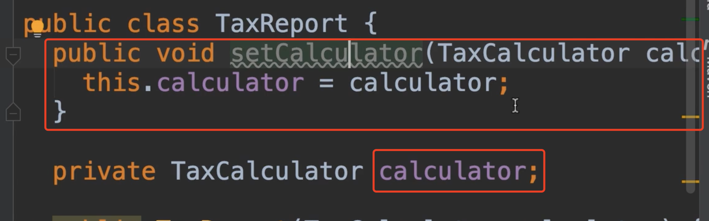
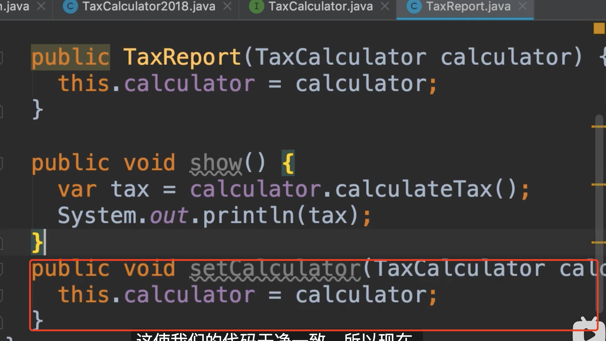
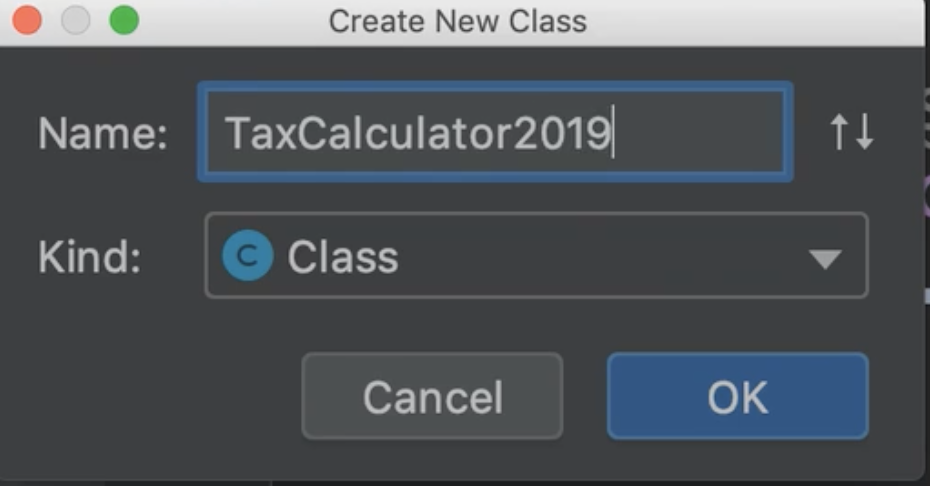
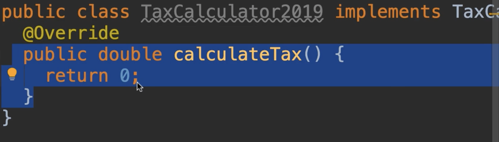
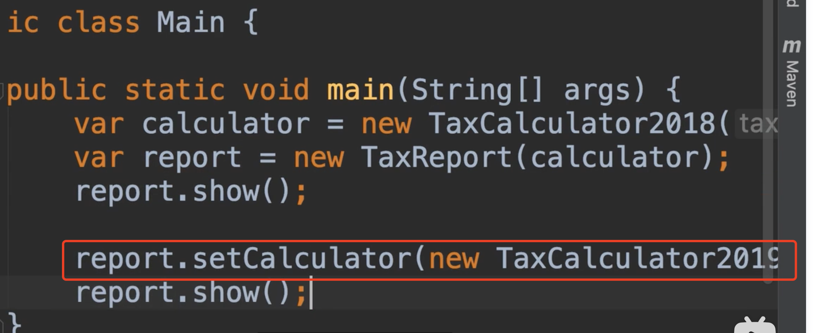
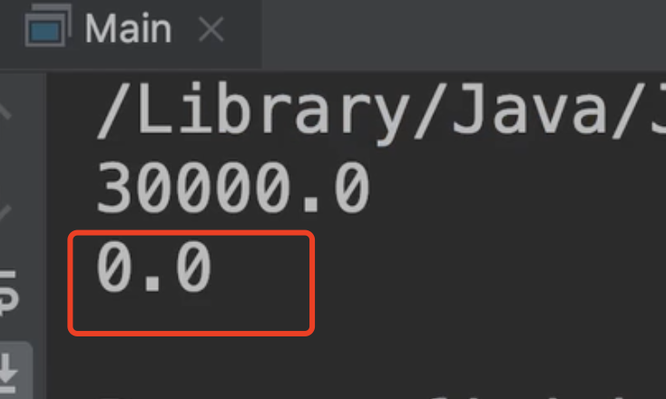

# 35.Setter注入

​	

​		我们讨论一下另一种称为setters的依赖注入

​		这里有一个私有字段，我们可以声明一个setter，并初始化它

​	现在我们不喜欢setter位于这个类的顶部，我们一般放在底部，所以我们选择代码块，然后按shift + alt + down，这样就移动到最下面了

​	现在除了这个构造器可以注入，我们还可以使用这个setter进行注入这个类的依赖关系，好处是什么？好处是我们可以在我们程序的整个生命周期中更改这些依赖关系，我们下面展示一下：

​	我们新建一个实现类：

然后实现我们的接口

然后我们来到主类Main，将实现类注入进去

我们执行一下代码：可以看到，2018年的是3000,2019年的是0

​	使用setter注入的好处是我们可以在应用程序的整个生命周期中更改类的依赖关系。

​	如果这样是我们需要的方式，那么就可以使用setter的方式进行注入，否则就使用构造函数。构造函数注入是更常见的方式。

