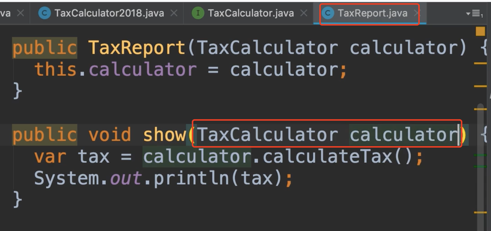
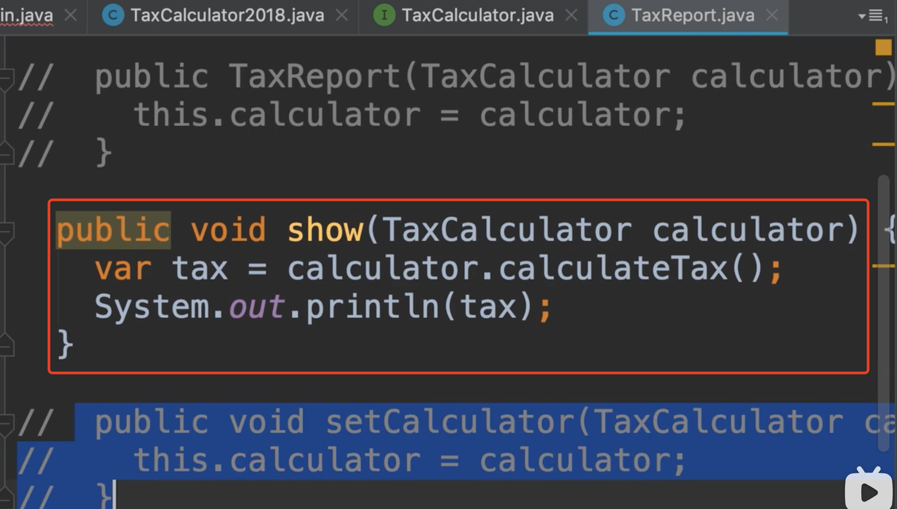
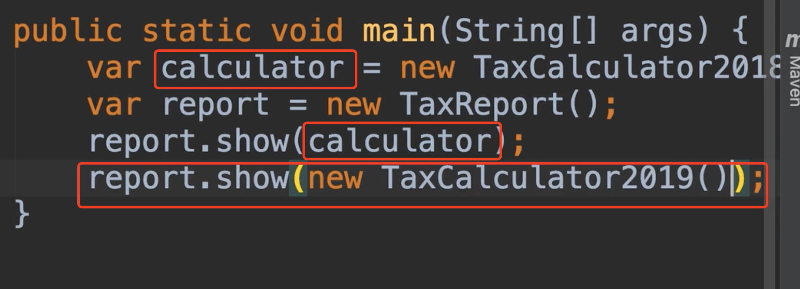

# 36.方法注入

​	

​	我们之前的setter注入非常好，他允许我们改变实现类，但我们必须要记得调用他，另外还有一种就是使用**方法注入**

​	所以，将我们的依赖项传递给使用的方法中，因为是这个方法使用的依赖关系，例如，我们将接口 TaxCalculator作为参数

​	现在我们从外部传递这个依赖项，方法只是在这个依赖项中对 接口TaxCalculator进行分类处理，它不在乎这个接口背后的实现是什么，现在这种改变，我们并不需要构造函数或setter注入，然后我们先把他们注释掉

现在我们回到主类Main中，我们可以简化一下代码--我们使用方法进行注入

​		这就是我们所说的方法注入，将依赖传递给满足条件的方法，实际上，我们大多数使用的是构造函数注入方式，因为通过构造器的方式，我们可以快速的看到类的依赖关系

​	到目前为止，我们已经将报表类和计算器类实现了解耦。但我们这里仍然有耦合，我们的报告类Report会使用税务计算器的接口，所以目前是和接口有耦合的联系，但这样的耦合要比和类耦合强的多，因为接口中没有实现的代码，接口只有方法且非常的清晰。

​	如果你改变了我们计算税收的方式，我们的报告Report不会受到影响，但如果我们通过添加新的方法更改这个接口或删除接口方法，当然我们就损坏了契约，以及依赖于这种契约接口的实现都将需要改变。所以在我们设计接口的时候要小心，我们要确保这些接口小而轻，因此不太可能更改。我们不想使用的很多方法来创建大型的接口。

