# 37.接口分离原理

​		

​	我们讨论一下，面向对象编程的原理，和接口分离原则，应该是隔离的原则。

​	或者是说把一个大的胖的接口分成一堆小的，有了这一点，我们可以减少变化的影响

​	我们用代码展示一下：

​	我们创建一个 UIWidget ui小部件接口，小部件包括文本框，复选框，常规按钮等等

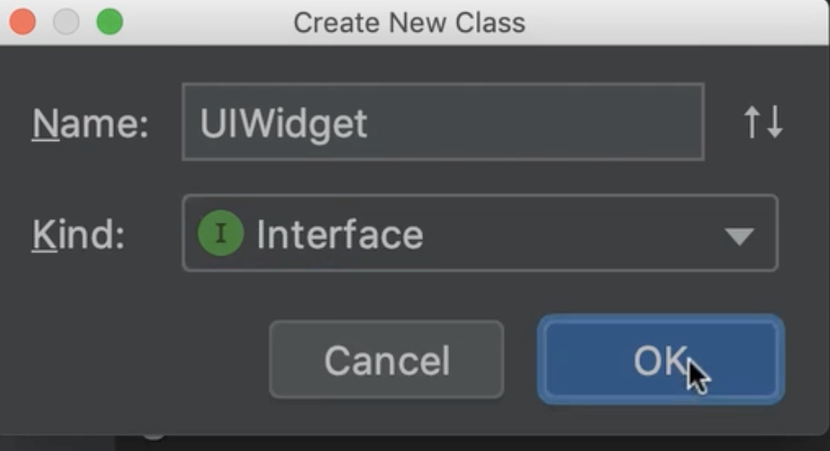

​	然后我们声明3个方法，drag拖动方法，调整大小resize方法，和render渲染方法，我们不用担心这个方法的参数，我们只需要知道我们的 ui小部件中具有这些功能，我们应该能够拖动它，调整大小和渲染

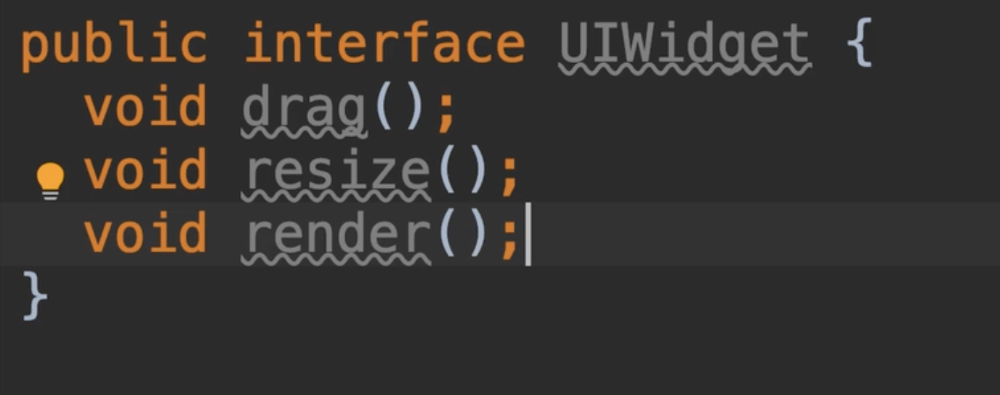

​	现在我们添加使用接口的实现类Dragger，想象一下我们使用这个类在屏幕上拖动一个对象

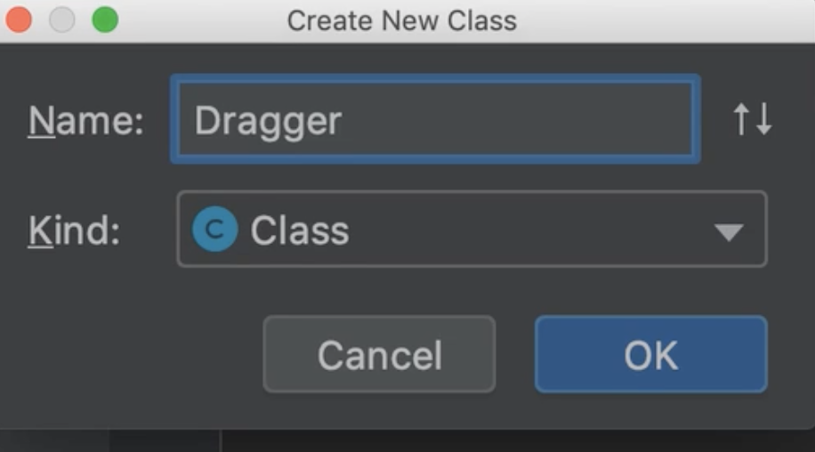

我们使用方法注入，dragger类耦合于ui小部件接口

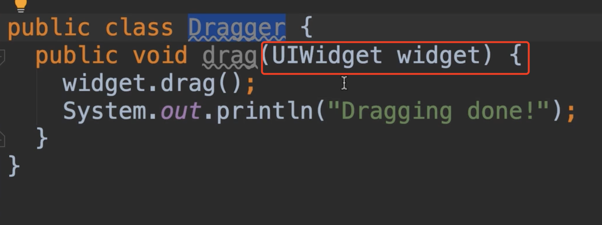

​	现在问题来了，如果我们改变了接口中的resize方法的签名，比如新添加了一个参数int size

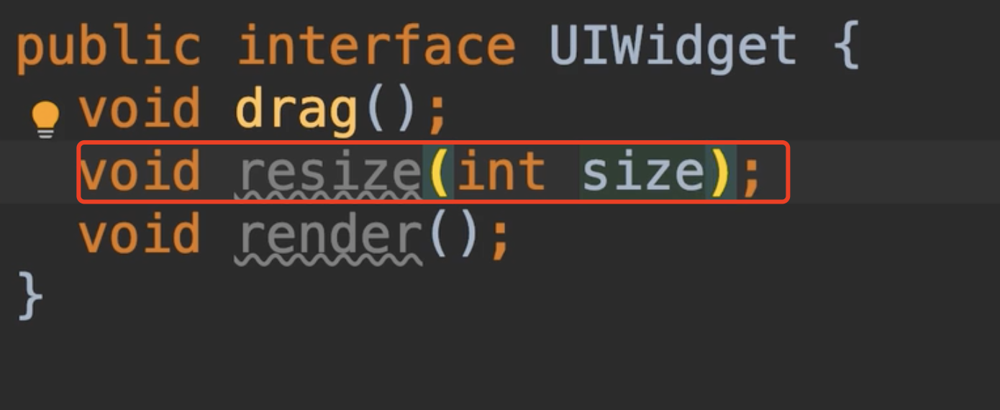

​	我们的dragger类将受到影响，并且必须重新编译，即使他没有使用这个方法或功能，它不关心调整UI小部件大小的方法，它只关心drag拖动的方法，所以我们需要处理一下这个问题。

​	一个相对较小的接口，但我们有不同的分工或能力，如果我们有一个接口中有10个或者20个方法，这样的接口应该改变，由于几个原因，每次我们更改接口或参数时，依赖于该接口所以的类及其依赖项可能会收到影响，这就是接口分离原则。

​	所以我们需要划分这个接口为较小的接口，每个接口都应该集中在一个能力，我们这里讨论的是不同的能力或功能，所以在这里我们应该提取一个新的接口，并移动drag方法

​	这里有个报错，提示我们应该在一个单独的文件中声明每个接口或类

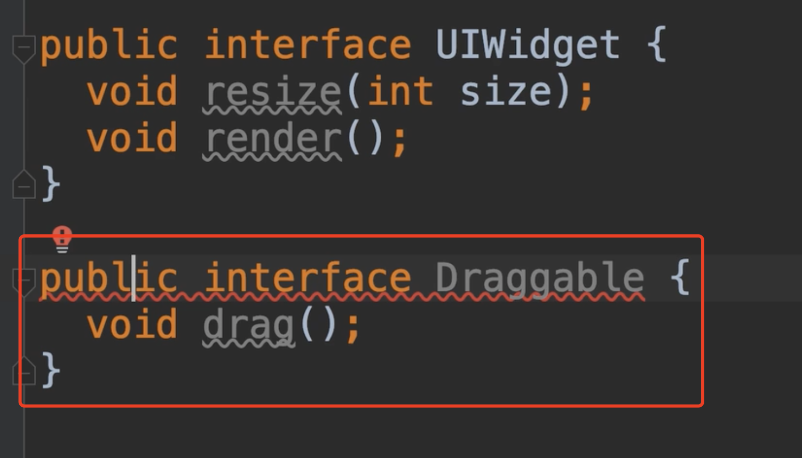

​	然后我们使用alt + enter--选择Move class 。。。。

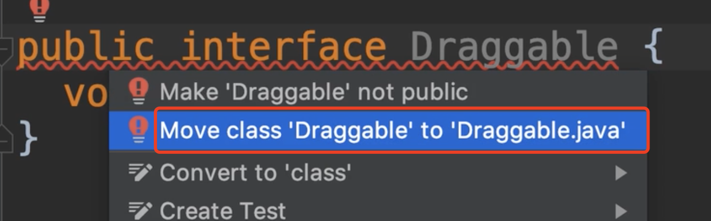

移动新的接口

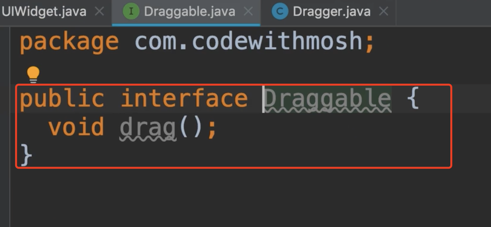

​	我们现在回到Dragger类中，我们不在使用ui小部件接口做参数了，我们需要使用Draggable做参数，我们不在乎它是否是ui小部件，我们不在乎它是否可以调整大小

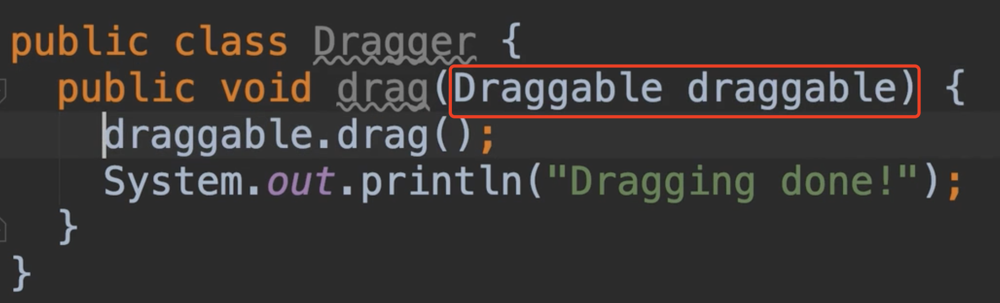

​	我们可以看一下Draggable接口，他只有一个方法，接口很轻量，也只有一个耦合点，如果你有10个方法，那么你会有10个耦合点。

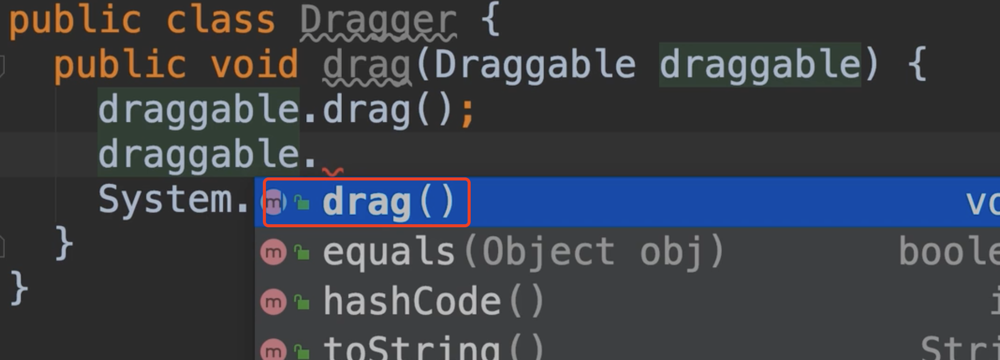

​	现在回到我们的UI小部件接口中，假设我们的应用程序需要使用这个接口的一部分，在一些地方需要所有的能力或者是方法，我们需要能够拖动，调整大小，并且渲染对象，这样我们就可以使用继承了，接口和接口之间也是可以继承的 使用关键字 extends

​	这个小部件接口将继承拖动接口

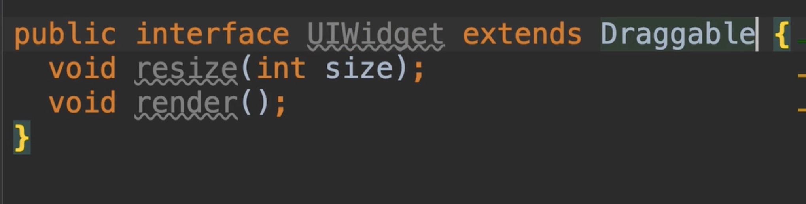

​	如果我们回到拖动类中将接收参数 Draggable接口替换为 ui小部件接口，发现方法是全面的

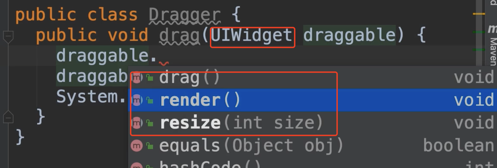

​		这就是我们如何应用接口分离原则

​	我们使用快捷键处理一下：回到我们的UI小部件接口中，我想将resize方法删除，到resizeable接口中，但我不想手动操作，我想让idea帮助我做这件事情

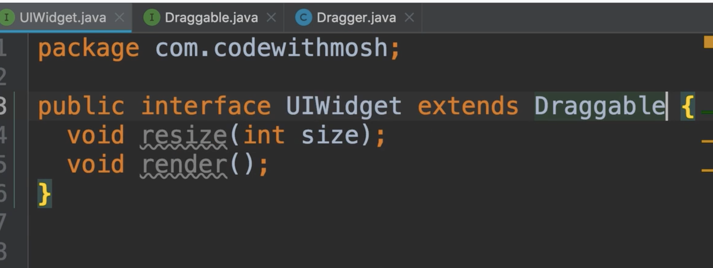

​	所以，我们把光标放在这个方法上面，按control + t ，呼出重构面板菜单，我们将在这里提取interface

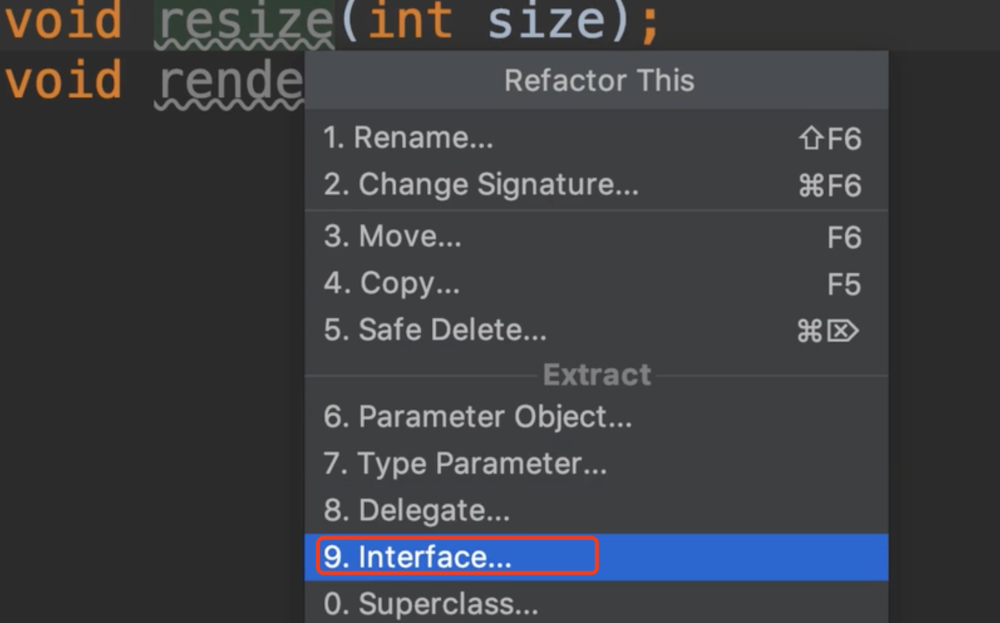

​	然后填写包的名称，接口的名称，选择我们想要移动的方法

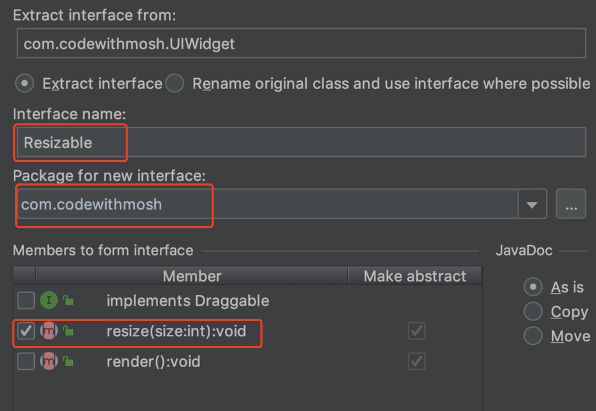

​	提示：接口已经成功创建，IDEA认为将使用之前的UIWidget替换为Resizable，你想这样吗？ 我们选择yes，是的我们想全部替换掉 这个yes或no尝试一下区别不是每次都是yes

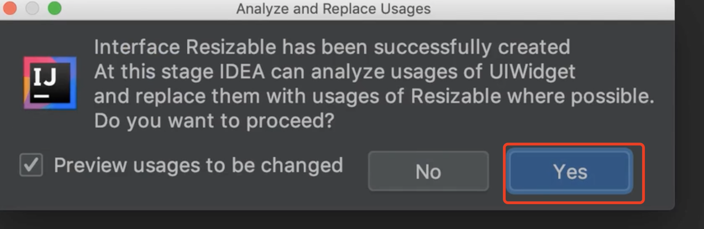

​	现在我们接口很轻量化了，顺便说下，**这并不意味着任何时候你都可以使用3种方法分为三个接口里面只有一个方法**，这不是本节的重点，这里的重点是我们应该分离不同的能力或功能

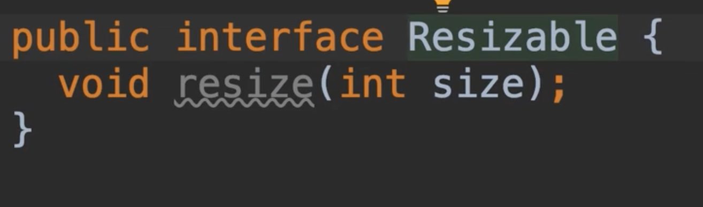

​	如果调整大小和渲染也有俩种不同的功能，但我们可能有不同的方法对于调整对象大小的方法

​	例如：接口中添加了一些方法，因为他们拥有差不多的能力或功能

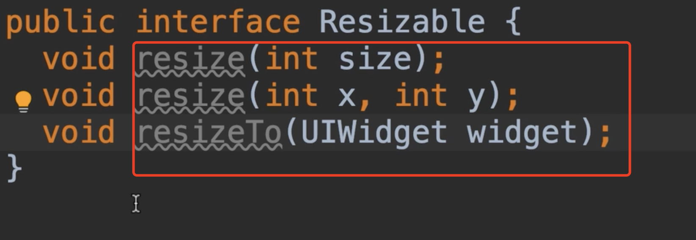

最后还有一点需要说一下，java的接口和类不同，接口的多个继承不是问题，也不会带来问题，如果声明的方法和父接口声明的方法相同，那么接口只会继承其中一个，也不会冲突。

​	相比之下，一个类不能有多个继承，因为这些父类可能声明了相同签名，但有不同实现。（如砖石问题）

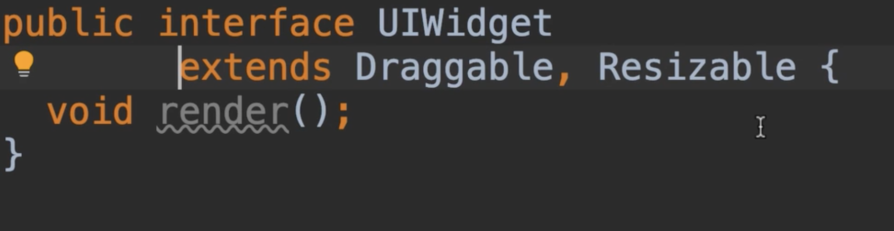

