# 38.Project：MyTube-Video-Platform

​		myTube视频平台：假设这个视频平台和youtube很像，人们可以上传自己的视频服务的平台，在这个项目中我们有一些类，像电子邮件服务EmailService， 用户USer，Video视频，视频数据库VideoDatabase，视频编码器VideoEncoder，和视频处理器VideoProcessor

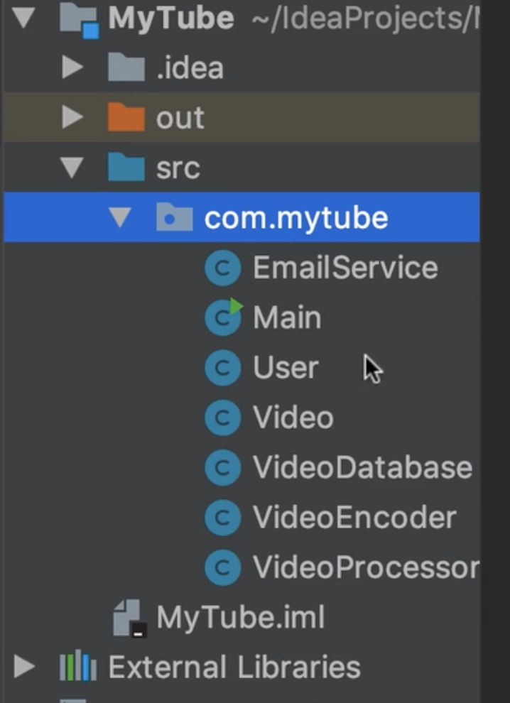

​	这是另外一个具有用户界面的完整工程应用程序，所以我们不用处理视频编码，或将他们存储在数据库中，我们只专注于这段关系，或者是这些类之间的关系，我们的练习是在必要的时候解耦这些类，让我们看一下main方法中有什么？

​	我们看到有视频对象，并设置了视频文件名称等等，最后我们创建了视频处理器对象来处理视频

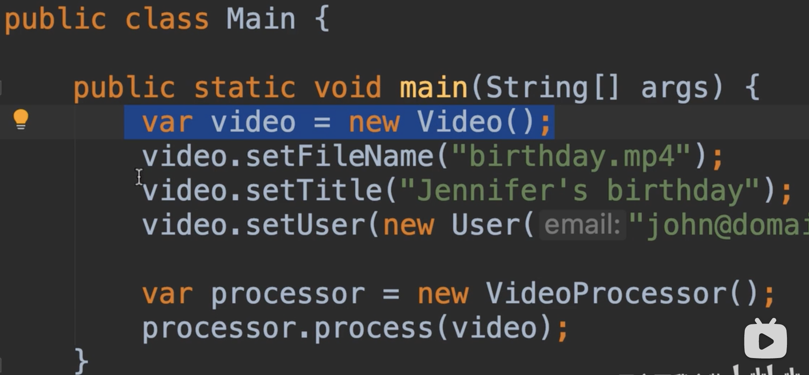

​	我们看一下视频处理器，处理视频的方法，这里我们使用了三个对象，有视频编码器对象VideoEncoder

​	然后接着我们存储这个视频使用视频存储对象VideodataBase到数据库中

​	最后-我们使用电子邮件服务来发送电子邮件给为这个视频发布的人或用户，我们会通知他们视频准备好了

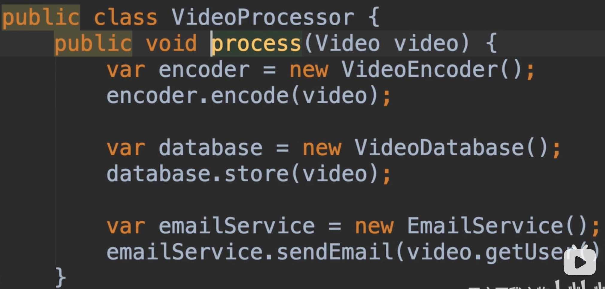

​		正如我们所看到的，这个视频处理器与这些类紧密耦合，与视频编码器，视频数据库和邮件服务紧密耦合，很有可能我们明天会有一个新的视频编码器会更快，也许它会在压缩视频时做的更好。这是我们应用程序可能会改变的一个领域，所以与其讨论具体的实施，我们可以使用一个接口，然后提供那个接口的不同实现

​		另一个我们可以看到可能改变的是 关于我们如何存储视频的元数据VideoDataBase，假如我们明天使用一个SQL数据库，或者说明天使用一个Mongo非关系型的数据库，或者我们使用另外一个后台作为服务提供者如fireBase，因此，存储关于这个视频的元数据方式也是可能再次改变的，我们也可以使用和一个接口进行接入处理

​		最后一个我们可能改变的是，在于我们如何和用户沟通的，现在我们可以使用邮件服务，以后我们可能使用短信的方式或者是把通知推送到他的手机上这些是可能发生改变的领域

​	那么视频类呢Video，这个类主要是个-数据容器data container 我们看一下这个类

​	有文件名称，标题，用户字段及填充内容的setter和getter，这个类实际上没有任何行为它没有算法，与其他类相比，比如视频编码器或电子邮件服务，它不太可能会修改，一旦我们定义了我们就需要知道关于视频的所有属性，所以没有必要对Video这个类进行解耦。

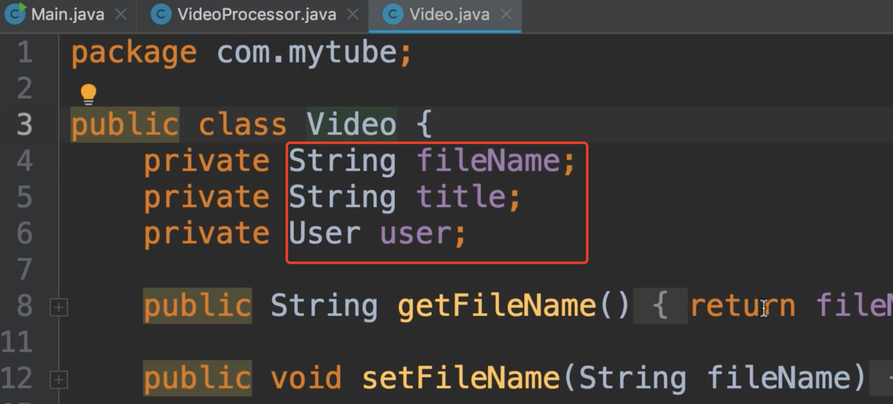

​	接下来我们想做的是，提取三个接口，并让视频处理器与这些接口通信

#### 解决方案

​	我们现在从视频处理器和视频编码器分离开始，我们现在使用一个技巧，我们不会手动的去创建一个interface，我们要让intellij从我们的代码类中实现。

​	所以我们现在把光标放在类名上，

​	在类名称上refactor--》extract--》interface

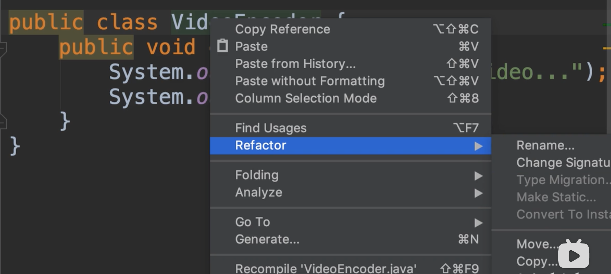

​	也可以从顶部菜单栏进入 Refactor --》Extract--》interface

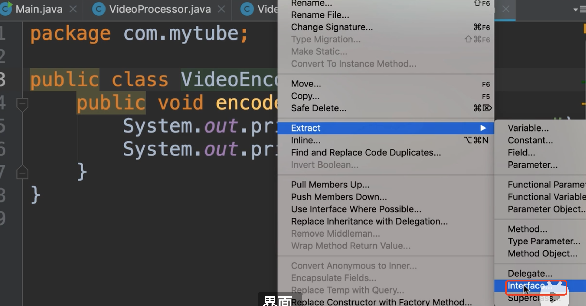

​	现在Intellij建议使用一个名称，VideoEncoder，但我们已经知道了，有一个同名的类所以我们需要重命名一下

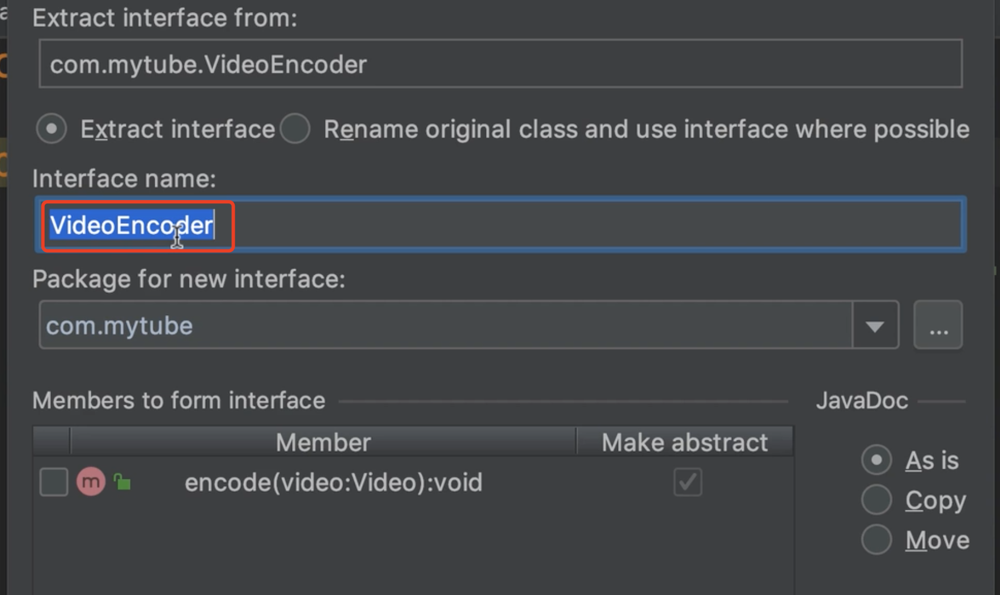

​	重命名使用原始类名作为接口，现在我们要选择这个单选按钮，接口实现名称该为XVideoEncoder,然后在Member中我们可以选择我们接口中想要的方法--最后点击Refactor

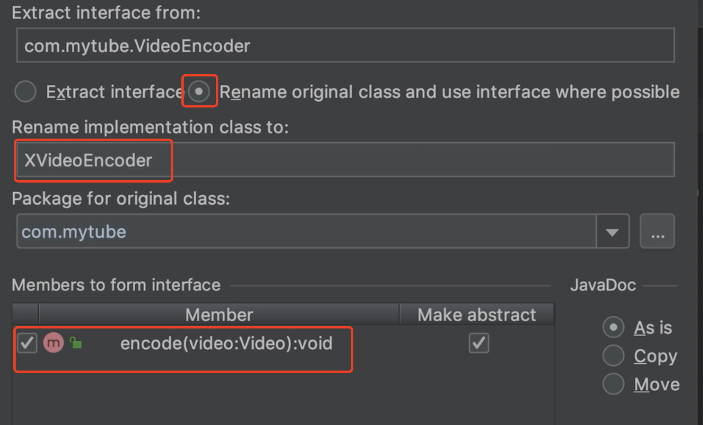

​	我们看一下发生了什么XVideoEncoder为实现类，VideoEncoder为新接口

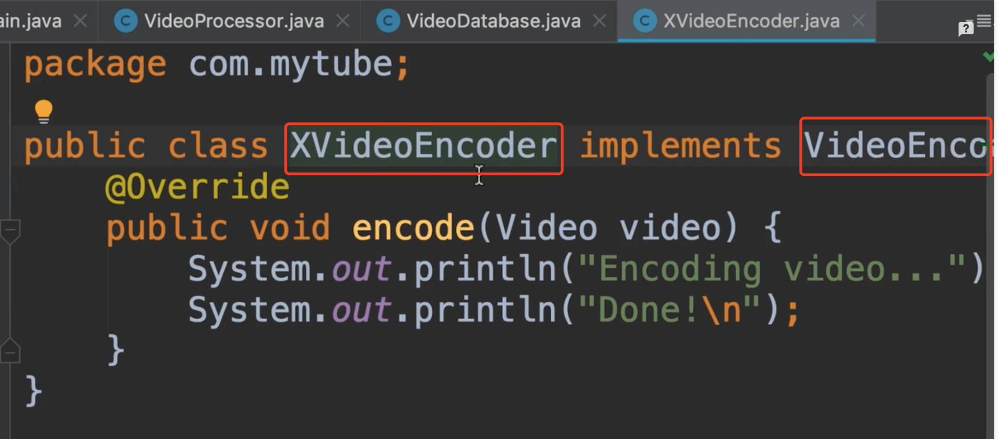

​	我们可以使用ctrl + b跳转到这个接口中看一下，我们有一个非常简单的轻量级接口和编码方法

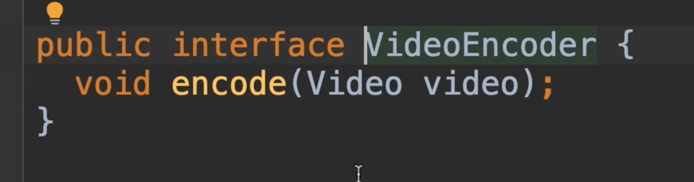

​	

​	现在我们回到视频处理器类中VideoProcessor，在实例化视频编码器时，我们希望应用依赖关系注入原则

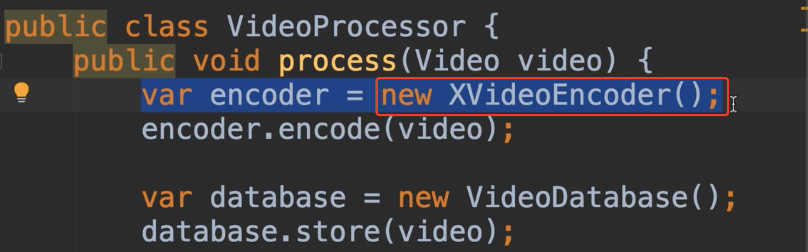

​	

我们声明一个私有字段，接口类型VideoEcoder，然后我们使用构造函数来初始化它

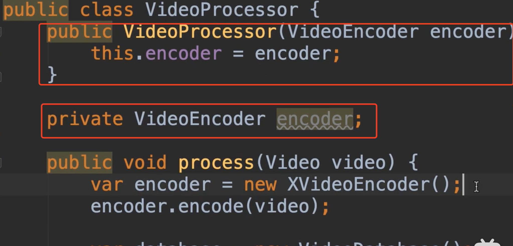

​		现在我们来吧创建的实例new XVideoEncoder替换掉,直接删掉就可以了，因为我们可以直接使用变量 encoder调用接口的方法了

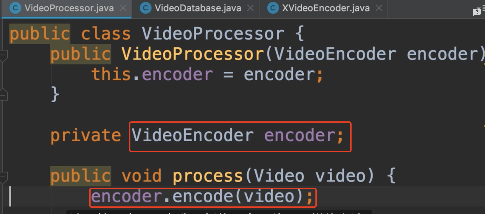

​	现在我们使用同样的方法，然后将视频处理器，和视频数据库，和电子邮件服务以接口的方式重构一下

​	重构完成的样子 

Main---使用VideoProcessor接口，然后使用不同的实例来处理数据

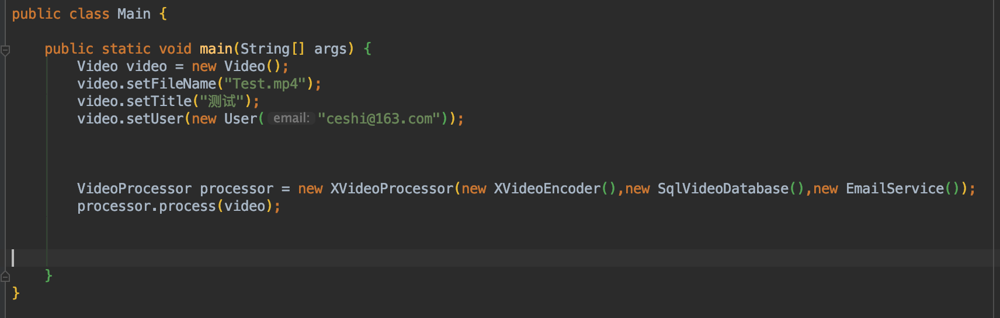

视频处理接口

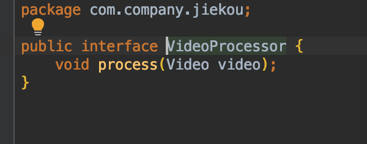

视频处理的实现：  设置构造器依赖注入，然后使用接口调用方法

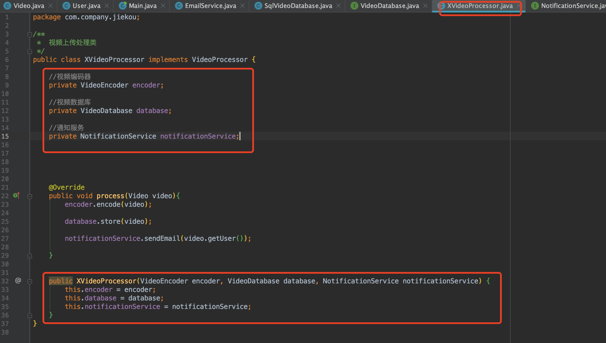

​	具体的代码实现参考，mac电脑上的mosh-java项目下的jiekou包

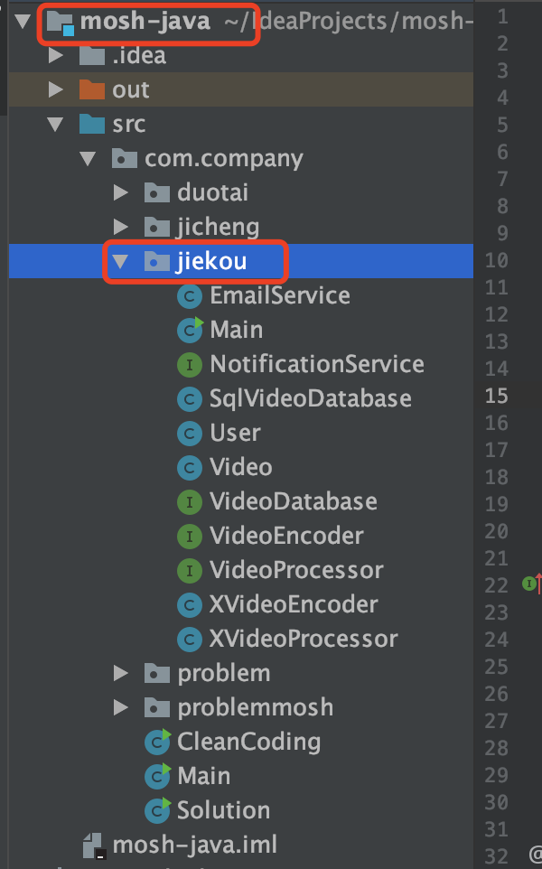

​	当然如果我们的通知服务，想以多通道的进行通知，这里的参数就需要多传入几个实例了，例如短信通知

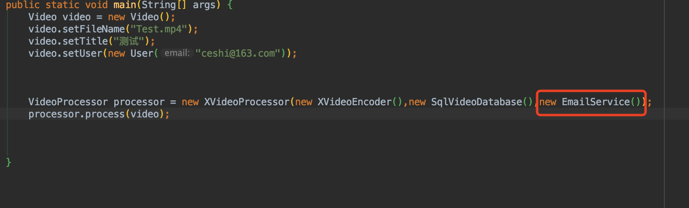

​	以上我们已经将类进行了解耦，以及依赖的注入，这样还有一个额外的好处就是单元测试，有了这些改变，**我们可以单独测试这个类，我们不依赖真正的数据库或真正的视频编码器，这就是我们所说的单元测试**（例如，我们现在单元测试 new 一个需要测试的实例，然后注入构造依赖的实例---然后调用方法及接口进行测试）

