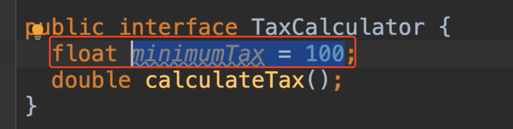
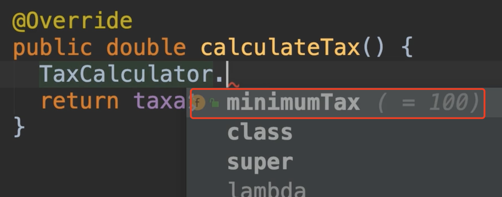
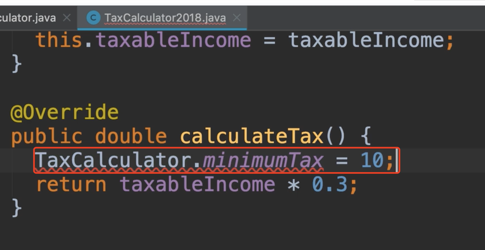

# 39.Fields In Interface

​		接口中的字段---新特性

​		我们已经看到了接口的真正用途，他们允许我们进行松散耦合，可扩展可测试的应用程序。

​		在前几年，我们的Java拥有了许多新特性，这些特性改变了接口的意义，在我看来还有很多其他人的观点，在我们看来这是一个糟糕的方向，接下来我们来看看这些新功能，我们解释一下为什么他们不好。以及除非你真正了解自己在做什么，否则你应该避免使用他们的这些功能。

​	我们要讨论的第一个特性是：在接口中声明字段。

​	

​	例如：我们可以声明一个字段在接口中，并可以设置默认值，如果是常量我们应该初始化他们，将来不可以更改他们的值。而且他们是静态的，我们可以使用接口 点出这个变量

​	我们会得到一个静态的，final不可改变的值

如果我们尝试修改值，会发现是会报错的，这个功能的背后意图就是避免出现神奇的数字，这些数字不知道从哪冒出来的，防止被修改的目的，这使我们的代码更干净，更易维护。

​	但是在使用这个功能前，我们需要考虑几件事，首先我们需要看看，该值是在所有实现中都是相同的，如果这个变量**最小税率minimumTax**在下一年会改变，我觉得很有这个可能，所以这个常量 应该在我们的实现中 而 不是在接口中，因为一旦我们在接口中设置了他，正如我们所看到的，我们就无法改变他

​	现在我们想象一下，这里我们要处理的是一个真正的常量，它永远不会改变，比如圆周率，或者是一年中的月数，我们在实现中使用这个常量，就可以定义到接口中，但是如果我们放在接口中，如果有一天想发生改变的话，修改后将影响所有实现此接口的类，修需要重新编译，所以我们看来没有必要把常量字段放在接口中。

​	仅仅因为Java支持各种功能并不意味着我们就应该使用这些功能，我们**需要了解这些特性及其含义**。

