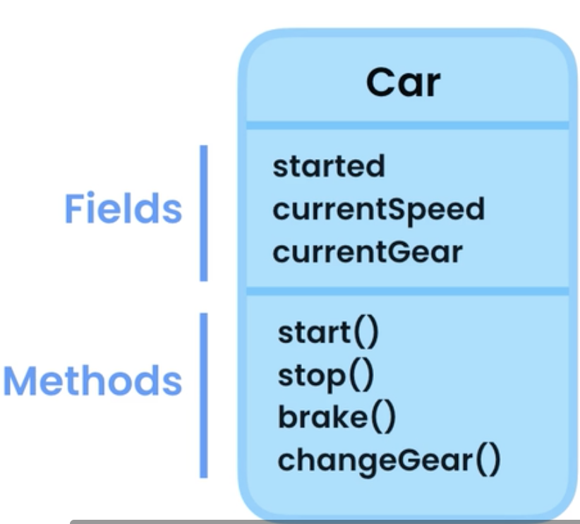
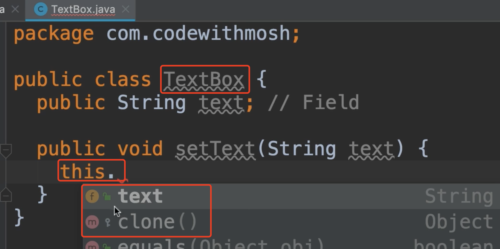
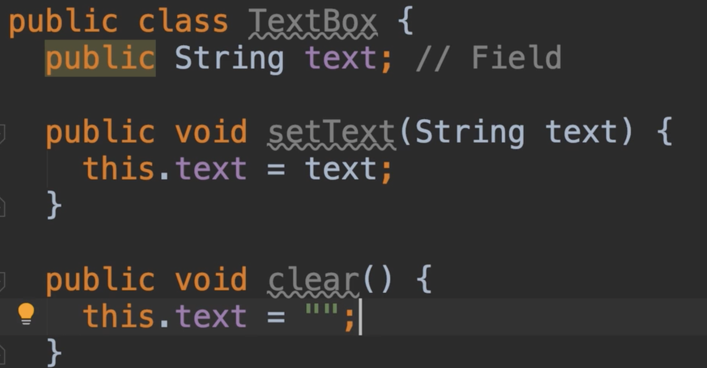
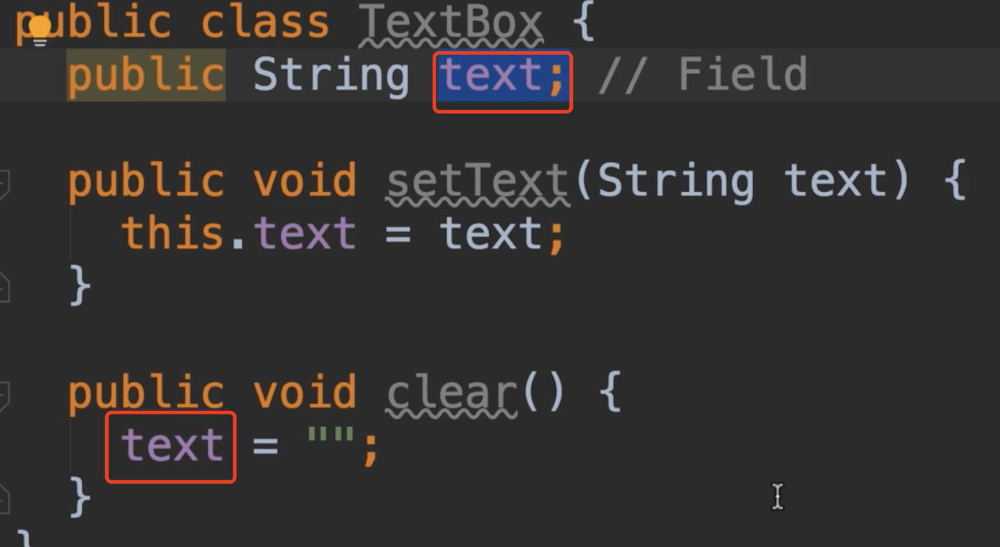
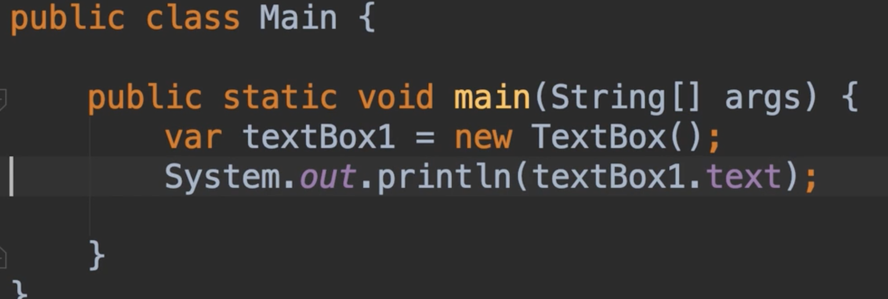
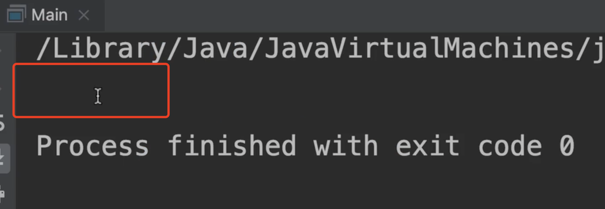
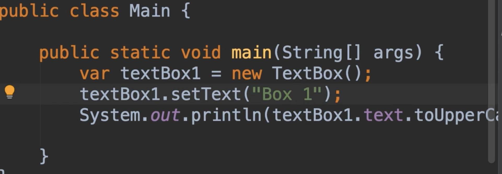
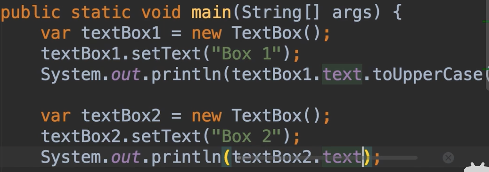
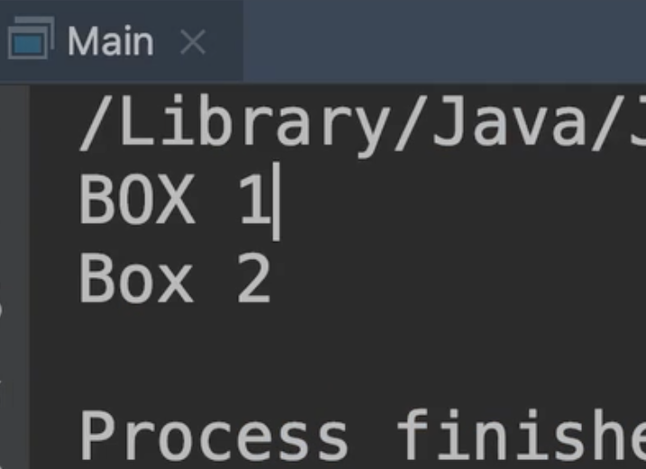

# 4.类和对象

​		我们从类和对象的角度来开始这部分，类和对象这俩个词经常被使用和互换，但他们根本不同， 类是用于创建对象的蓝图或者是模板

​	例如：一个叫做car的类，在这个类我们可以定义我们需要知道一切关于car的内容

​		所以一辆车有一些属性，比如他是否启动，他的当前速度，他的当前档位等等，编程时，我们使用类似于变量的字段来实现这些属性，在类中定义。

​		car也可以有一些方法，如，启动，停止，制动，换挡等等

​		

​	例如-当我们调用这些方法的时候，汽车的状态会发生变化，我们调用 换挡方法时，当前档位的字段值会发生变化

​	所以，这个Car类是一个模板或蓝图，用于创建新的对象，对象是类的实例，因此基于通过这个模板，我们可以创建许多实例，比如car1，car2。。。所有这些car对象将具有相同的字段和方法，但他们彼此独立，每个汽车物体都将位于一个内存中有单独的空间，他可以处于单独的 状态，比如每个车的档位和当前速度可能不同，因此每个汽车对象的数据可能会不同。

我们用UML来表示一下这些对象，UML--是统一建模语言的缩写（unfied modeling language）,这是一种简单的视觉语言，我们用来在可视化关系

#### create Class 创建类

​	现在我们创建一个类，我们在设置text方法的时候 text = text是不可以的，所以我们需要使用this关键字，this是使用当前对象的引用，这个this运算符可以查看此对象的成员，我们找到了这个text文本字段中，这个成员上的图标是f，代表field字段，我们还可以看到一些方法比如clone()等等，我们并没有声明这些方法，他们是如何出现在这里的呢？

​		这是通过一种叫做继承的机制实现的，我们java中声明的类自动继承了另一个类，我们在以后讨论这个点

我们创建一个清除文本的方法clear

​	在clear这里我们其实不需要this这个关键字，因为没有重复的名字

​	这是我们的文本框类，有三个成员，1个字段和2个方法

​	从技术上讲，我们不应该声明为public字段，公开的字段，好的，我们现在只是起步，然后慢慢深入。

#### 创建实例对象

​	我们声明一个TextBox的变量，然后new运算符创建实例

​	这里我们可以改进一下，这个TextBox重复了俩次，这是一个很好的例子，我们的代码有点脏，我们可以使用var来简化这个过程，var是java的关键字

​	因此我们可以将第一个TextBox替换为var，Java编译器将检测这个变量的类型，根据右侧的内容

​	当我们使用var 时，我们可以声明一个变量并给他不同类型的值，他会自动识别类型的

​	如果我们随便给他赋值编译器会识别类型是否一致，如下不一致会报错

​	所以我们使用var关键字，可以使代码更干净，我们将让java编译器确定

我们运行下面这段代码，结果是null，为什么是null呢？

​	这就关于我们之前学习的 基本类型和引用类型了，基本类型是数字，布尔，字符，其他的都是引用类型，text字段是String 类型，如果我们不初始化这些引用类型，他们将设置为null

如果我们认为不是null，还调用了大小写转换的方法，就会发生报错了

发生了空指针异常--他是java中最常见的异常

​		因为这个text为空，所以它没有得到内存中的值，这个是不存在的所以就报空指针了，内存中根本没有这个

​	那么我们如何避免这种情况的发生呢？

​	我们可以给他初始化一个值，这样text永远都不会是null了

我们再次运行一下main方法调用一下

​	打印了个空白，没有发生异常

现在我们设置一个值试一下

我们添加一个text对象设置不同的值我们看一下

我们可以看到这些对象完全独立

