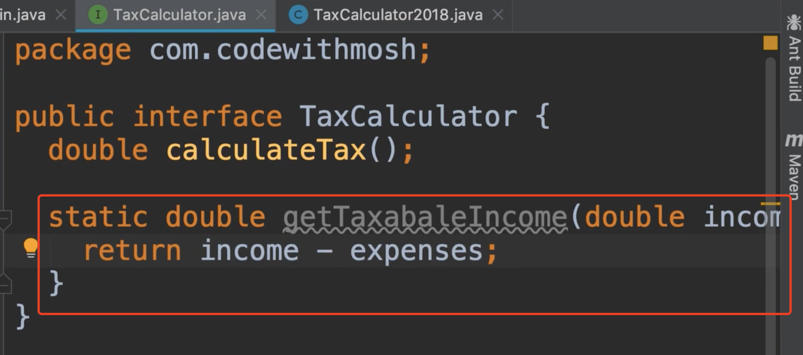
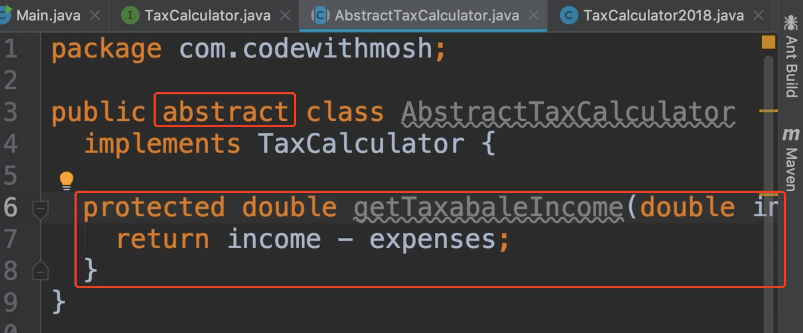
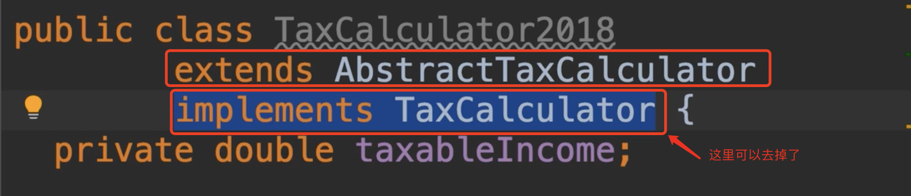
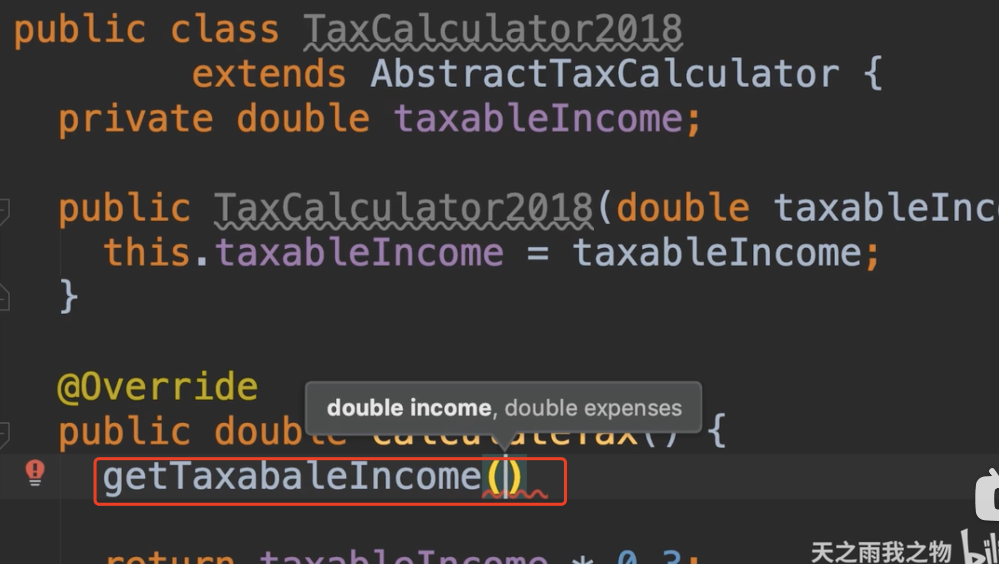

# 40.接口-静态方法

​		Static Methods

​	Java近年来引入的另一个糟糕的特性是，在我们的接口中定义静态方法

​	例如我们可以定义一个静态的方法：并传入2个参数

​	这会有什么问题？ 问题是这个接口有实现，有实现逻辑代码，这种逻辑可以改变未来。现在我们要处理的是一个非常简单的减法逻辑可能永远不会改变，但我见过很多人向接口中添加很多行的方法，难以置信的是，这些人并不真正理解接口的用途，这里我们说的案例是计算完成某件事，我们听到常见的观点是，如果我们需要重用复用他们呢，实现此接口的所有类逻辑，那就是当你定义一个抽象类，把这个逻辑移动到那里，他就可以被所以的子类分享。

我们展示一下：我们新建一个抽象的税务计算器类

​	然后加入关键字abstract ,然后实现接口，把刚刚的静态方法移到到这个 抽象的实现类中，这个方法应该是静态的，因为这是实现的细节，只有拥有具体的计算方法才应该使用静态方法。

​	我们使用受保护的访问修饰符protected，所以我们从外部隐藏了此方法，但可以在继承的类中使用他

​	现在我们回到具体的实现类中，我们继承一下这个抽象类，我们可以把实现的接口从这里去掉了，因为我们的抽象类已经实现过这个接口了

​	然后我们现在可以使用继承的抽象类中的一些可以重用的方法逻辑，所以我们避免在接口中使用静态方法，我们可以在抽象类中去解决这种重用的问题，这样我们的接口的非常的干净了，无论我们何时定义逻辑，都不要在接口中定义，逻辑是属于在类中的。

