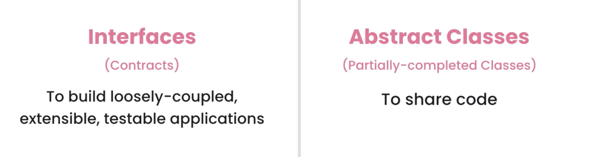
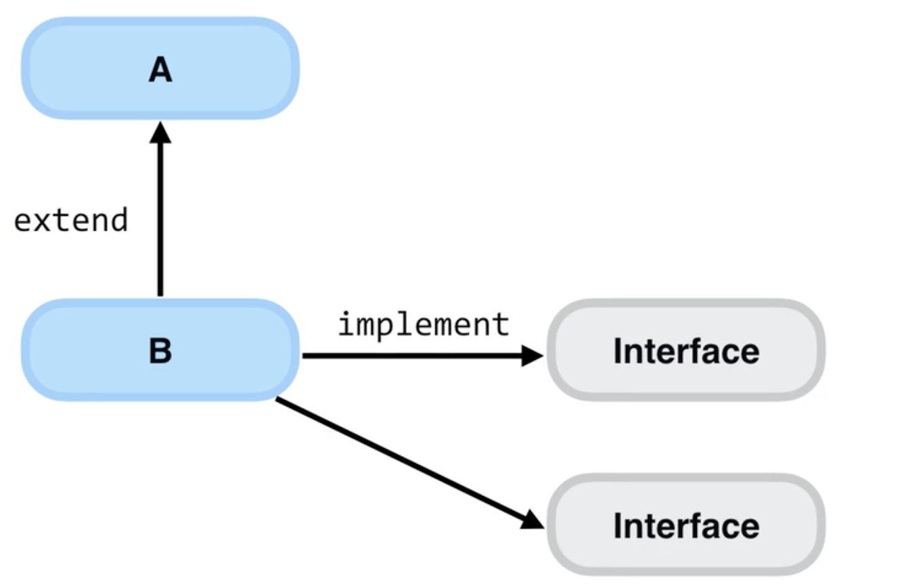

# 42.接口和抽象类

​	Interfaces vs Abstract Classes ：接口和抽象类

​	在面试中常见的一个问题是，接口和抽象类的区别？ 

​	在以前，这是非常明确的，我们可以说接口是纯粹的 约定或契约，他们没有代码或实现，我们用他们来构建松散耦合的，可扩展的以及可测试的应用程序。

​	抽象类是部分抽象的实现类，我们用它在几个类之间共享代码

​	但是正如我们所看到的，Java引入了一些糟糕的新特性，在过去的几年里，接口的含义发生了变化，现在很多人都在滥用接口并使用他们实现多重继承，因为在Java中，类可以扩展一个类，但他可以实现多个接口

​	所以很多人把这些接口当做类来对待，他们在这里放了一些逻辑代码然后让另一个类实现，这就像从多个父类继承了许多代码一样，正如我们之前说的，多重继承来带了很多的复杂性，在我看来，最好避免这样的使用。

​		如果你在面试中被问到这个问题，这正是你需要说的，从接口的历史及他们的使用和用途，和有了这些新特性后，比如接口中可以有私有或者是静态方法，接口已经失去了意义，很多人滥用他们是因为他们不明白接口是用来做什么的。现在如果面试官碰巧是这些人中的一个，他可能会被冒犯，他会取消你的资格并拒绝你。

​	令人惊叹的是真为你高兴，因为我们不想为这样一个对工作知之甚少的人工作，他对面向对象编程非常傲慢，一个好的面试就是会问你什么样的问题，比如他们可能会问你为什么你认为这些功能不好？ 你需要解释其原理，人们利用特性这个来实现多重实现，但接口不应该与类混淆，我们应该把接口当做是一个约定或者说契约，这样我们的应用程序就可以尽量减少变化，和松散耦合，如果我们改变了做某事的方式，我们不会破坏代码中的更改或重新编译。这些都是关于接口和抽象类的。

