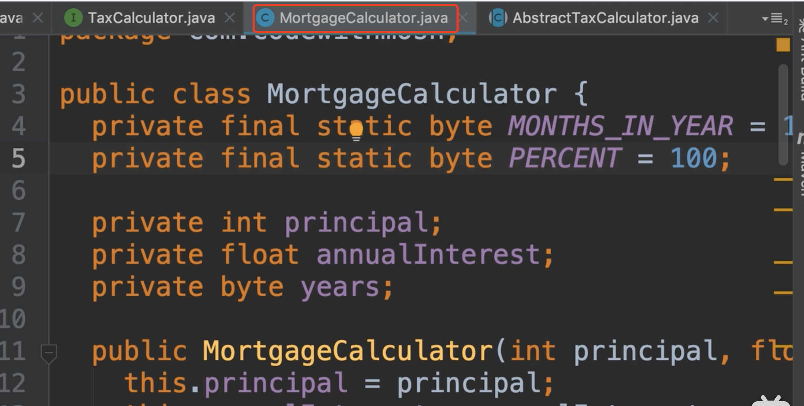
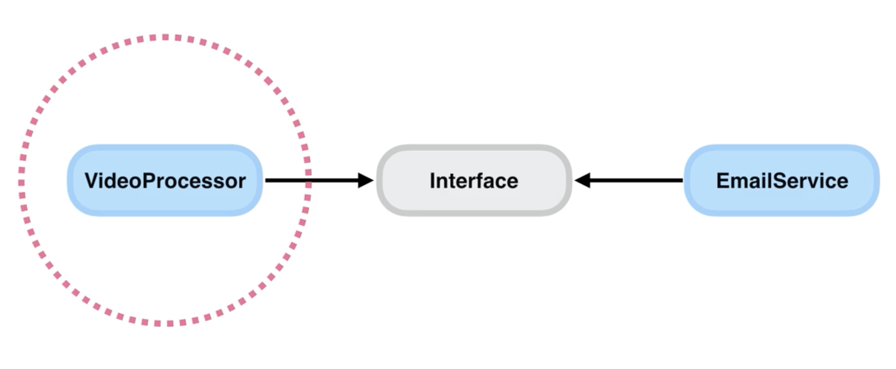

# 43.什么时候使用接口？

​	When to use Interface？

​	我们总是强调解决问题的重要性，我们不应该仅仅为了编写代码而编写代码，在我们写代码的时候，我们需要明白我们想写什么？我们想解决什么？

​	我见过很多人从项目中的没个类中抽象出一个接口，并称为最佳实践，因为他们使用的是接口，正如我们在本节提到的，我们应该在以下情况下使用接口：

​	你可能希望将一个类与他的依赖项解耦，这将为你提供很多好处，好处是你可以轻松解决一个实现，我们之前有过这样的几个例子，例如想要一个编码视频的算法，你想到以后会有更快的算法吗？这是一个很好的脱钩理由，这些类可以让你在以后提供新的类对应用程序的影响最小或者是为0。

​		在其他的类，当你使用第三方服务时，假设你使用的是一项发送电子邮件服务，明天可能想换一家不同的服务提供商，也可以使用接口的方式。

​	现在我们回到抵押贷款计算项目，我们正在使用这个计算类中看一下

​	我们不太可能用另外一个计算器来替代这个，因为计算和抵押贷款支付时间表是直接的，不会改变，你不会有不同的算法，更快或更准确，因此像这样的代码实际上不需要从中提取接口并注入抵押报告类。除非你想做单元测试，我们稍后讨论。

​	使用接口的另一个好处就是可以轻松以最小的影响扩展应用程序，这很有用，如果你正在设计一个供他人使用的框架，例如我们正在构建一个用于web应用程序的框架，我们的框架应该具有模板引擎能够解析html模板，放一些数据，然后将响应返回给客户端，现在我们可以提供框架中的默认模板引擎，但我们希望允许其他人构建自己的模板引擎，这就是使用接口的另外一种情况。

​	因此，与其针对具体实现进行编程，就像一个一个具体的模板引擎，我们可以根据接口进行编程，其他人可以创建新的模板引擎来实现我们的接口，所以，通过使用接口，我们可以为应用程序框架增加可扩展性。

​	使用接口的最后一个好处是我们可以单独测试类，所以如果类使用电子邮件服务或存储引擎，我们可以将其与这些依赖项并单独测试这个类，这是我们所说的单元测试，如果我们没有在组织中进行单元测试，那么提取这些接口不会有任何价值，所以

​	所以，不要只是盲目的编写代码并遵循这些所谓的最佳实践，因为有人让你这么做，对于我们编写的每一段代码去理解我们想要解决的问题，如果我们没有解决任何问题，那么我们只是在浪费时间，没有增加任何价值，事实上我们会增加成本，因为写的代码越多，产生的bug就越多而且应用程序的维护成本也会很高。

