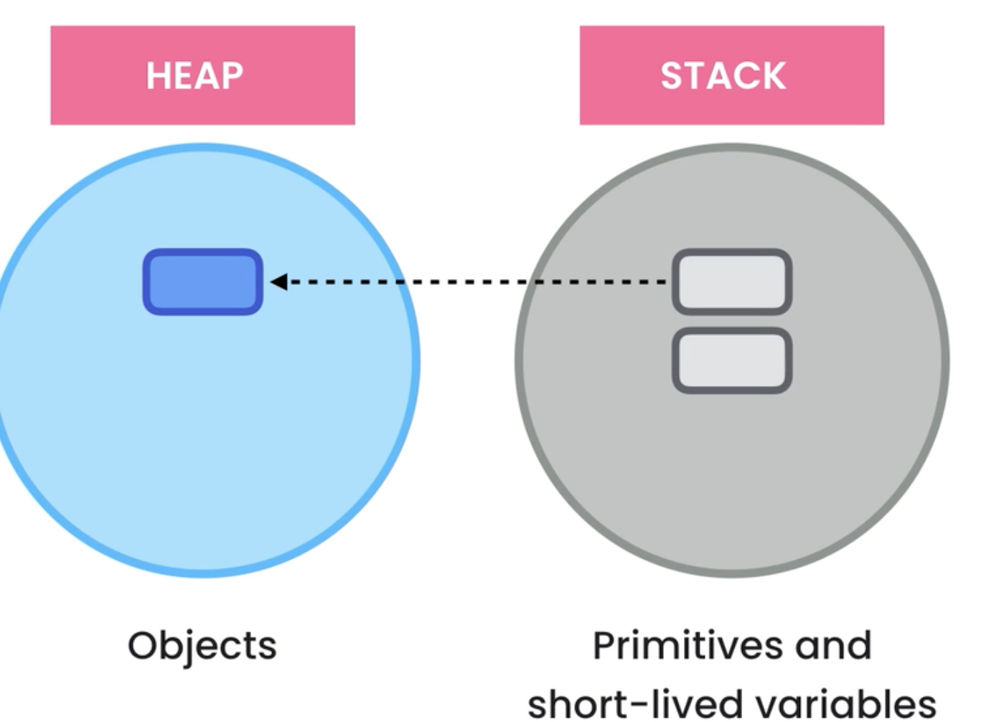
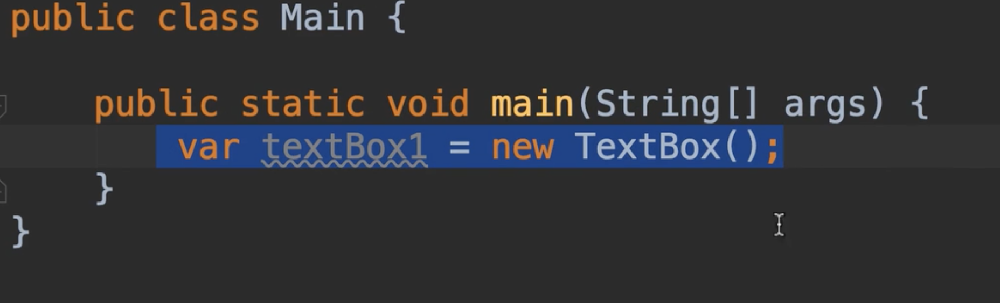
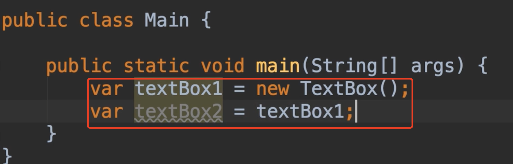
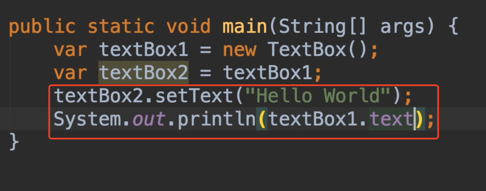
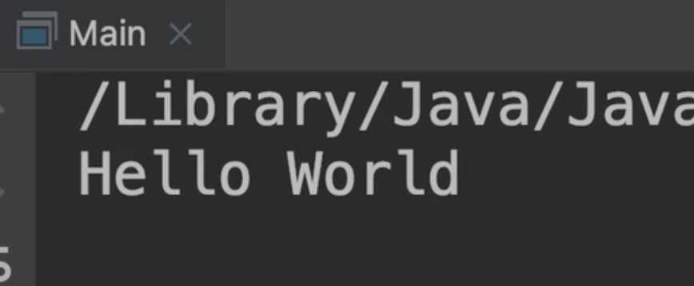

# 5.内存分配Memory-Allocation

 		我们了解一下引擎下，创建对象时会发生什么。

​		Java管理2个不同的内存区域，一个是HEAP堆，这是它存储对象的地方。

​			另外一个区域是STACK这就是它存储短期变量的地方，以及存储引用的变量，指向在堆的对象

看看这段代码：

​	当java运行执行操作时，首先他将评估 运算符 new右侧的内容，因此它将创建一个新的TextBox对象，并将其存储到heap里。

​		现在我们假设堆上的这个对象的地址是100，然后java运行时将执行此操作，它将在堆栈上分配一些内存，，在这个内存位置，它将存储我们的heap上的TextBox对象，所以我们这里有一个变量，正在引用堆上的对象，这就是为什么我们将这些变量称为**引用类型** 因为这些变量不是存储的实际的值。

​	基本类型就不同了，当我们声明一个integer，该整数存储在堆栈上，并且变量中的数据将存储在该内存的位置上

我们再举一个例子，比如

在这个例子中2个变量 textBox1和textBox2 引用堆上相同的TextBox对象

​	所以我们没有俩个不同的TextBox对象，只有一个TextBox对象，堆栈上有2个变量引用了这个对象，这意味着，如果我通过其中一个引用或变量，其中一个变量发生变化时，可以 从另一个变量中看到

​	这里我们使用textBox2，将值字段text设置一下，然后使用第一个变量输出一下值

​	我们看一下效果

​		可以获得到变量 textBox2的值，这证明2个变量都引用了同一个对象 

​	那么我们的内存如何释放呢？在java中我们不像C++，我们不需要担心释放内存，java会自动处理这个问题。当我们运行完一个方法时，它会立即删除堆栈中存储的所有变量，以上这个例子2个变量都存储于堆栈中，我们执行完任务后，他们将立即被移除

​		他会监视堆上的这些对象，如果一段时间内未被使用过，该过程将自动停止，并移除堆上的对象，这就是所谓的垃圾收集

​		java运行时有一个叫做垃圾收集器的组件，他将自动删除堆上未使用的对象，这就是java中的内存分配和释放

