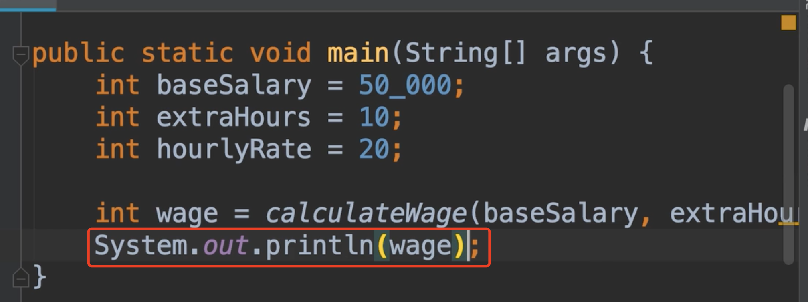
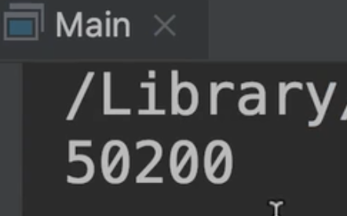

# 6.程序编程

​	

​	在面向对象编程前，我们先使用一下过程范式，这是我们在面向对象前的范例

​	假设，我们要写一个程序来计算我们员工的工资

​		我们先声明3个变量，baseSalary 基本工资，声明一个变量extraHours =10--加班小时，还有一个 hourlyRate =20--小时工资

​		

现在我们实现计算员工工资的方法：

然后我们调用方法，并得到的值打印输出一下

​	这个代码写的如何？从技术上讲，这里没有什么问题，因为这是一个非常简单的程序，我们的主方法只有5行代码和我们另外一个只有一行的计算方法

​	然而，我们如果扩展这个程序，如果我们增加更多的功能，使用这套程序，我们最终会得到一个非常 臃肿的main方法，我们的main方法会因为太多的代码变得臃肿，当然我们可以提取其中的一些方法，进行方法的重构，就像计算工资的方法一样做抽离，但是我们的主类，最终会变得如此臃肿，这就是我们使用的称为程序编程范式，然而我们不会有类和对象，我们有一堆变量和函数function 也称为过程

​	见过很多编写这样代码的开发人员，如果他们正在使用面向对象编程，因为java是面向对象编程的语言，然而他们仅仅使用主类，如果还有其他几个类，他们会认为自己在做面向对象的编程，但事实并非如此。 仅仅因为你在程序中使用了类和对象并不意味着你在做面向对象编程，那么使用面向对象编程，它有很多技巧，我们下面演示一下。

​	如果代码是以过程风格编写的，那么最终会得到具有很多参数的方法，我们刚刚的例子还好只有三个参数，但我有见过有函数开发的人员有5个甚至10个参数的方法，有时甚至更多，如果你有这样的方法，那就是一个明显的症状，你没有做面向对象编程，所以如果你是不断的给方法传递很多参数，这意味着你在做程序性的编程工作。

​		当我们这样编码的时候，最终程序肯定是会变得方法很臃肿或者是类很臃肿，以这种方式编写的类和程序很难维护，如果出了问题你得到处找，然后看这么多的代码，最终找出你需要改变的地方，一旦你修改了一些内容，可能会出现其他的bug，另外这样的代码缺乏可重用性，所以最终会到处都有这么多的函数或方法，如果你想重用他们，在其他程序中使用，你必须从这里复制一些代码，然后你不能把他们放在一起，因为他们的参数都不一样，太乱了，这就是我们所说的意大利面代码，代码看起来像意大利面条，所有东西都是相互关联的，改变这样的计划真的很难。

​		那么接下来的任务就是，我们重构这段代码，这意味着我们要让他成为面向对象编程的方式。

