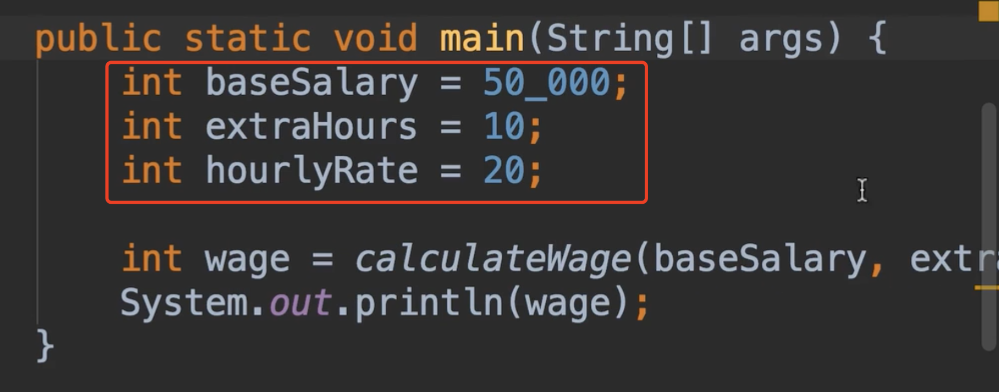
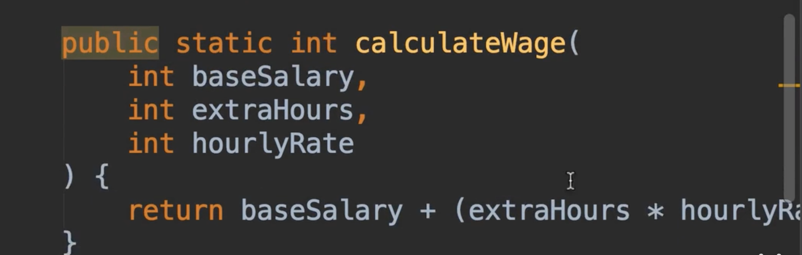
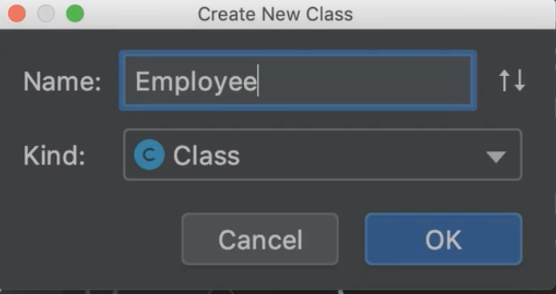
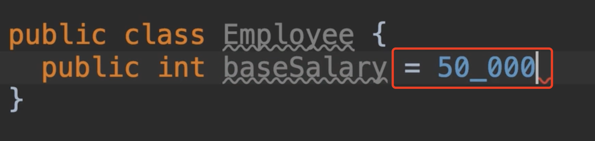
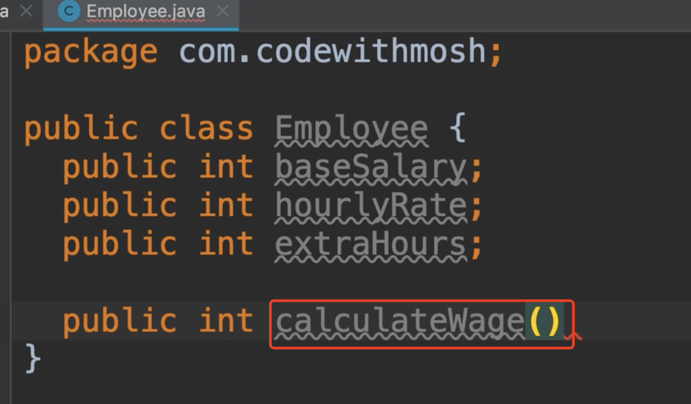
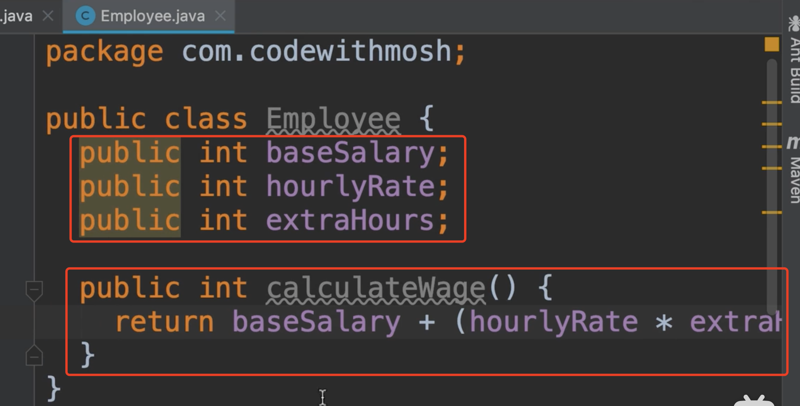
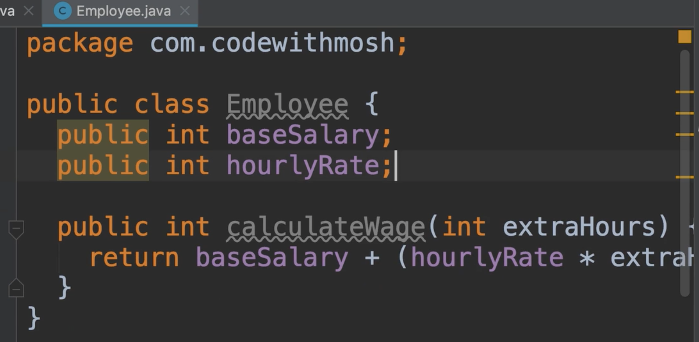
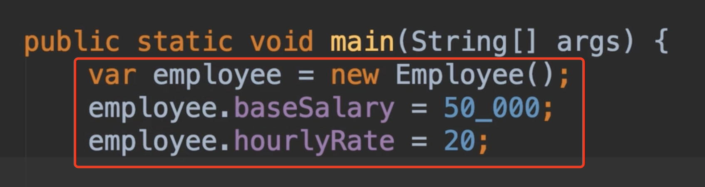
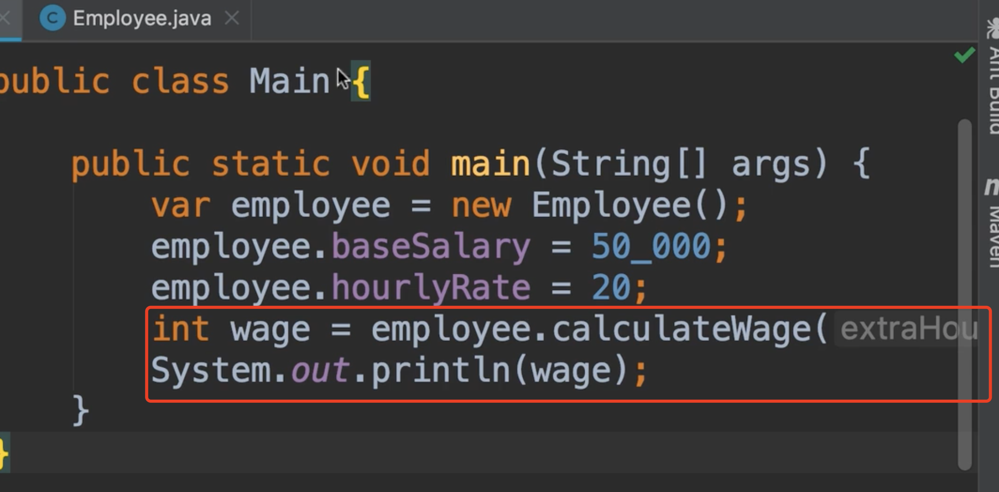

# 7.封装

​		Encapsulation 面向对象编程原理，封装，基本上也就是说，我们应该将数据和操作方法捆绑在一起，在单个单元或对象内的数据上

在这个程序中，我们在3个变量中存储一些数据，在main方法中，这些变量是方法的局部变量，因此，在这个方法之外他们是不能被访问到的

这是一个计算工资的方法，所以我们也传递了一些变量，所以这里我们应该遵循封装原理，并在一个单元下，把他们像胶囊一样封装在一个单元中

我们应该把这个单元或类称为什么呢？这里我们要讨论员工的概念，因为我们计算员工的工资，所以我们添加一个employee类到项目中

在这个类中我们将声明三个字段，与我们之前声明的变量相同

​	但是我们不应该设置初始化值，因为我们希望对所有employee对象设置，这只是个模板稍后我们创建 employee对象，为每个员工设置基本工资

我们设置完字段后，我们设置计算工资的方法，static，只有我们真正需要的时候才使用静态的，现在我们不需要静态的方法

​	现在我们需要什么参数，我们要加上 int baseSalary 。。。吗？不需要传，因为我们将这些值存储在这个类的字段中，所以真的没有必要给这个方法设置参数

​	因此，我们可以在方法中简单的返回 基本工资+（加班时间*加班费）

​	这是我们第一个名为面向对象编程的代码，你可以进行计算但方法没有参数（以前我们有三个参数）

​	所以我们应该封装这些值，而不是传递值，以及在单个对象中对其进行操作的方法

​	现在我们做个假设，想象一下，每年的基本工资和小时工资是固定的（baseSalary，hourlyRate），但每年是每个月的工作时间都不一样（extraHours），所以我们不想把（extraHours）存储在字段中，而是希望把他们作为参数传递给此方法。

​	所以，我们给方法添加一个extraHours参数，然后我们将字段删除

现在我们回到主类中的main方法中，首先我们创建一个employee对象

​	然后设置基本工资和小时工资值

然后工作时间传入个10--我们直接就可以计算工资了，现在我们的类更干净了，代码行更少，更易于维护，我们已经封装了数据和方法，对单个类中的数据进行操作，如果我们明天想为了构建另一个涉及计算员工工资的应用程序，我们可以简单的将此类复制到该项目中，或将其放入可重用库中，所以我们不需要复制粘贴代码

​		但是稍等我们还没有完成，这段代码有一个问题，我们将在下一步研究这个问题

https://www.bilibili.com/video/BV1Su411X7Bb?p=11&spm_id_from=pageDriver

