# 8.getters-setters-title

​		接着上节遗留的问题，这样设置值的问题是，如果我们将基本工资baseSalary设置为一个负数或者是0，我们的employee对象将处于返回状态，但如果不能够产生正确的结果，就无法正确的计算工资

​		但你可能会想，我们应该设置基本工资，我完全同意，但如果你读取他们的值呢？所以这里我们需要做一些数据验证，我们想确保用户输入的基本工资是正值

​		

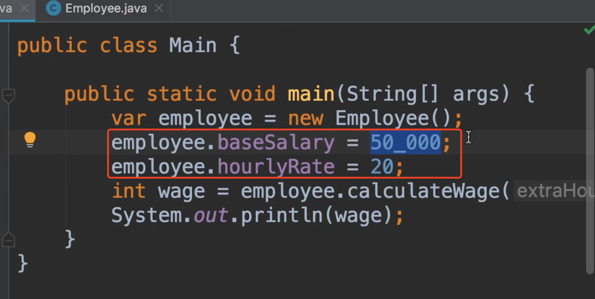

​    有个解决问题的方法，就是我们可以写if语句，从用户界面查看baseSalary，然后检查他是否为负数，如果是负数，我们将打印一条错误消息

​	然而这种实现的问题我们每次使用对象我们都需要写这个if语句，我们不想那样做，我们想将此逻辑放在employee类中，这时候我们该怎么做？如果我们把这些变量隐藏起来呢，那么他在employee类之外就不可以访问了

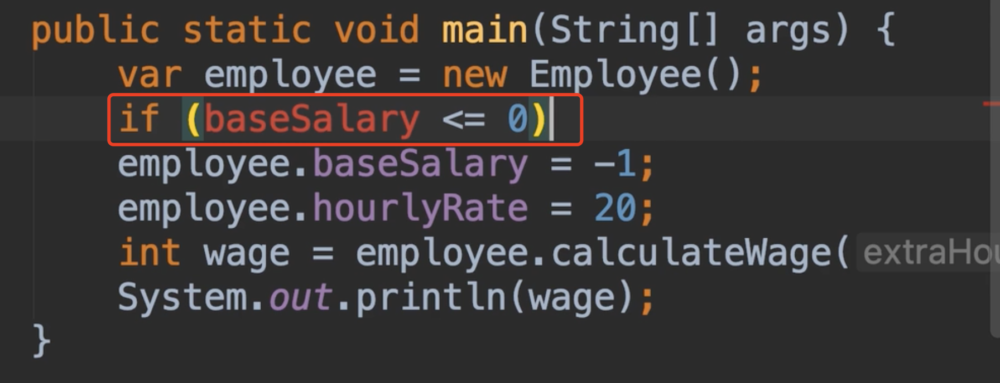

​	

​	相反我们通过这个基于值的方法，我们可以在此方法中进行数据验证，因此方法在employee类中，我们无论在哪里使用这个类，我们都要进行数据的验证，思维方式我们不必到处重复的if判断了

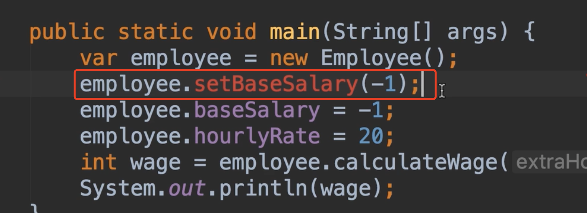

​	所以，我们回到我们的employee类，之前我们讨论过修饰符，我们目前是把字段设置为public，这意味着此字段在本类之外是可以访问的，现在如果我们改为private，那么就只能在本类中访问了

现在我们创建这个方法：

​	如果基本工资小于0，我们就终止计算计划，为此我们需要创建一个新实例 new IllegalArgumentException （非法参数异常），关于异常的情况我们以后聊，现在我们只需要知道他是java类库中的类，当我们抛出异常时，handle会终止我们的程序，所以我们在这里创建这个异常类的实例，这里我们可以传递一条错误消息给用户看-薪水不能小于0

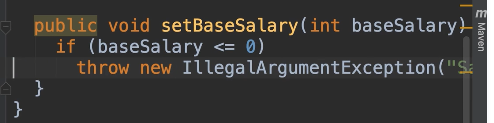

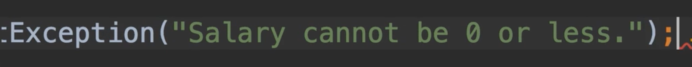

​	所以如果这个基本工资是无效的，我们不会设置我们的字段值，校验通过后我们设置值

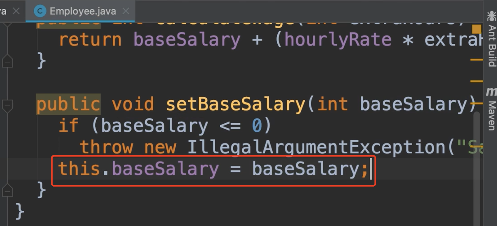

现在看一下我们的主方法-设置基本工资的方法也不会报错了

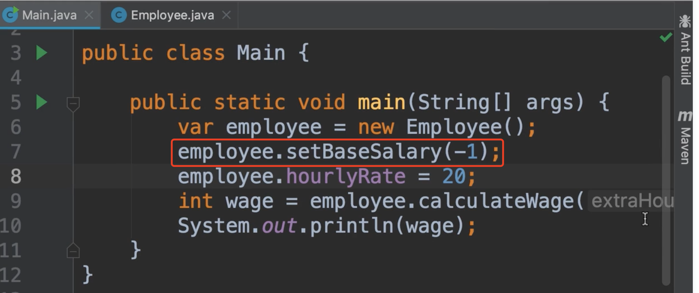

我们执行一下看一下：

​	不出意外程序终止了，然后提示这个异常是，非法的参数

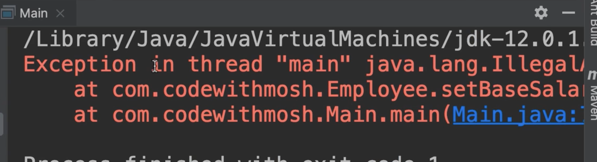

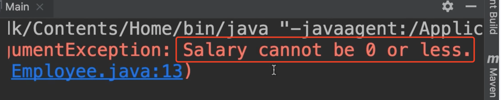

​	我们现在已经阻止了employee对象进入无效的状态，现在如果你想了解这份薪水的值呢？

​	我们无法从外部访问此字段，我们可以创建一个类似的方法，如getBaseSalary()

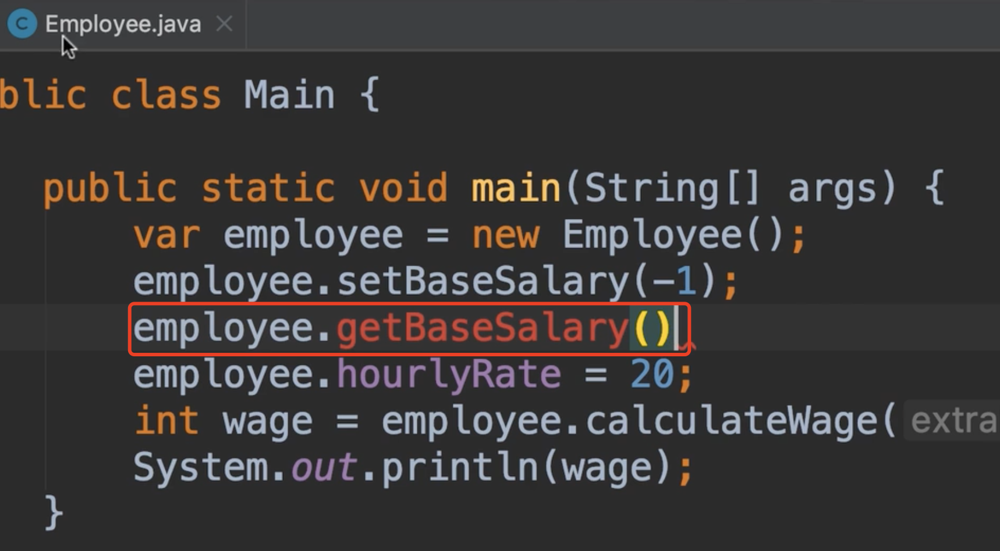

我们回到我们的employee类中，我们创建新的方法

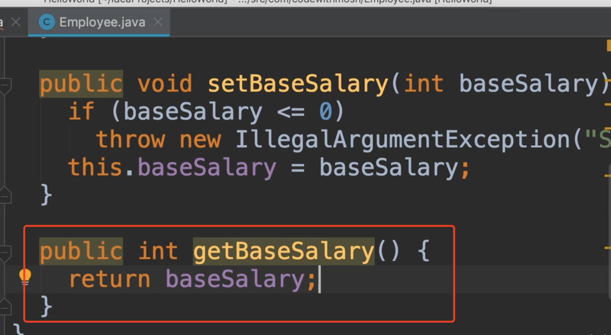

​		我们在这里看到的这些方法在java中非常常见，我们把他们称为setter，getter，因为我们使用他们设置或获取字段的值，所以在java中我们想把我们的字段设置为私有，相反，我们希望添加getter和setter为他们工作，我们下节解释原因

​	我们使用idea快速创建getter和setter，使用一个快捷键操作是，将光标放在字段上，我们可以看到一个黄色的小灯泡

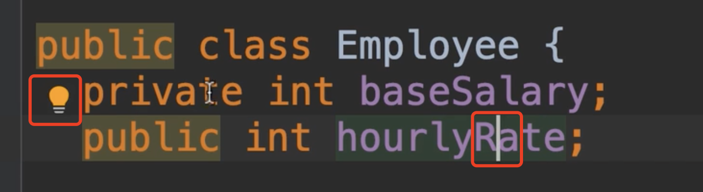

​	然后单击他或是按Alt键

​		第一项：封装字段，回车

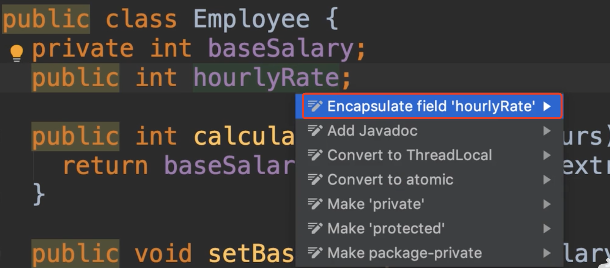

​		你可以看到我们在这个类中的字段，第一个字段为灰色是因为我们已经设置了getter和setter了，我们勾选第二个字段，Getter和Setter里面的内容是建议使用这些名称创建

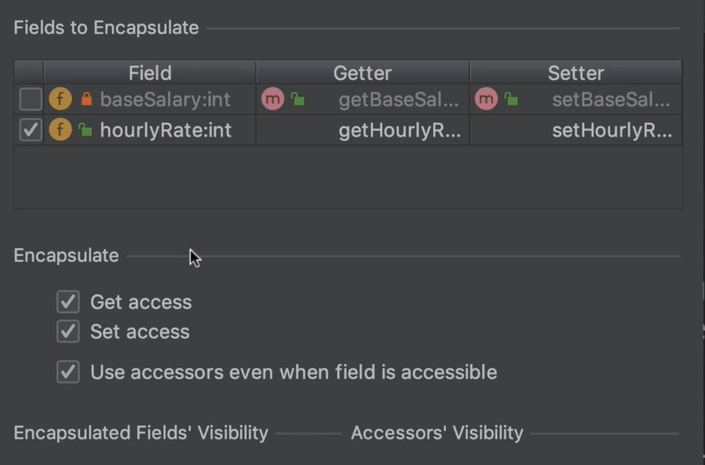

​	有时候我们只需要一个只读字段，那么我们就只创建一个getter就可以了，那么我们就取消setter的勾选就可以了

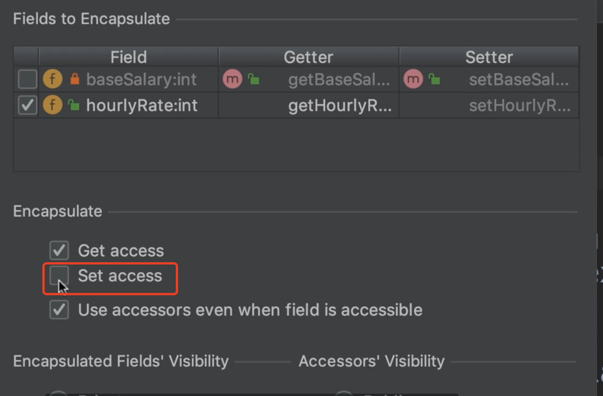

 在最下面我们还可以勾选选择字段的可见范围

最后我们把基本工资改为正常，我们测试一下：

​		而且这里看到没idea字段为我们修改了赋值的语句（之前是公开的直接赋的值）

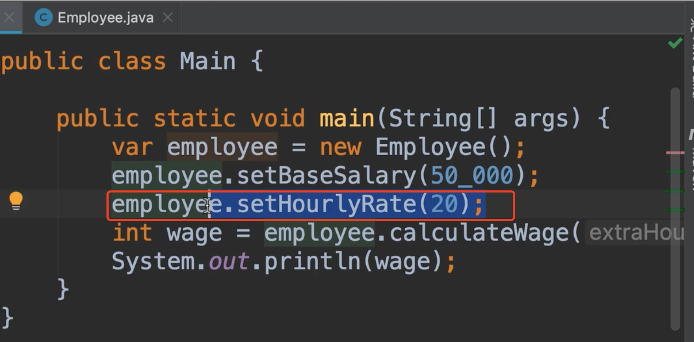

