# 9.抽象Abstraction

​		现在我们谈谈abstraction抽象

​		抽象意味着应该通过隐藏不必要的细节来降低复杂性，不幸的是，这是最容易被误解的概念之一，在面向对象中，很多人不知道抽象是什么。

​		通过隐藏不必要的细节来降低复杂性。

​		所以我们比喻一下，想想遥控器，你的电视，遥控器有一系列的按钮，可以让你操作这台电视，在这个遥控器里，我们有一个电子版，一堆晶体管等等

​		我们不直接使用这些晶体管和内部实现细节，这太复杂了，我们也不想明白，我们只是想改变我们电视的频道，我们不在乎发生了什么在底层，我们不在乎晶体管的状态，这就是在行动Action中的抽象，所以我们想要隐藏抽象类的细节，并将其视为一个黑匣子。我们不在乎里面有什么，我们只是有一个简单的界面，就像遥控器的按钮一样。

​	回到代码，之前我们将这些字段设置为私有字段，因为这些字段很可能是遥控器内的晶体管，我们不想直接在这些领域工作，他们是实现细节，下面我们考虑如何去做

​	将数据存储在employee对象中，目前我们使用俩个整数，如果明天我们决定用数组替换这俩个整数呢？

​	如果我们做了这个改变使用数组，所有其他使用employee这个类的类都得做出修改，所以我们想隐藏细节，并公开一系列供他人使用的方法，比如我们有Setter、getter，与baseSalary字段配合，现在我们有这种1：1的 （一个字段，一个getter一个setter），但在更复杂的应用程序中，我们不一定公开getter，setter和字段信息。

​	例如我们可能有一个TV对象，只需要调用setChanel方法，该方法将在内部设置几个不同的字段，我们并不知道是那些字段，设置为什么值，我们不在乎，我们只是想换电视频道

​	所以请记住面向对象编程的抽象原则，我们**应该通过隐藏来降低复杂性**。（隐藏不必要的细节）

​	但抽象还有很多好处，可以解决耦合的问题

#### Coupling 耦合

​	那么，耦合到底是怎么回事？耦合是关于一个类依赖于多少或与其他类的结合多少

​	类之间依赖的等级

​	

​		比如，我们使用手机，所以你与手机连接起来了，这不是坏事，但你使用手机的次数越多，你就越依赖它，如果你使用手机每分钟都是不同的需要，那么你真的很依赖他，如果拿走你的手机，你的生活会很艰难。

​		面向对象中，我们有同样的概念，所以我们想减少类之间的耦合，现在，不存在没有耦合的情况或0耦合，总有耦合因为所有我们创建的类，应该一起来工作执行一些任务，我们只是想减少耦合。

​	例如：a类使用b类，所以他依赖于b，如果我们改变b类，那么a类可能也需要做出调整，依赖于a的其他类可能也需要调整，这目前可能不是什么大的问题，但如果一个真正复杂的应用程序中，可能会有数千个类，这就是我们耦合类多的问题

​	相互关联的关系越多，我们的修改代价就越高

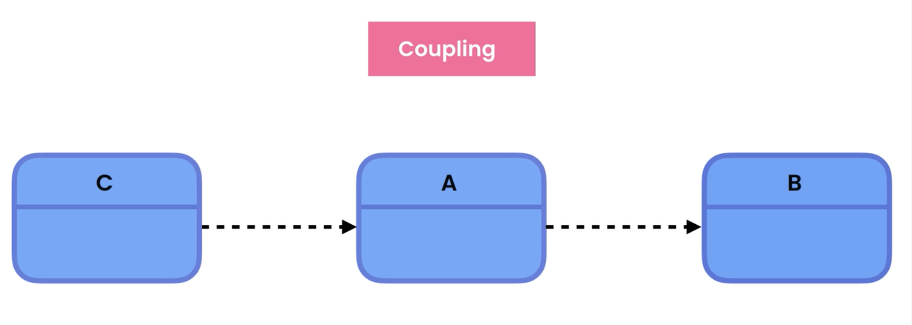

​	因此，通过减少耦合，我们可以减少变化的影响

#### 我们代码展示一下：

​		我们现在在main类中使用employee类，因此main类依赖employee类，那么我们的耦合点是什么？

​		第一个耦合点是创建 new Employee新实例，目前我们没有在这里传递任何参数，但是如果将来我们改变员工的等级，我们必须通过在创建员工的时候传入，然后我们就必须得在main主类中修改创建的实例加入参数，这个类中的代码必须重新编译

​		另一个耦合点是：设置基本工资的方法setBaseSalary--到第9行代码都属于耦合

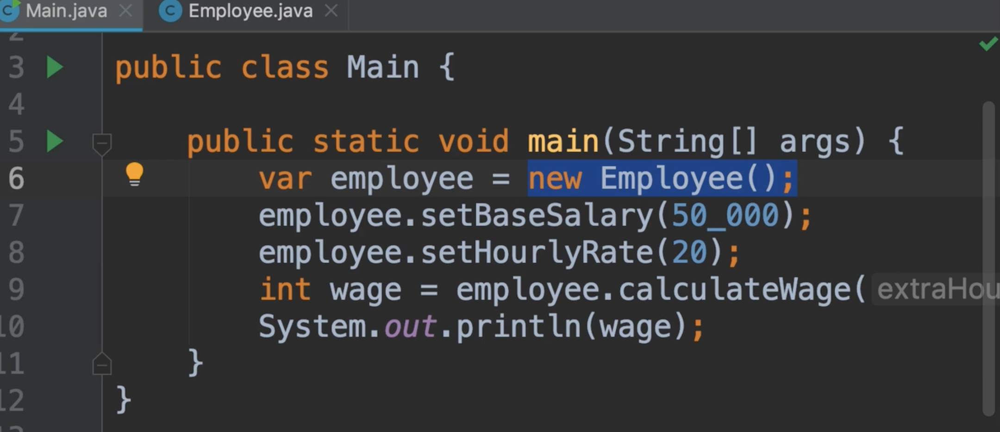

​	我们来看一下employee这个类的成员，在这里我们有几个方法，我们并没有在main类中使用，假设这些没有使用的方法真的是不没有要求这些方法的，如果我们不需要这些方法最好隐藏或者是删除他们，因为一个类提供的方法越多，其他类就越多的依赖

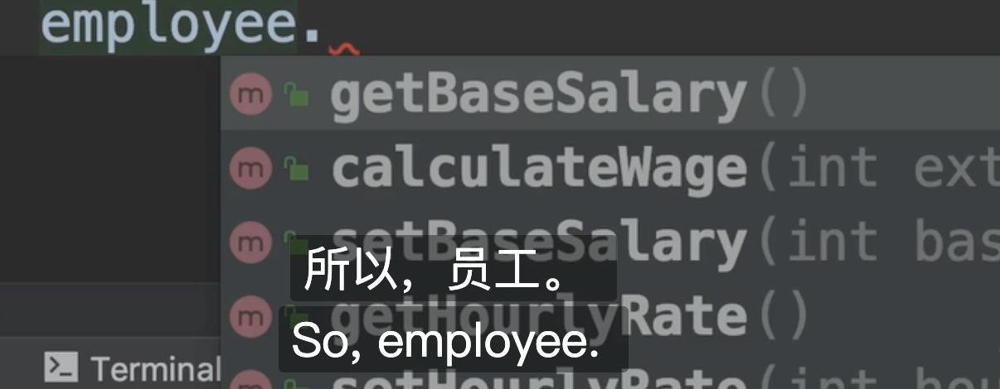

就像手机和安装在上面的应用一样，我们将于之结合，如果你的手机只有5个应用，那么你的手机有5个耦合点，如果有100个就有100个耦合点

 回到我们的代码中：

​	将getBaseSalary获取基本工资的方法私有化，我们把他隐藏了，这就是抽象行动Action，我们隐藏了不必要的细节，我们隐藏了实现的细节，通过这一点，我们正在降低复杂性

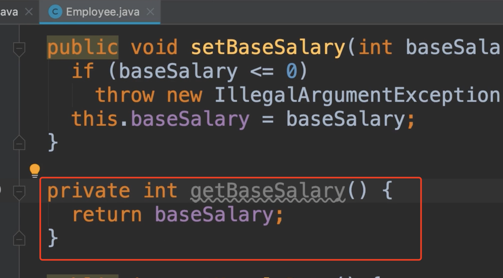

​	回到主类中，我们看到使用employee实例只有3个必要的方法了，所以这个类的接口是更简单，更容易使用，将来我们将有更少的耦合

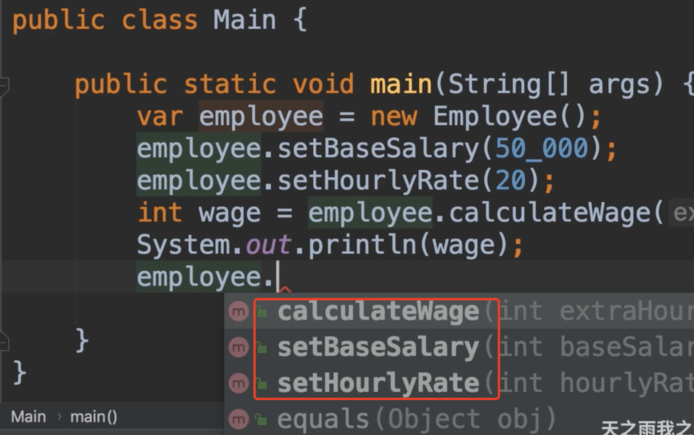

​	我们在比喻一下：你可能使用过其中的一个遥控器，按钮很多，很难使用。相反我们有这样按钮少的遥控器，非常简单和容易使用，所以遥控器上的按钮就像我们使用的类中的方法，减少暴露在外的这些方法和数量

#### Reducing Coupling 减少耦合

​	想象一下，我们想构建一个浏览器应用程序，我们创建一个浏览器类

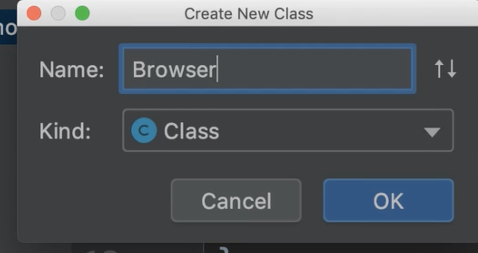

​	

​	创建一个导航方法，传入一个地址导航到该地址

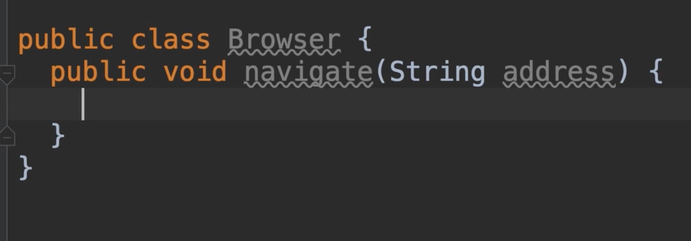

​	那么你首先要找到这个网站的IP地址，所以这个浏览器对象必须与dns服务器，用于查找给定网站的ip地址

​	在这个演示中，我们不想因为这么复杂而分心，我们可以假设查找网站的ip地址仅仅是一行代码。

​	所以我们将有一个单独的方法来获取ip地址，我们先创建方法传入参数，并希望返回String类型，然后我们会看到idea有个红色的灯泡，我们点击，然后点击create会为我们自动创建该方法

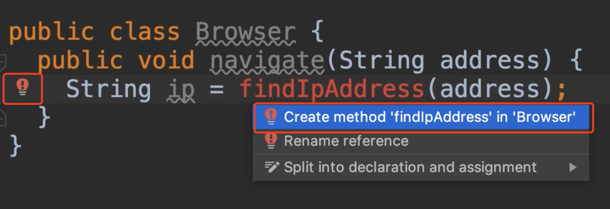

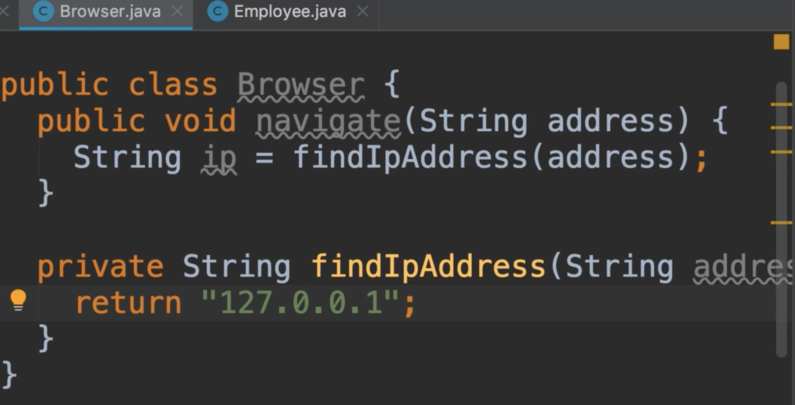

现在已经有了ip地址，接下来我们发送一个http请求，获取本网站主页的内容，所以我们可以创建另一个方法sendHttpRequest并穿入这个ip地址

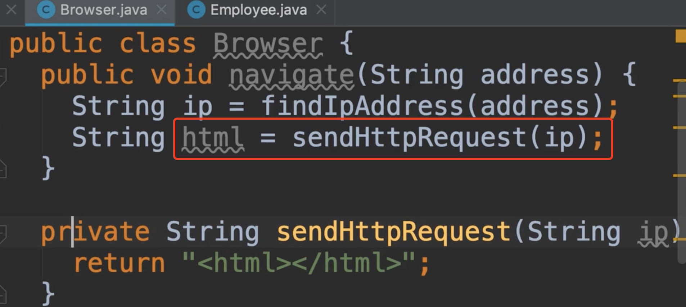

​	我们继续：我们对于这个演示，我们可以将获取的请求内容在终端上打印出来

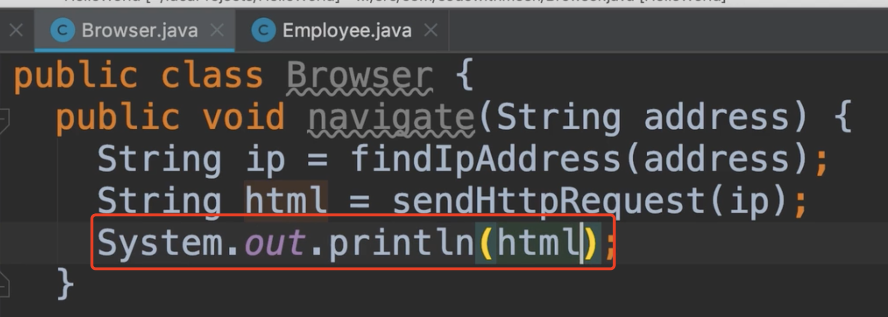

好了，现在我们开始使用这个浏览器

​	在main主类中我们需要创建这个浏览器实例，现在我们展示一下idea的捷径，我们输入new Browser 然后alt+enter，会提示引入局部变量

​	我们还可以把光标放在类上，alt，会提示使用var 替换显式类型

我们可以看到有3个方法可以使用，但其实查询ip和发送请求是不必要的，我们可以把这俩个方法隐藏掉，我们只需要导航方法来获取网站内容

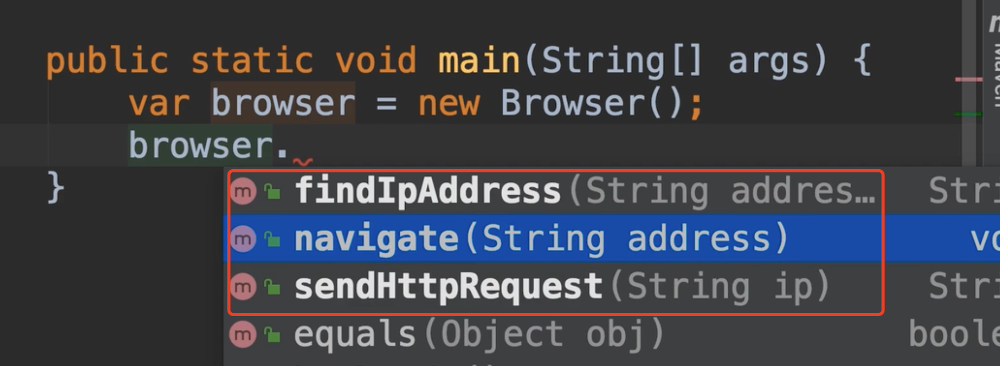

将他们都设置为私有

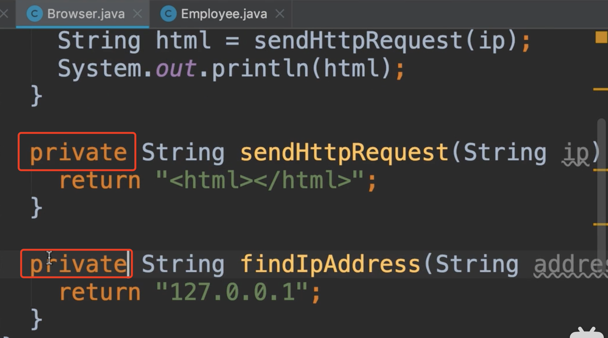

现在我们只有这一个导航方法了，当然我们还要其他想equals方法等等，他们是继承的方法

​	如果我们决定每天修改获取ip的方法和发送请求的方法，我们的main主类是不会收到影响的，其他使用这个类也是不会受到影响的

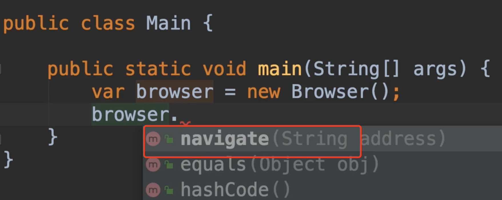

​		很多对于使用面向对象失败的设计，原因就是不知道耦合变化的影响，不知道什么是抽象，他们做的只是具有字段和方法的类，这不是面向对象编程。因为面向对象有很多技术，他们不仅仅是一些字段和方法，这是一种思维方式，一种构建软件的方式。

​	所以，再一次记住抽象的原则是：减少和隐藏不必要的细节减少复杂性。

​	

