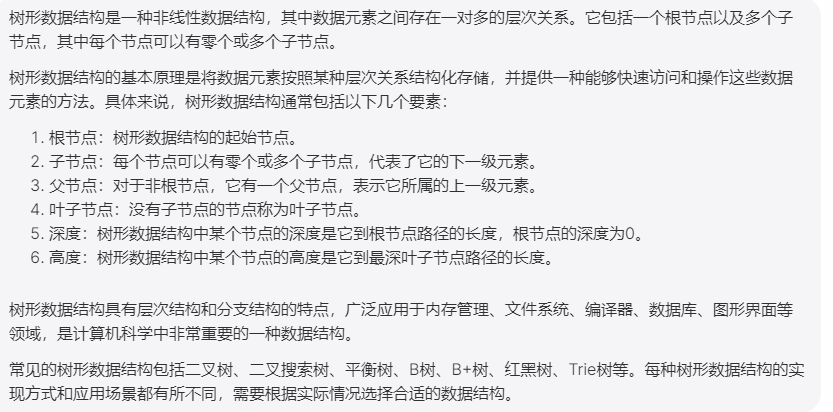

# 2、如何学习数据结构

## 	1、我们为什么要学习数据结构

```
学习数据结构对于计算机科学和编程非常重要。以下是几个原因：

提高编程能力：学习数据结构可以提高编程能力，让你更好地理解如何组织和操作数据，从而开发更高效、更可靠的代码。

移植性：在不同的编程语言和框架中，许多基本数据结构都是通用的。因此，通过有关数据结构的学习，你将获得可转移的技能，能够在各种环境和情况下快速学习和调整代码。

符合算法理念：一些高效算法的实现依赖于适当的数据结构。因此，学习数据结构可以帮助你更好地理解算法的工作原理，并实现更优秀、更高效的代码。

提高面试能力：在面试时，数据结构通常是面试官问到的问题之一。对数据结构掌握的越好，你在面试中的表现就越优秀，从而提高了获得工作的机会。

总之，学习数据结构可以提高你的编程技能，并增加你在职业中的机会和发展空间。因此，建议积极学习和实践不同类型的数据结构，从而提升自己的能力。
```


​	


## 2、数据结构的种类


Java 中可以使用多种数据结构，包括但不限于以下几种：

1. 数组（Array）：数组是一种线性数据结构，它将元素按照顺序存储在一段连续的内存中。

   

2. 链表（Linked List）：链表也是一种线性数据结构，它将元素存储在一个链式结构中，每个节点包含一个元素和一个指向下一个节点的指针。

   

3. 栈（Stack）：栈是一种具有“后进先出”（Last In First Out）特性的数据结构。

   

4. 队列（Queue）：队列是一种具有“先进先出”（First In First Out）特性的数据结构。

   

5. 树（Tree）：树是一种非线性数据结构，其中每个节点都可以有零个或多个子节点。

   

6. 散列表（Hash Table）：散列表是一种根据键值对存储和访问数据的数据结构。

   

7. 堆（Heap）：堆是一种特殊的树形数据结构，其中每个节点的键值都小于或等于其子节点的键值或者都大于或等于其子节点的键值。

   

可以通过理解每种数据结构的基本原则、特性、操作等来学习它们。深入学习数据结构还可以探讨算法的实现和复杂度分析等更加高级的内容。

在学习数据结构时，建议多练习编写代码来加深对数据结构的理解。此外，了解不同数据结构的优缺点，能够正确选择不同数据结构来解决问题也是非常重要的。


#### 2.1、数组


#### 2.2、链表


#### 2.3、栈


#### 2.4、队列


#### 2.5、树形数据结构




#### 2.6、散列表

##### 		单向数据列表：

##### 		双向数据链表：

​			双向链表（Doubly Linked List），也叫双向链表、双面链表，是一种链式数据结构，其每个节点除了包括一个指向后继节点的指针外，还包括一个指向前驱节点的指针。

相比于单向链表，双向链表可以双向遍历，查找某个节点的前驱节点或后继节点的时间复杂度均为 O(1)，而单向链表只能从前往后遍历并且只能查找后继节点。


   使用java实现的双向链表--

```java
public class DoublyLinkedList {
    private Node head; // 头节点
    private Node tail; // 尾节点
    private int size; // 链表长度

    private class Node {
        int val;
        Node prev; // 前驱指针
        Node next; // 后继指针

        Node(int val) {
            this.val = val;
            this.prev = null;
            this.next = null;
        }
    }

    public DoublyLinkedList() {
        head = null;
        tail = null;
        size = 0;
    }

    public int get(int index) {
        if (index < 0 || index >= size) {
            return -1;
        }
        Node p;
        if (index < size / 2) { // 从头节点开始查找
            p = head;
            for (int i = 0; i < index; i++) {
                p = p.next;
            }
        } else { // 从尾节点开始查找
            p = tail;
            for (int i = size - 1; i > index; i--) {
                p = p.prev;
            }
        }
        return p.val;
    }

    public void addAtHead(int val) {
        Node p = new Node(val);
        if (head == null) {
            head = p;
            tail = p;
        } else {
            p.next = head;
            head.prev = p;
            head = p;
        }
        size++;
    }

    public void addAtTail(int val) {
        Node p = new Node(val);
        if (tail == null) {
            head = p;
            tail = p;
        } else {
            tail.next = p;
            p.prev = tail;
            tail = p;
        }
        size++;
    }

    public void addAtIndex(int index, int val) {
        if (index < 0 || index > size) {
            return;
        }
        if (index == 0) {
            addAtHead(val);
            return;
        }
        if (index == size) {
            addAtTail(val);
            return;
        }
        Node p = new Node(val);
        Node q;
        if (index < size / 2) { // 从头结点开始遍

```


```
# 双向数据列表的思路
当我们创建一个双向链表对象时，会初始化一个头节点 head 和尾节点 tail，以及链表长度 size（初始为 0）。其中，Node 表示双向列表中的节点，包含一个整型值 val，以及两个指针 prev 和 next，分别指向该节点的前驱节点和后继节点。

addAtHead() 方法会在链表头部添加一个节点，我们创建一个新的节点 p，将 head 的前驱指针指向 p，p 的后继指针指向 head，再将 head 指向 p，这样新节点就被插入到了头部。

addAtTail() 方法则会在链表尾部添加一个节点，与 addAtHead() 方法类似，只需要将新节点的前驱指针指向 tail，tail 的后继指针指向 p，再将 tail 指向 p 即可。

get() 方法用于获取链表中指定位置的元素。如果 index 超出了链表范围，则返回 -1。我们可以根据 index 的位置来遍历链表，如果 index 小于 size 的一半，就从头部开始往后遍历；如果 index 大于等于 size 的一半，就从尾部开始往前遍历，直到找到对应的节点。

addAtIndex() 方法在指定位置插入一个节点，先判断是否在链表范围内，如果是在表头或表尾，就直接调用 addAtHead() 或 addAtTail() 方法；否则需要在 index 位置前面插入节点，具体实现方式类似于 get() 方法中的遍历方式。

以上就是这个双向链表例子的主要思路


```


#### 2.7、堆

​	堆是一种特殊的树形数据结构，它满足以下两个条件：

1. 堆是一棵完全二叉树，即除最后一层外，其它各层的节点数都达到最大值，最后一层的节点都集中在左边。

   

2. 任意节点的值都大于或等于（或小于或等于）其左右子节点的值。

   

根据第二个条件，可以将堆分为两种类型：最大堆和最小堆。最大堆是一种满足任意节点的值都大于或等于其左右子节点的值的堆，根节点是堆中的最大值；最小堆则是一种满足任意节点的值都小于或等于其左右子节点的值的堆，根节点是堆中的最小值

​	

​	例如：使用场景

​		堆的使用场景十分广泛，它们通常被用来实现优先队列、堆排序、图算法（如最短路径）等。在 Java 中，可以使用 java.util.PriorityQueue 类来实现最小堆， PriorityQueue 按照指定的比较器自动维护堆的性质。

以下是一个使用 PriorityQueue 实现最小堆的例子：

```java
import java.util.PriorityQueue;

public class MinHeapExample {
    public static void main(String[] args) {
        int[] nums = { 5, 4, 3, 2, 1 };
        PriorityQueue<Integer> minHeap = new PriorityQueue<>();
        for (int num : nums) {
            minHeap.add(num);
        }
        while (!minHeap.isEmpty()) {
            System.out.print(minHeap.poll() + " ");
        }
    }
}

// Output: 1 2 3 4 5

```

以上代码中，首先定义了一个整型数组 nums，然后使用 PriorityQueue 实现最小堆。使用 add() 方法将数组中的元素添加到最小堆中，使用 poll() 方法依次弹出最小元素并输出 -- 每次都是拿出最小的


## 3、 为什么要学习算法

​	学习算法的主要目的是为了提高解决问题的能力和效率。算法是解决各种问题的核心工具，包括排序、查找、图形处理、网络流量和加密等领域都有广泛的应用。以下是一些例子:

1. 提高代码效率：好的算法可以帮助你优化代码执行效率，减少计算机资源的浪费，从而改善程序性能。

   

2. 数据分析： 通过算法，可以处理大量的数据，实现数据分析、挖掘和预测。

   

3. 人工智能：算法是人工智能的基础，机器学习、深度学习等领域都需要广泛的算法支持。

   

4. 优化决策：算法可以用于解决最优化问题，如优化目标函数或查询制约条件，帮助决策者做出更优的决策。

   

5. 解决复杂问题：通过算法，我们可以解决许多难以计算的问题，如旅行商问题、最大化团问题和图形着色问题等。

   

总之，掌握好的算法可以让你更加高效地解决各种问题，提高程序效率和质量，同时提升自己的技能水平。


