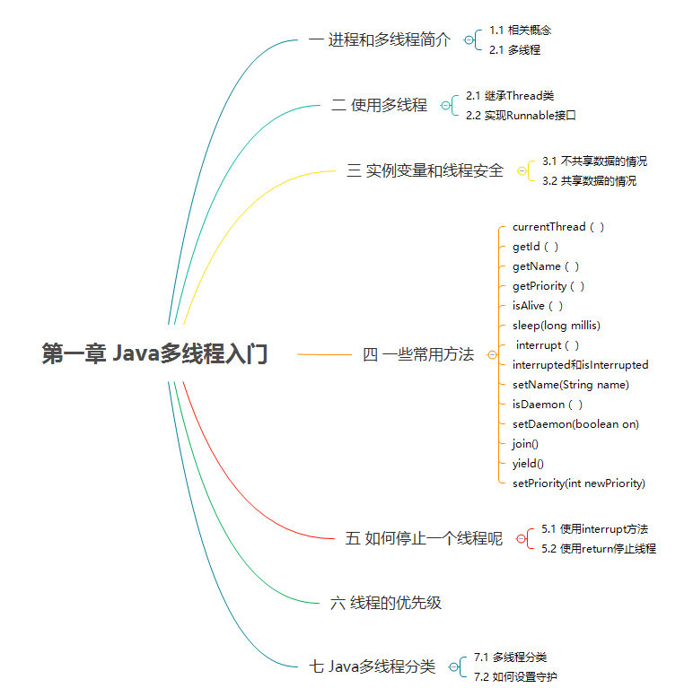
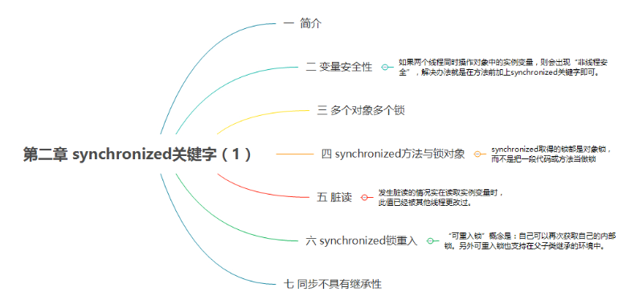
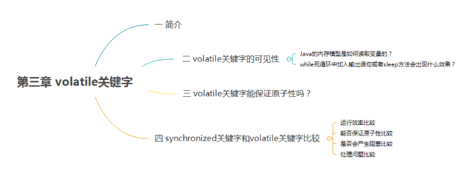
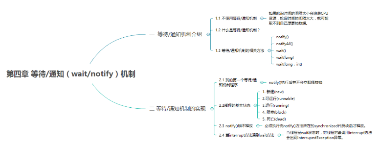
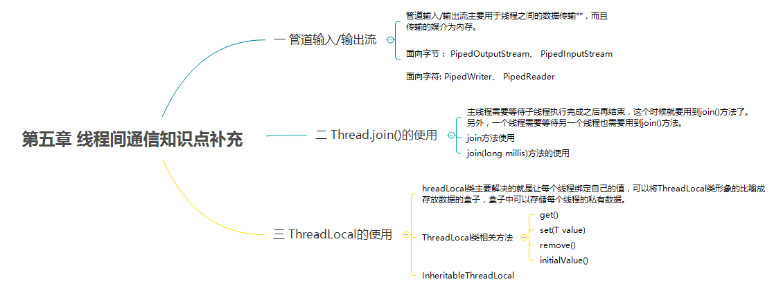
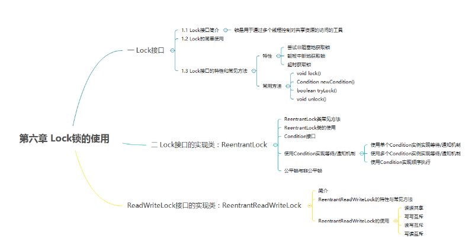
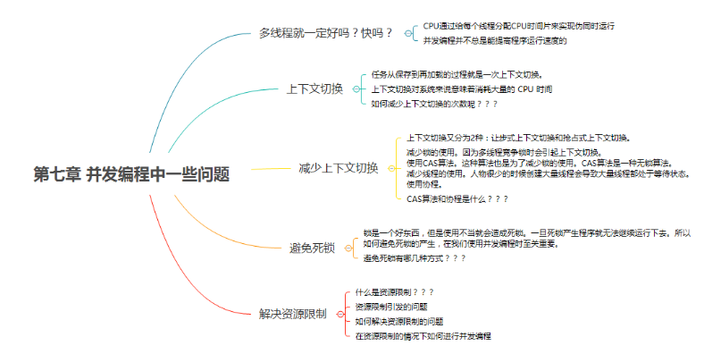
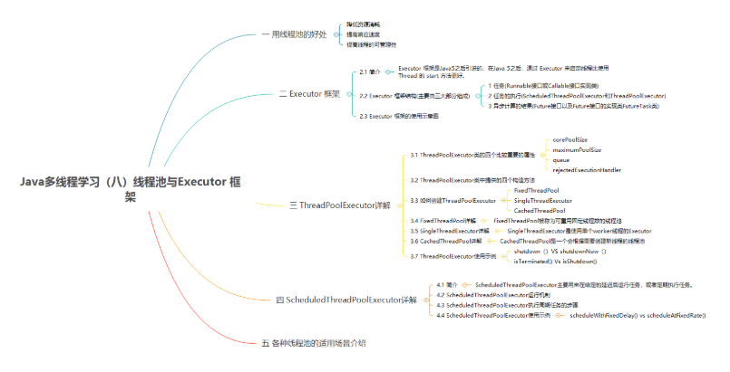

# 多线程系列
> ## 多线程系列文章
下列文章，我都更新在了我的博客专栏：[Java并发编程指南](https://blog.csdn.net/column/details/20860.html)。

1. [Java多线程学习（一）Java多线程入门](http://blog.csdn.net/qq_34337272/article/details/79640870)
2. [Java多线程学习（二）synchronized关键字（1）](http://blog.csdn.net/qq_34337272/article/details/79655194)
3.  [Java多线程学习（二）synchronized关键字（2）](http://blog.csdn.net/qq_34337272/article/details/79670775)
4. [Java多线程学习（三）volatile关键字](http://blog.csdn.net/qq_34337272/article/details/79680771)
5. [Java多线程学习（四）等待/通知（wait/notify）机制](http://blog.csdn.net/qq_34337272/article/details/79690279)

6. [Java多线程学习（五）线程间通信知识点补充](http://blog.csdn.net/qq_34337272/article/details/79694226)
7. [Java多线程学习（六）Lock锁的使用](http://blog.csdn.net/qq_34337272/article/details/79714196)
8. [Java多线程学习（七）并发编程中一些问题](https://blog.csdn.net/qq_34337272/article/details/79844051)
9. [Java多线程学习（八）线程池与Executor 框架](https://blog.csdn.net/qq_34337272/article/details/79959271)

> ## 多线程系列文章重要知识点与思维导图

###  Java多线程学习（一）Java多线程入门

###  Java多线程学习（二）synchronized关键字（1）

注意：**可重入锁的概念**。

   另外要注意：**synchronized取得的锁都是对象锁，而不是把一段代码或方法当做锁。** 如果多个线程访问的是同一个对象，哪个线程先执行带synchronized关键字的方法，则哪个线程就持有该方法，那么其他线程只能呈等待状态。如果多个线程访问的是多个对象则不一定，因为多个对象会产生多个锁。

###  Java多线程学习（二）synchronized关键字（2）

   **注意：**

   - 其他线程执行对象中**synchronized同步方法**（上一节我们介绍过，需要回顾的可以看上一节的文章）和**synchronized(this)代码块**时呈现同步效果;
   - **如果两个线程使用了同一个“对象监视器”（synchronized(object)）,运行结果同步，否则不同步**.

   **synchronized关键字加到static静态方法**和**synchronized(class)代码块**上都是是给**Class类**上锁，而**synchronized关键字加到非static静态方法**上是给**对象**上锁。

   数据类型String的常量池属性:**在Jvm中具有String常量池缓存的功能**

###  Java多线程学习（三）volatile关键字

   **注意：**

   **synchronized关键字**和**volatile关键字**比较

### Java多线程学习（四）等待/通知（wait/notify）机制

### Java多线程学习（五）线程间通信知识点补充

   **注意：** ThreadLocal类主要解决的就是让每个线程绑定自己的值，可以将ThreadLocal类形象的比喻成存放数据的盒子，盒子中可以存储每个线程的私有数据。

###  Java多线程学习（六）Lock锁的使用

   

### Java多线程学习（七）并发编程中一些问题

### Java多线程学习（八）线程池与Executor 框架

