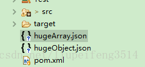

# 4.FastJson的使用心得


#### 1.1主要API

fastjson入口类是com.alibaba.fastjson.JSON，主要的API是JSON.toJSONString，和parseObject。

```java
 package com.alibaba.fastjson;
 public abstract class JSON {
       public static final String toJSONString(Object object);
       public static final <T> T parseObject(String text, Class<T> clazz, Feature... features);
 }

```


**序列化**

```java
String jsonString = JSON.toJSONString(obj);
```


**反序列化**

```java
VO vo = JSON.parseObject("...", VO.class);
```


**泛型反序列化**

```java
import com.alibaba.fastjson.TypeReference;
List<VO> list = JSON.parseObject("...", new TypeReference<List<VO>>() {});

```


#### 1.2基本使用


**User类**

```java
 1 package json.fastjson.base;
 2 ​
 3 public class User {
 4 ​
 5     private Long id;
 6     private String name;
 7 ​
 8     public Long getId() {
 9         return id;
10     }
11 ​
12     public void setId(Long id) {
13         this.id = id;
14     }
15 ​
16     public String getName() {
17         return name;
18     }
19 ​
20     public void setName(String name) {
21         this.name = name;
22     }
23 ​
24     @Override
25     public String toString() {
26         return "User [id=" + id + ", name=" + name + "]";
27     }
28 }

```


**Group类**

```java
 1 package json.fastjson.base;
 2 ​
 3 import java.util.ArrayList;
 4 import java.util.List;
 5 ​
 6 public class Group {
 7 ​
 8     private Long id;
 9     private String name;
10     private List<User> users = new ArrayList<User>();
11 ​
12     public Long getId() {
13         return id;
14     }
15 ​
16     public void setId(Long id) {
17         this.id = id;
18     }
19 ​
20     public String getName() {
21         return name;
22     }
23 ​
24     public void setName(String name) {
25         this.name = name;
26     }
27 ​
28     public List<User> getUsers() {
29         return users;
30     }
31 ​
32     public void setUsers(List<User> users) {
33         this.users = users;
34     }
35 ​
36     public void addUser(User user) {
37         users.add(user);
38     }
39 ​
40     @Override
41     public String toString() {
42         return "Group [id=" + id + ", name=" + name + ", users=" + users + "]";
43     }
44 }

```


**测试类**

```java
 public class TestBase {

     public static void main(String[] args) {
         Group group = new Group();
         group.setId(0L);
         group.setName("admin");

         User guestUser = new User();
         guestUser.setId(2L);
         guestUser.setName("guest");

         User rootUser = new User();
         rootUser.setId(3L);
         rootUser.setName("root");

         group.addUser(guestUser);
         group.addUser(rootUser);

         List<User> userList = group.getUsers();

         // Group序列化
         String jsonString = JSON.toJSONString(group);
         System.out.println("Group序列化:" + jsonString);

         // Group反序列化
         jsonString = "{\"id\":0,\"name\":\"admin\",\"users\":[{\"id\":2,\"name\":\"guest\"},{\"id\":3,\"name\":\"root\"}]}";
         group = JSON.parseObject(jsonString, Group.class);
         System.out.println("Group反序列化:" + group);

         // List序列化
         jsonString = JSON.toJSONString(userList);
         System.out.println("List序列化:" + jsonString);

         // List泛型反序列化
         jsonString = "[{\"id\":2,\"name\":\"guest\"},{\"id\":3,\"name\":\"root\"}]";
         userList = JSON.parseObject(jsonString, new TypeReference<List<User>>() {});
         System.out.println("List反序列化:" + userList);
     }
 }
 结果:
 
 Group序列化:{"id":0,"name":"admin","users":[{"id":2,"name":"guest"},{"id":3,"name":"root"}]}
 Group反序列化:Group [id=0, name=admin, users=[User [id=2, name=guest], User [id=3, name=root]]]
 List序列化:[{"id":2,"name":"guest"},{"id":3,"name":"root"}]
 List反序列化:[User [id=2, name=guest], User [id=3, name=root]]

```


#### 1.3测试时间

```java
 public class TestDate {
 
     public static void main(String[] args) {
 
         User user = new User();
         user.setId(2L);
         user.setName("guest");
         user.setDate(new Date());
 
         // 序列化
         String jsonString = JSON.toJSONString(user);
         System.out.println("序列化:" + jsonString);
 
         // 序列化处理时间，方式一
         jsonString = JSON.toJSONStringWithDateFormat(user, "yyyy-MM-dd HH:mm:ss.SSS");
         System.out.println("序列化处理时间，方式一:" + jsonString);
 
         // 序列化处理时间，方式二：ISO-8601日期格式
         jsonString = JSON.toJSONString(user, SerializerFeature.UseISO8601DateFormat);
         System.out.println("序列化处理时间，方式二：ISO-8601日期格式:" + jsonString);
 
         // 序列化处理时间，方式三：全局修改日期格式
         JSON.DEFFAULT_DATE_FORMAT = "yyyy-MM-dd";
         jsonString = JSON.toJSONString(user, SerializerFeature.WriteDateUseDateFormat);
         System.out.println("序列化处理时间，方式三：全局修改日期格式:" + jsonString);
 
     }
 }
 
 测试结果
 
 序列化:{"date":1558595807672,"id":2,"name":"guest"}
 序列化处理时间，方式一:{"date":"2019-05-23 15:16:47.672","id":2,"name":"guest"}
 序列化处理时间，方式二：ISO-8601日期格式:{"date":"2019-05-23T15:16:47.672+08:00","id":2,"name":"guest"}
 序列化处理时间，方式三：全局修改日期格式:{"date":"2019-05-23","id":2,"name":"guest"}

```


#### 1.4JSONField和JSONType

- 一、JSONField 介绍 注意：1、若属性是私有的，必须有set*方法。否则无法反序列化。


```java
 1 public @interface JSONField {
 2     // 配置序列化和反序列化的顺序，1.1.42版本之后才支持
 3     int ordinal() default 0;
 4 
 5      // 指定字段的名称
 6     String name() default "";
 7     
 8     // 指定字段的格式，对日期格式有用
 9     String format() default "";
10     
11     // 是否序列化
12     boolean serialize() default true;
13     
14     // 是否反序列化
15     boolean deserialize() default true;
16 
17 }

```


二、JSONField 配置方式 FieldInfo可以配置在getter/setter方法或者字段上。例如：

- **2.1 配置在getter/setter上**

```java
1 public class A {
2       private int id;
3 
4       @JSONField(name="ID")
5       public int getId() {return id;}
6       @JSONField(name="ID")
7       public void setId(int value) {this.id = id;}
8 
9  }

```

**2.2 配置在field上**


```java
public class A {
  @JSONField(name="ID")
  private int id;
  public int getId() {return id;}
  public void setId(int value) {this.id = id;}
 }

```


- 三、使用format配置日期格式化

```java
public class A {
      // 配置date序列化和反序列使用yyyyMMdd日期格式
      @JSONField(format="yyyyMMdd")
      public Date date;
 }
```


- 四、使用serialize/deserialize指定字段不序列化


```java
1 public class A {
2       @JSONField(serialize=false)
3       public Date date;
4  }
5 
6  public class A {
7       @JSONField(deserialize=false)
8       public Date date;
9  }

```


- 五、使用ordinal指定字段的顺序

```java
ordinal 默认值为 0

public static class VO {
    @JSONField(ordinal = 3)
    private int f0;

    @JSONField(ordinal = 2)
    private int f1;
    
    @JSONField(ordinal = 1)
    private int f2;

}

```


- 六、使用serializeUsing制定属性的序列化类

```
在fastjson 1.2.16版本之后，JSONField支持新的定制化配置serializeUsing，可以单独对某一个类的某个属性定制序列化，比如：
```

```java
 1 public static class Model {
 2     @JSONField(serializeUsing = ModelValueSerializer.class)
 3     public int value;
 4 }
 5 
 6 public static class ModelValueSerializer implements ObjectSerializer {
 7     @Override
 8     public void write(JSONSerializer serializer, Object object, Object fieldName, Type fieldType,
 9                       int features) throws IOException {
10         Integer value = (Integer) object;
11         String text = value + "元";
12         serializer.write(text);
13     }
14 }

```


**测试代码**

```java
 Model model = new Model();
 model.value = 100;
 String json = JSON.toJSONString(model);
 Assert.assertEquals("{\"value\":\"100元\"}", json);
 
 JSONType和JSONField类似，但JSONType配置在类上，而不是field或者getter/setter方法上。这里就不再介绍了。
 
 public class User {
 
     @JSONField(name = "ID", ordinal = 3, serializeUsing = UserIDValueSerializer.class)
     private Long id;
     @JSONField(serialize = false)
     private String name;
     @JSONField(serialize = true, ordinal = 2)
     private String sex;
     
     @JSONField(deserialize = false)
     private String address;
     @JSONField(deserialize = true)
     private String phone;
     
     // 配置date序列化和反序列使用yyyyMMdd日期格式
     @JSONField(format = "yyyyMMdd", ordinal = 1)
     private Date date;
     
     public Long getId() {
         return id;
     }
     
     public void setId(Long id) {
         this.id = id;
     }
     
     public String getName() {
         return name;
     }
     
     public void setName(String name) {
         this.name = name;
     }
     
     public Date getDate() {
         return date;
     }
     
     public void setDate(Date date) {
         this.date = date;
     }
     
     public String getSex() {
         return sex;
     }
     
     public void setSex(String sex) {
         this.sex = sex;
     }
     
     public String getAddress() {
         return address;
     }
     
     public void setAddress(String address) {
         this.address = address;
     }
     
     public String getPhone() {
         return phone;
     }
     
     public void setPhone(String phone) {
         this.phone = phone;
     }}
     
     UserIDValueSerializer 类：
 
 package json.fastjson.JSONField;
 
 import java.io.IOException;
 import java.lang.reflect.Type;
 
 import com.alibaba.fastjson.serializer.JSONSerializer;
 import com.alibaba.fastjson.serializer.ObjectSerializer;
 
 public class UserIDValueSerializer implements ObjectSerializer {
     @Override
     public void write(JSONSerializer serializer, Object object, Object fieldName, Type fieldType, int features) throws IOException {
         //serializer:{"address":"杭州","phone":"18603396966","date":"20180125","sex":"男","ID":
         //object:100
         //fieldName:ID
         //fieldType:class java.lang.Long
         //features:0
         Long value = (Long) object;
         String text = value + "元";
         serializer.write(text);
     }
 }

```


**测试类**

```java
 1 package json.fastjson.JSONField;
 2 
 3 import java.util.Date;
 4 
 5 import com.alibaba.fastjson.JSON;
 6 
 7 public class TestJSONField {
 8 
 9     public static void main(String[] args) {
10         User user = new User();
11         user.setId(100L);
12         user.setName("WaKengMaiNi");
13         user.setSex("男");
14         user.setAddress("杭州");
15         user.setPhone("18603396966");
16         user.setDate(new Date());
17     
18         // User序列化
19         String jsonString = JSON.toJSONString(user);
20         System.out.println("User序列化:" + jsonString);
21     }
22 
23 }

```


**输出结果**

```java
User序列化:{"address":"杭州","phone":"18603396966","date":"20180125","sex":"男","ID":"100元"}
```


#### 1.5通过SerializeFilter定制序列化

PropertyPreFilter 根据PropertyName判断是否序列化； PropertyFilter 根据PropertyName和PropertyValue来判断是否序列化； NameFilter 修改Key，如果需要修改Key，process返回值则可； ValueFilter 修改Value； BeforeFilter 序列化时在最前添加内容； AfterFilter 序列化时在最后添加内容。


##### 1.5.1 PropertyFilter

​	**根据PropertyName和PropertyValue来判断是否序列化**

```java
 public class TestPropertyFilter {
 
     public static void main(String[] args) {
         PropertyFilter filter = new PropertyFilter() {
 
             @Override
             public boolean apply(Object source, String name, Object value) {
 
                 System.out.println("----------------source=" + source);
                 System.out.println("----------------name=" + name);
                 System.out.println("----------------value=" + value);
                 System.out.println("");
                 // 属性是id并且大于等于100时进行序列化
                 if ("id".equals(name)) {
                     long id = ((Long) value).longValue();
                     return id >= 100;
                 }
                 return false;
             }
         };
 
         User user = new User();
         user.setId(9L);
         user.setName("挖坑埋你");
 
         String jsonString = JSON.toJSONString(user, filter); // 序列化的时候传入filter
         System.out.println("序列化,id=9：" + jsonString + "\n");
 
         user.setId(200L);
         jsonString = JSON.toJSONString(user, filter); // 序列化的时候传入filter
         System.out.println("序列化,id=200：" + jsonString);
     }
 
 }
 测试结果
 
 ----------------source=User [id=9, name=挖坑埋你]
 ----------------name=id
 ----------------value=9
 
 ----------------source=User [id=9, name=挖坑埋你]
 ----------------name=name
 ----------------value=挖坑埋你
 
 序列化,id=9：{}
 
 ----------------source=User [id=200, name=挖坑埋你]
 ----------------name=id
 ----------------value=200
 
 ----------------source=User [id=200, name=挖坑埋你]
 ----------------name=name
 ----------------value=挖坑埋你
 
 序列化,id=200：{"id":200}

```


#### 1.5.2 NameFilter 序列化时修改Key

```java
 public class TestNameFilter {
 
     public static void main(String[] args) {
         User user = new User();
         user.setId(9L);
         user.setName("挖坑埋你");
 
         String jsonString = JSON.toJSONString(user); // 序列化的时候传入filter
         System.out.println("普通序列化：" + jsonString + "\n");
 
         NameFilter filter = new NameFilter() {
 
             @Override
             public String process(Object object, String name, Object value) {
                 System.out.println("----------------object=" + object);
                 System.out.println("----------------name=" + name);
                 System.out.println("----------------value=" + value);
                 System.out.println("");
                 // 属性是id是修改id的名字
                 if ("id".equals(name)) {
                     return name + "$";
                 }
                 return name;
             }
         };
 
         jsonString = JSON.toJSONString(user, filter); // 序列化的时候传入filter
         System.out.println("NameFilter序列化：" + jsonString + "\n");
 
         // fastjson内置一个PascalNameFilter，用于输出将首字符大写的Pascal风格
         jsonString = JSON.toJSONString(user, new PascalNameFilter()); // 序列化的时候传入filter
         System.out.println("PascalNameFilter序列化：" + jsonString + "\n");
     }
 
 }
 普通序列化：{"id":9,"name":"挖坑埋你"}
 
 ----------------object=User [id=9, name=挖坑埋你]
 ----------------name=id
 ----------------value=9
 
 ----------------object=User [id=9, name=挖坑埋你]
 ----------------name=name
 ----------------value=挖坑埋你
 
 NameFilter序列化：{"id$":9,"name":"挖坑埋你"}
 
 PascalNameFilter序列化：{"Id":9,"Name":"挖坑埋你"}

```


#### 1.5.3 ValueFilter 序列化时修改Value

```java
 1 public class TestValueFilter {
 2 
 3     public static void main(String[] args) {
 4         User user = new User();
 5         user.setId(9L);
 6         user.setName("挖坑埋你");
 7 
 8         String jsonString = JSON.toJSONString(user); // 序列化的时候传入filter
 9         System.out.println("普通序列化：" + jsonString + "\n");
10 
11         ValueFilter filter = new ValueFilter() {
12 
13             @Override
14             public Object process(Object object, String name, Object value) {
15                 System.out.println("----------------object=" + object);
16                 System.out.println("----------------name=" + name);
17                 System.out.println("----------------value=" + value);
18                 System.out.println("");
19                 // 属性是id时修改id的值
20                 if ("id".equals(name)) {
21                     long id = ((Long) value).longValue();
22                     return id + "$";
23                 }
24                 return value;
25             }
26         };
27 
28         jsonString = JSON.toJSONString(user, filter); // 序列化的时候传入filter
29         System.out.println("ValueFilter序列化：" + jsonString + "\n");
30     }
31 
32 }
33 测试结果：
34 普通序列化：{"id":9,"name":"挖坑埋你"}
35 
36 ----------------object=User [id=9, name=挖坑埋你]
37 ----------------name=id
38 ----------------value=9
39 
40 ----------------object=User [id=9, name=挖坑埋你]
41 ----------------name=name
42 ----------------value=挖坑埋你
43 
44 ValueFilter序列化：{"id":"9$","name":"挖坑埋你"}

```


#### 1.5.4 BeforeFilter 序列化时在最前添加内容

```java
 1 public static void main(String[] args) {
 2         User user = new User();
 3         user.setId(9L);
 4         user.setName("挖坑埋你");
 5 
 6         String jsonString = JSON.toJSONString(user); // 序列化的时候传入filter
 7         System.out.println("普通序列化：" + jsonString + "\n");
 8 
 9         BeforeFilter filter = new BeforeFilter() {
10 
11             @Override
12             public void writeBefore(Object object) {
13 
14                 System.out.println("----------------object=" + object);
15 
16                 User user = (User) object;
17                 System.out.println(
18                         "----------------User.id=" + user.getId() + " " + "User.name=" + user.getName() + "\n");
19                 user.setName(user.getName() + "$$$");
20             }
21         };
22 
23         jsonString = JSON.toJSONString(user, filter); // 序列化的时候传入filter
24         System.out.println(user);
25         System.out.println("BeforeFilter序列化：" + jsonString + "\n");
26 
27     }
28 测试结果
29 
30 普通序列化：{"id":9,"name":"挖坑埋你"}
31 在序列化之前就修改值，这样拿到的是变化的。
32 ----------------object=User [id=9, name=挖坑埋你]
33 ----------------User.id=9 User.name=挖坑埋你
34 
35 User [id=9, name=挖坑埋你$$$]
36 BeforeFilter序列化：{"id":9,"name":"挖坑埋你$$$"}

```


#### 1.5.5  AfterFilter 序列化时在最后添加内容

```java
 1 public static void main(String[] args) {
 2         User user = new User();
 3         user.setId(9L);
 4         user.setName("挖坑埋你");
 5 
 6         String jsonString = JSON.toJSONString(user); // 序列化的时候传入filter
 7         System.out.println("普通序列化：" + jsonString + "\n");
 8 
 9         AfterFilter filter = new AfterFilter() {
10 
11             @Override
12             public void writeAfter(Object object) {
13 
14                 User user = (User) object;
15                 System.out.println("------------User.id=" + user.getId() + " " + "User.name=" + user.getName() + "\n");
16                 user.setName(user.getName() + "$$$");
17             }
18         };
19 
20         jsonString = JSON.toJSONString(user, filter); // 序列化的时候传入filter
21         System.out.println("AfterFilter序列化：" + jsonString + "\n");
22         System.out.println(user);
23 
24     }
25 测试结果
26 
27 普通序列化：{"id":9,"name":"挖坑埋你"}
28 
29 ------------User.id=9 User.name=挖坑埋你
30 
31 AfterFilter序列化：{"id":9,"name":"挖坑埋你"}
32 
33 User [id=9, name=挖坑埋你$$$]

```


#### 1.6  定制反序列化

1.6.1 使用 ExtraProcessor 处理多余字段

```java
 1 public class VO {
 2     private int id;
 3     private Map<String, Object> attributes = new HashMap<String, Object>();
 4 
 5     public int getId() {
 6         return id;
 7     }
 8 
 9     public void setId(int id) {
10         this.id = id;
11     }
12 
13     public Map<String, Object> getAttributes() {
14         return attributes;
15     }
16 
17     @Override
18     public String toString() {
19         return "VO [id=" + id + ", attributes=" + attributes + "]";
20     }
21 }
22 
23 public class TestExtraProcessor {
24 
25     public static void main(String[] args) {
26 
27         ExtraProcessor processor = new ExtraProcessor() {
28             public void processExtra(Object object, String key, Object value) {
29 
30                 System.out.println("---------------object = " + object);
31                 System.out.println("---------------key = " + key);
32                 System.out.println("---------------value = " + value);
33                 System.out.println();
34 
35                 VO vo = (VO) object;
36                 vo.setId(789);// 修改一下id值
37                 vo.getAttributes().put(key, value);
38             }
39         };
40         // 这里name和phone是多余的，在VO里没有
41         VO vo = JSON.parseObject("{\"id\":123,\"name\":\"abc\",\"phone\":\"18603396954\"}", VO.class, processor);
42 
43         System.out.println("vo.getId() = " + vo.getId());
44         System.out.println("vo.getAttributes().get(\"name\") = " + vo.getAttributes().get("name"));
45         System.out.println("vo.getAttributes().get(\"phone\") = " + vo.getAttributes().get("phone"));
46     }
47 
48 }
49 测试结果：
50 
51 ---------------object = VO [id=123, attributes={}]
52 ---------------key = name
53 ---------------value = abc
54 
55 ---------------object = VO [id=789, attributes={name=abc}]
56 ---------------key = phone
57 ---------------value = 18603396954
58 
59 VO [id=789, attributes={phone=18603396954, name=abc}]
60 vo.getId() = 789
61 vo.getAttributes().get("name") = abc
62 vo.getAttributes().get("phone") = 18603396954

```


#### 1.6.2  使用ExtraTypeProvider 为多余的字段提供类型

```java
 1 public class TestExtraTypeProvider {
 2 
 3     public static void main(String[] args) {
 4 
 5         ExtraProcessor processor = new MyExtraProcessor();
 6 
 7         VO vo = JSON.parseObject("{\"id\":123,\"value\":\"123456\"}", VO.class, processor);
 8 
 9         System.out.println("vo.getId() = " + vo.getId());
10         System.out.println("vo.getAttributes().get(\"value\") = " + vo.getAttributes().get("value"));
11         System.out.println("vo.getAttributes().get(\"value\").getClass() = " + vo.getAttributes().get("value").getClass());
12         // value本应该是字符串类型的，通过getExtraType的处理变成Integer类型了。
13     }
14 
15 }
16 
17 class MyExtraProcessor implements ExtraProcessor, ExtraTypeProvider {
18     public void processExtra(Object object, String key, Object value) {
19         VO vo = (VO) object;
20         vo.getAttributes().put(key, value);
21     }
22 
23     public Type getExtraType(Object object, String key) {
24 
25         System.out.println("---------------object = " + object);
26         System.out.println("---------------key = " + key);
27         System.out.println();
28 
29         if ("value".equals(key)) {
30             return int.class;
31         }
32         return null;
33     }
34 };
35 ---------------object = VO [id=123, attributes={}]
36 ---------------key = value
37 
38 vo.getId() = 123
39 vo.getAttributes().get("value") = 123456
40 vo.getAttributes().get("value").getClass() = class java.lang.Integer

```


#### 1.7  处理超大对象和超大JSON文本

#### 1.7.1 超大Json数组序列化

```java
 1 public class TestHugeArraySerialize {
 2 
 3     public static void main(String[] args) throws IOException {
 4         JSONWriter writer = new JSONWriter(new FileWriter("hugeArray.json"));
 5         writer.startArray();
 6         for (int i = 0; i < 10; ++i) {
 7             writer.writeValue(new VO(i));
 8         }
 9         writer.endArray();
10         writer.close();
11     }
12 
13 }

```


**运行结果**




```java
[{"attributes":{},"id":0},{"attributes":{},"id":1},{"attributes":{},"id":2},{"attributes":{},"id":3},{"attributes":{},"id":4},{"attributes":{},"id":5},{"attributes":{},"id":6},{"attributes":{},"id":7},{"attributes":{},"id":8},{"attributes":{},"id":9}]

```


#### 1.7.2 超大JSON对象序列化

```java
public class TestHugeObjectSerialize {

    public static void main(String[] args) throws IOException {

        JSONWriter writer = new JSONWriter(new FileWriter("hugeObject.json"));
        writer.startObject();
        for (int i = 0; i < 10; ++i) {
            writer.writeKey("x" + i);
            writer.writeValue(new VO(i));
        }
        writer.endObject();
        writer.close();
    }

}
运行结果

{"x0":{"attributes":{},"id":0},"x1":{"attributes":{},"id":1},"x2":{"attributes":{},"id":2},"x3":{"attributes":{},"id":3},"x4":{"attributes":{},"id":4},"x5":{"attributes":{},"id":5},"x6":{"attributes":{},"id":6},"x7":{"attributes":{},"id":7},"x8":{"attributes":{},"id":8},"x9":{"attributes":{},"id":9}}
1

```


#### 1.7.3  超大JSON数组反序列化

```java
 1 public class TestHugeArrayDeserialize {
 2 
 3     public static void main(String[] args) throws IOException {
 4         // 读入上面输出的文件
 5         JSONReader reader = new JSONReader(new FileReader("hugeArray.json"));
 6         reader.startArray();
 7         while (reader.hasNext()) {
 8             VO vo = reader.readObject(VO.class);
 9             System.out.println(vo);
10         }
11         reader.endArray();
12         reader.close();
13     }
14 
15 }
16 VO [id=0, attributes={}]
17 VO [id=1, attributes={}]
18 VO [id=2, attributes={}]
19 VO [id=3, attributes={}]
20 VO [id=4, attributes={}]
21 VO [id=5, attributes={}]
22 VO [id=6, attributes={}]
23 VO [id=7, attributes={}]
24 VO [id=8, attributes={}]
25 VO [id=9, attributes={}]

```


#### 1.7.4  超大JSON对象反序列化

```java
 1 public class TestHugeObjectDeserialize {
 2 
 3     public static void main(String[] args) throws IOException {
 4         // 读入上面输出的文件
 5         JSONReader reader = new JSONReader(new FileReader("hugeObject.json"));
 6         reader.startObject();
 7         while (reader.hasNext()) {
 8             String key = reader.readString();
 9             VO vo = reader.readObject(VO.class);
10             System.out.println(key + "：" + vo);
11         }
12         reader.endObject();
13         reader.close();
14     }
15 
16 }
17 x0：VO [id=0, attributes={}]
18 x1：VO [id=1, attributes={}]
19 x2：VO [id=2, attributes={}]
20 x3：VO [id=3, attributes={}]
21 x4：VO [id=4, attributes={}]
22 x5：VO [id=5, attributes={}]
23 x6：VO [id=6, attributes={}]
24 x7：VO [id=7, attributes={}]
25 x8：VO [id=8, attributes={}]
26 x9：VO [id=9, attributes={}]

```


#### 1.8 SerializerFeature 特性的使用

| 名称                           | 含义                                                         |
| :----------------------------- | :----------------------------------------------------------- |
| QuoteFieldNames                | 输出key时是否使用双引号,默认为true                           |
| UseSingleQuotes                | 使用单引号而不是双引号,默认为false                           |
| WriteMapNullValue              | 是否输出值为null的字段,默认为false                           |
| WriteEnumUsingToString         | Enum输出name()或者original,默认为false                       |
| UseISO8601DateFormat           | Date使用ISO8601格式输出，默认为false                         |
| WriteNullListAsEmpty           | List字段如果为null,输出为[],而非null                         |
| WriteNullStringAsEmpty         | 字符类型字段如果为null,输出为”“,而非null                     |
| WriteNullNumberAsZero          | 数值字段如果为null,输出为0,而非null                          |
| WriteNullBooleanAsFalse        | Boolean字段如果为null,输出为false,而非null                   |
| SkipTransientField             | 如果是true，类中的Get方法对应的Field是transient，序列化时将会被忽略。默认为true |
| SortField                      | 按字段名称排序后输出。默认为false                            |
| WriteTabAsSpecial              | 把\t做转义输出，默认为false不推荐设为true                    |
| PrettyFormat                   | 结果是否格式化,默认为false                                   |
| WriteClassName                 | 序列化时写入类型信息，默认为false。反序列化是需用到          |
| DisableCircularReferenceDetect | 消除对同一对象循环引用的问题，默认为false                    |
| WriteSlashAsSpecial            | 对斜杠’/’进行转义                                            |
| BrowserCompatible              | 将中文都会序列化为\uXXXX格式，字节数会多一些，但是能兼容IE 6，默认为false |
| WriteDateUseDateFormat         | 全局修改日期格式,默认为false。                               |
| DisableCheckSpecialChar        | 一个对象的字符串属性中如果有特殊字符如双引号，将会在转成json时带有反斜杠转移符。如果不需要转义，可以使用这个属性。默认为false |
| BeanToArray                    | 将对象转为array输出                                          |


```java
 1 public class TestNull {
 2 
 3     public static void main(String[] args) {
 4 
 5         // WriteNullListAsEmpty 将Collection类型字段的字段空值输出为[]
 6         // WriteNullStringAsEmpty 将字符串类型字段的空值输出为空字符串 ""
 7         // WriteNullNumberAsZero 将数值类型字段的空值输出为0
 8         // WriteNullBooleanAsFalse 将Boolean类型字段的空值输出为false
 9 
10         Model obj = new Model();
11 
12         System.out.println("------------------加上参数------------------------------");
13         String text = JSON.toJSONString(obj, 
14                 SerializerFeature.WriteNullListAsEmpty, 
15                 SerializerFeature.WriteNullStringAsEmpty,
16                 SerializerFeature.WriteNullNumberAsZero,
17                 SerializerFeature.WriteNullBooleanAsFalse,
18                 SerializerFeature.WriteMapNullValue,
19                 SerializerFeature.PrettyFormat);
20 
21         System.out.println(text + " \n");
22 
23         System.out.println("------------------不加参数------------------------------");
24         text = JSON.toJSONString(obj,
25                 SerializerFeature.PrettyFormat);
26 
27         System.out.println(text);
28     }
29 
30 }
31 
32 class Model {
33     public int iFull = 9;
34     public int iEmpty;
35 
36     public Integer integerFull = 9;
37     public Integer integerEmpty;
38 
39     public boolean bFull = true;
40     public boolean bEmpty;
41 
42     public Boolean BFull = true;
43     public Boolean BEmpty;
44 
45     public List<String> listFull = Arrays.asList("挖", "坑", "埋", "你");
46     public List<String> listEmpty;
47 
48     public Map<String, String> mapFull = new HashMap<String, String>() {{put("a", "b");}};
49     public Map<String, String> mapEmpty;
50 
51 }
52 ------------------加上参数------------------------------
53 {
54     "BEmpty":false,
55     "BFull":true,
56     "bEmpty":false,
57     "bFull":true,
58     "iEmpty":0,
59     "iFull":9,
60     "integerEmpty":0,
61     "integerFull":9,
62     "listEmpty":[],
63     "listFull":[
64         "挖",
65         "坑",
66         "埋",
67         "你"
68     ],
69     "mapEmpty":null,
70     "mapFull":{
71         "a":"b"
72     }
73 } 
74 
75 ------------------不加参数------------------------------
76 {
77     "BFull":true,
78     "bEmpty":false,
79     "bFull":true,
80     "iEmpty":0,
81     "iFull":9,
82     "integerFull":9,
83     "listFull":[
84         "挖",
85         "坑",
86         "埋",
87         "你"
88     ],
89     "mapFull":{
90         "a":"b"
91     }
92 }

```


