# 5.lombok 工具的使用集成idea

​		什么是lombok？lombok的原理，lombok的常用注解，lombok的安装

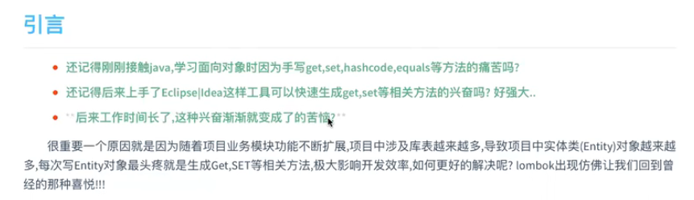

#### 1、什么是lombok

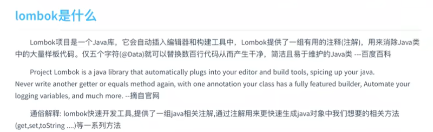

#### 2、使用lombok

​	首先是引入依赖--在官网中找到需要的maven依赖

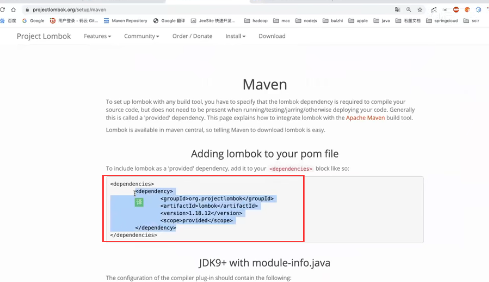

​	使用提供的注解

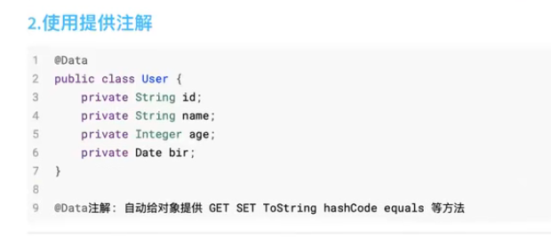

#### 2、lombok的原理

​	他是如何做到的帮我们的类动态的添加这些方法呢？

​	我们进入到这个@Data注解中，我们可以看到这个注解中的@Retention是Source属于在编译阶段生效

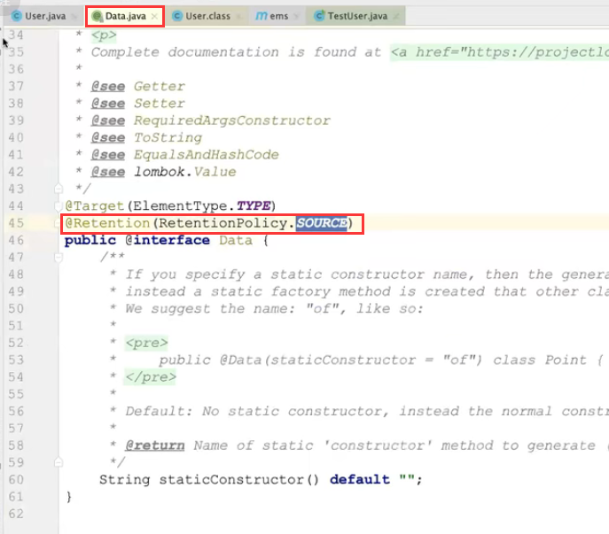

​	比如我们Spring的一些注解，他们都是运行时生效的注解Runtime

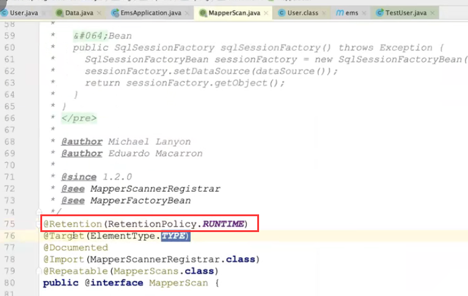

​	如果Lombok也是运行时生效就没有意义了

​	整个过程原理，java源文件在编译前是先会去整理语法树的，如果我们使用了lombok那么lombok会对语法树做出修改的操作，那么在编译的时候就生成了对应注解的方法了

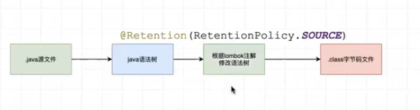

​	我们可以查看我们编译后的class就知道每个注解的作用了，当然也可以看我们编辑器的Structure

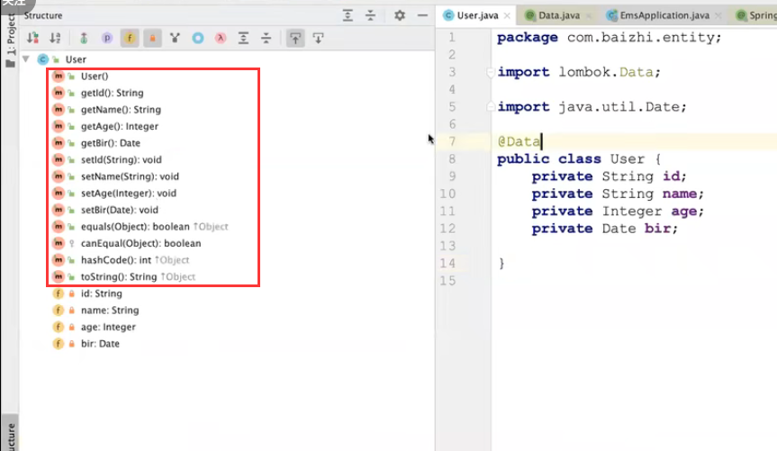

如果我们去掉@Data的话那么这些方法就都没有了

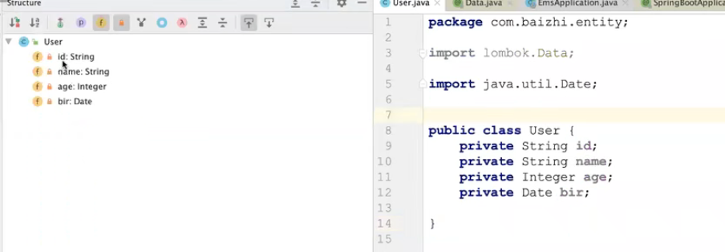

我们在引入的时候maven的scope是provided，我们在生产环境就不需要他了，因为编译过后我们就不需要他了

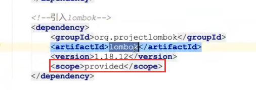

#### 3、lombok一组注解

​	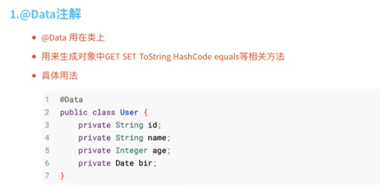

@Getter 和@Setter都是只生成get或set或一起使用都生成的意思

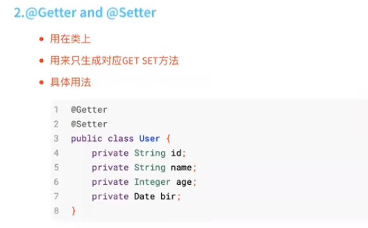

构造方法的注解--只能是全参数和无参数的自动生成，如果想自定义参数的话那么就需要自己添加了

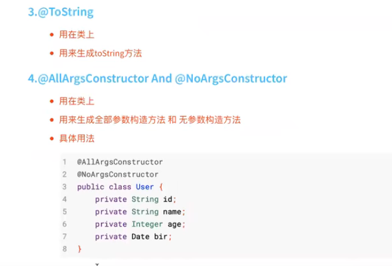

@Accessors注解是比较好用的注解，他可以开启链式调用，或者使用@Builder注解

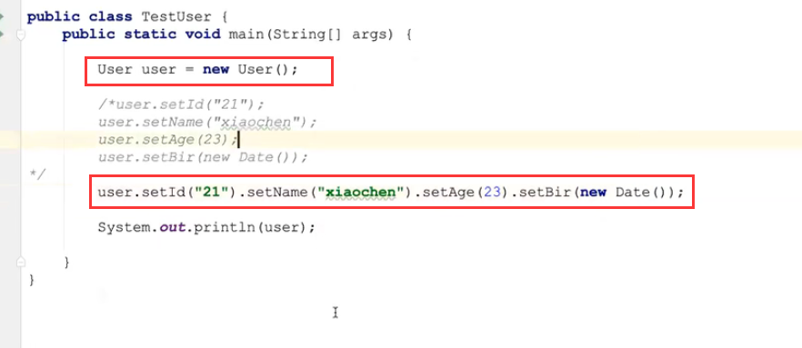

​	@Slf4j 这个注解也是比较有用的，为我们提供方便的日志调用的功能

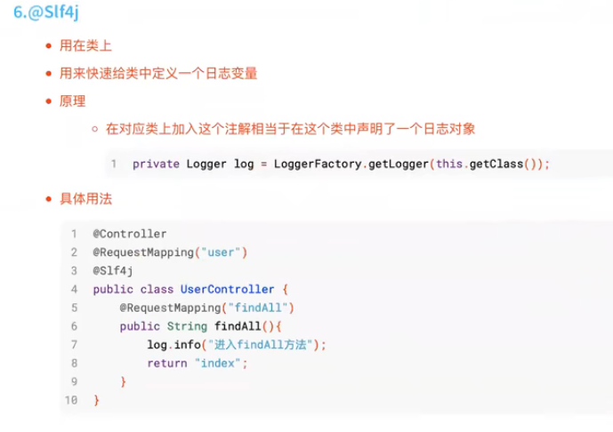

​		我们在不使用这个注解之前，我们想打印输出一个日志的内容的话还需要创建Logger对象，每个类中都得创建一个--比较麻烦

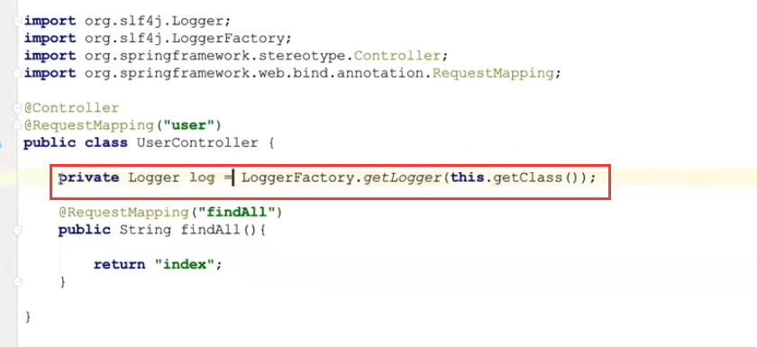

之后我们直接在类上加上这个@Slf4j注解，就相当于创建了log这个变量了

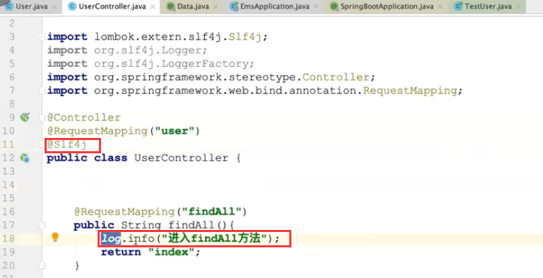

​	这里还有一个就是，我们的日志还可以使用占位的方式动态的输出需要的内容，这样就很专业，而不是字符串的拼接，占位使用【】包{}的方式才可以

​		这样的话让人看起来更清晰，比字符串的拼接那种使用更加的专业

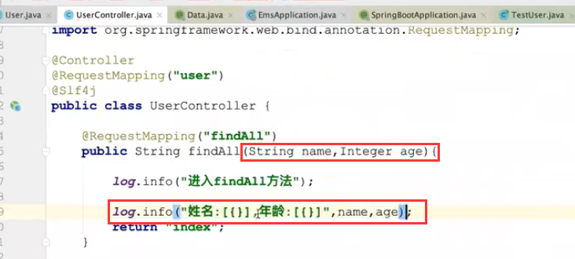

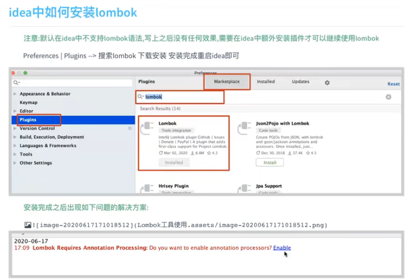

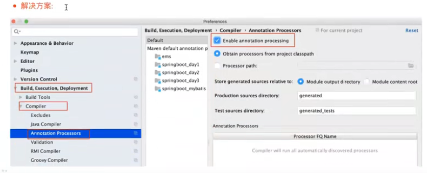

https://www.bilibili.com/video/BV1gg4y1v7Mi?p=3&spm_id_from=pageDriver&vd_source=243ad3a9b323313aa1441e5dd414a4ef

