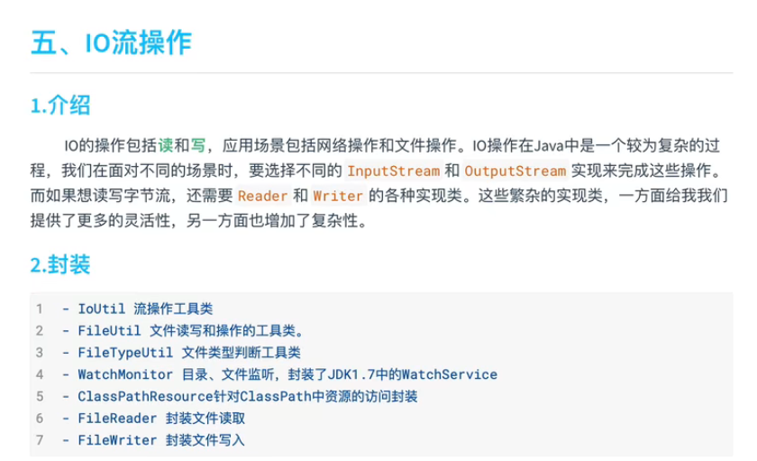
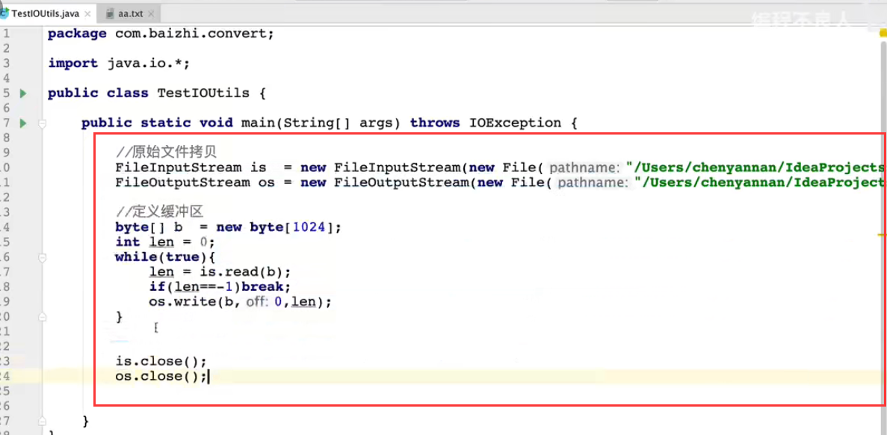
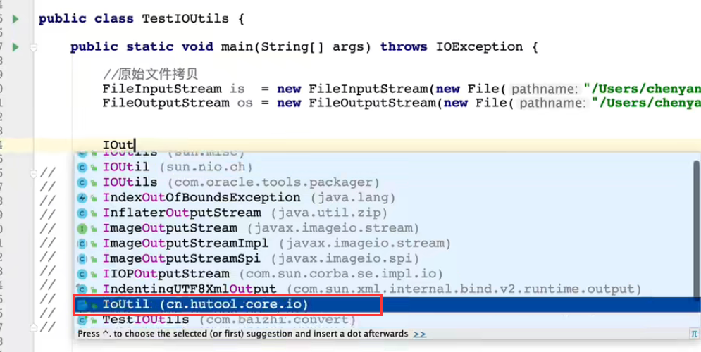
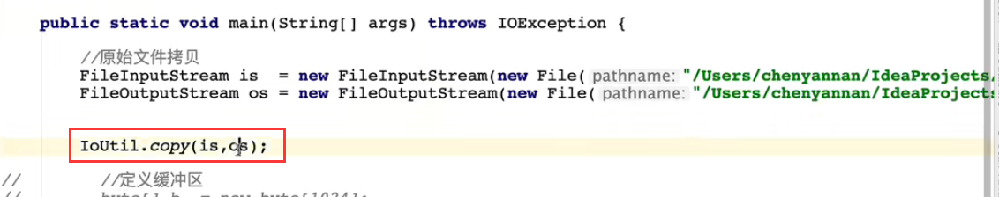
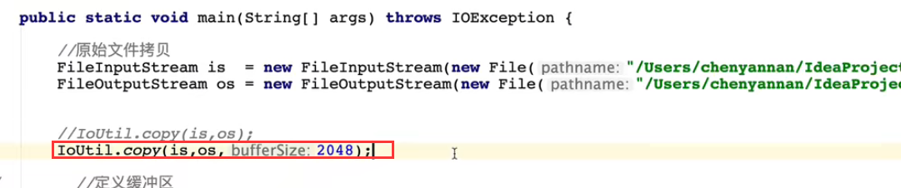

# 7.开发必备工具hutool之IOUtils

我们以前的方式，读取和写入一个文件的话，会很繁琐，而且需要抛出异常，很容易出错

如果我们使用Hutool工具类的话就简单多了--而且会自动的关闭流

一行代码就解决问题了

有很多参数还可以指定缓存区的大小，比如指定是2048

https://www.bilibili.com/video/BV1gg4y1v7Mi?p=5&spm_id_from=pageDriver&vd_source=243ad3a9b323313aa1441e5dd414a4ef

