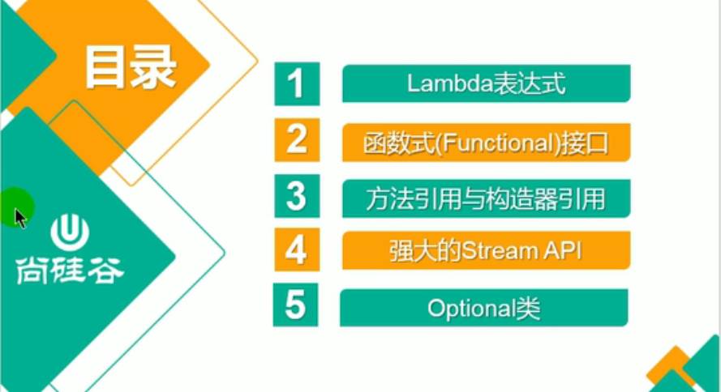
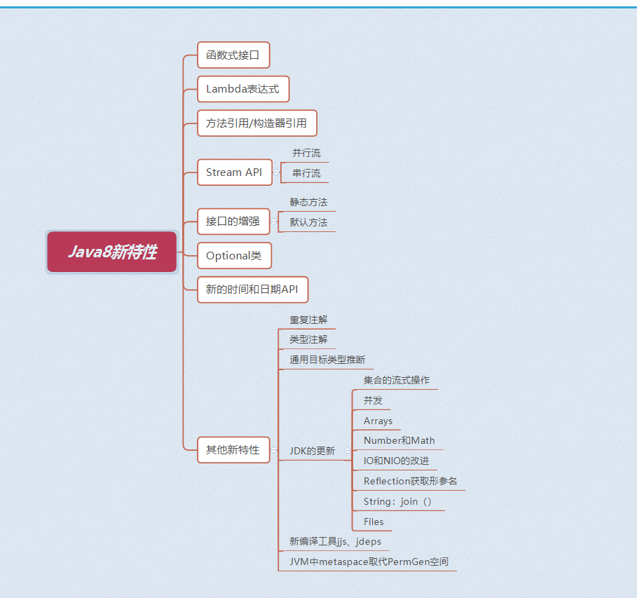
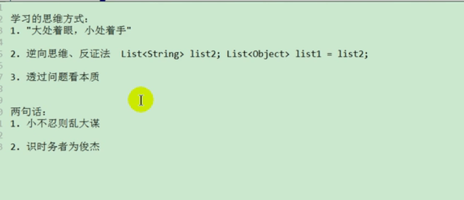
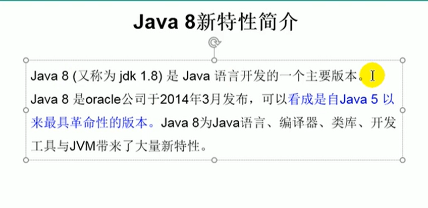
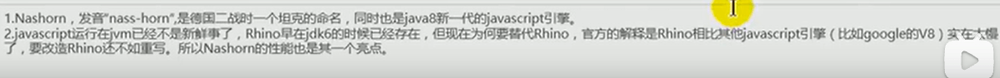
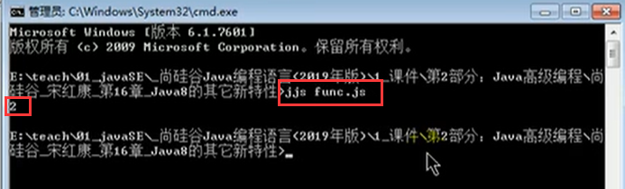

# 1.Java8的新特性内容概括

#### 1.性能介绍

- 速度更快--比如HashMap的优化
- 代码更少（增加 了新的语法lambda表达式）
- 强大的StreamAPI--通过他我们可以对内存层面的多个数据比如一个List过滤，排序等等操作
- 便于并行
- 最大化减少空指针异常：optional
- nashorn引擎，允许在JVM上运行JS应用--可以在java中运行js脚本

**便于并行：**并行流与串行流

​	**并行流**就是把一个内容分成多个数据块，并用不同的线程分别处理每个数据块的流，**相比较串行的流并行流可以很大程度上提高程序的执行效率。**

​	Java8中将并行进行了优化，我们可以很容易的对数据进行并行操作。

​	Stream API可以声明性地通过 parallel() 与 sequential() 在并行流与顺序流之间进行切换。

使用jjs命令，可以执行js脚本

**内容地址**：https://www.bilibili.com/video/BV1kk4y1R7AC?from=search&seid=13619411349926672258&spm_id_from=333.337.0.0

