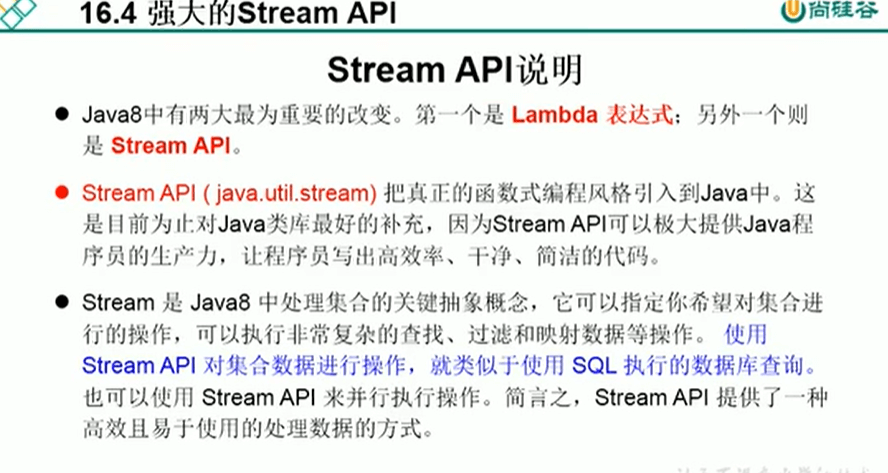

# 10.StreamAPI介绍




使用Stream API 对集合数据进行操作，就类似于使用SQL执行的数据库查询，简单来说，Stream API提供了一种高效且易于使用的处理数据的方式。


**执行过程**


为什么Stream是延迟的呢，是因为只要你不调用终止操作，其他中间环节的过滤方法的调用其实都是不执行的，只有等调用了终止操作才会调用中间环节的所有操作。


```java
/**
 *  1.  Stream 关注的是对数据的运算，与CPU打交道
 *      集合关注的是数据的存储，与内存打交道的。
 *
 *  2.  Stream 自己不会存储元素，
 *      Stream不会改变原对象，相反，他们会返回一个持有结果的新的Stream
 *      Stream操作是延迟执行的，这意味着他们会等到需要结果的时候才执行
 *
 *  3.  Stream 执行流程
 *      1：Stream的实例化
 *      2：一系列的中间操作（过滤操作、映射操作、等等）
 *      3：终止操作
 *
 *  4.  说明：
 *          1.一个中间有个操作链，对数据源的数据进行处理
 *          2.一旦执行终止操作，就执行中间操作链，并产生结果，之后，不会再被使用
 */
 
```


