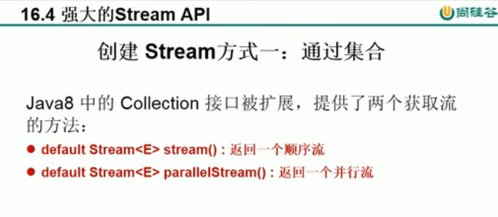
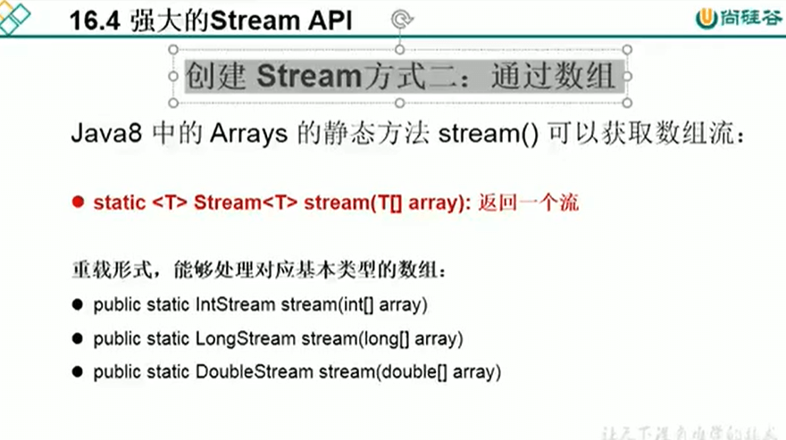
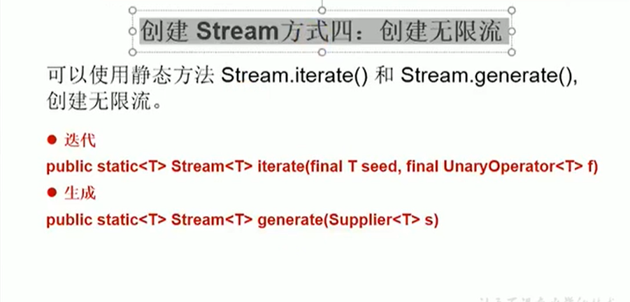

# 11.Stream的实例化


#### 创建Stream的方式：





#### 第三种方式：


#### 第四种方式：用的比较少了解就可以



```java
package com.llbt.jpademo.stream;

import com.llbt.jpademo.entity.JpaStudent;
import org.junit.jupiter.api.Test;

import java.util.ArrayList;
import java.util.Arrays;
import java.util.List;
import java.util.stream.IntStream;
import java.util.stream.Stream;

/**
 *  1.  Stream 关注的是对数据的运算，与CPU打交道
 *      集合关注的是数据的存储，与内存打交道的。
 *
 *  2.  Stream 自己不会存储元素，
 *      Stream不会改变原对象，相反，他们会返回一个持有结果的新的Stream
 *      Stream操作是延迟执行的，这意味着他们会等到需要结果的时候才执行
 *
 *  3.  Stream 执行流程
 *      1：Stream的实例化
 *      2：一系列的中间操作（过滤操作、映射操作、等等）
 *      3：终止操作
 *
 *  4.  说明：
 *          1.一个中间有个操作链，对数据源的数据进行处理
 *          2.一旦执行终止操作，就执行中间操作链，并产生结果，之后，不会再被使用
 *
 *   测试Stream的实例化
 */
public class StreamAPITest {

    // 创建Stream方式一： 通过集合
    @Test
    public void test1(){
        //先创建一个集合
        List<JpaStudent> list = new ArrayList<>();
        list.add(new JpaStudent("张三"));
        list.add(new JpaStudent("李四"));
        list.add(new JpaStudent("王五"));
        list.add(new JpaStudent("赵六"));

//        default Stream<E> stream();   返回一个顺序流
        Stream<JpaStudent> stream = list.stream();


//        default Stream<E> parallelStream（）；   返回一个并行流
        Stream<JpaStudent> parallelStream = list.parallelStream();


    }

    // 创建Stream方式二： 通过数组
    public void test2(){
        int [] arr = new int[]{1,2,3,4,5,6};
        // 调用Arrays 类的static <T> Stream<T> stream(T[] array);          返回一个流
        IntStream stream = Arrays.stream(arr);

        JpaStudent s1 = new JpaStudent("张三");
        JpaStudent s2 = new JpaStudent("张四");

        JpaStudent[] arr1 = new JpaStudent[]{s1,s2};
        Stream<JpaStudent> stream1 = Arrays.stream(arr1);


    }

//    创建Stream 方式三： 通过Stream的of（）
    @Test
    public void test3(){
        Stream<Integer> integerStream = Stream.of(1, 2, 3, 4, 5);

    }


//    创建Stream 方式四：创建无限流----可以使用它来帮我们造数据
    @Test
    public void test4(){
//        迭代  创建无限个元素流 seed种子
//        public static<T> Stream<T> iterate(final T seed, final UnaryOperator<T> f)

//        遍历前10个偶数--首先我们给一个种子，最先是0----会导致无限流，添加一个limit限制一下取前10个
        Stream.iterate(0, t -> t + 2).limit(10).forEach(System.out :: println);

//        生成
//        public static<T> Stream<T> generate(Supplier<T> s)
        Stream.generate(Math :: random).limit(10).forEach(System.out::println);


    }


}


```


