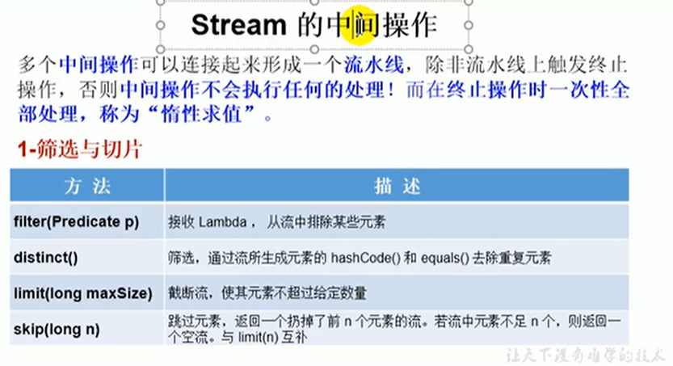

# 12.Stream的中间操作-筛选与切片




#### 案例：

```java
package com.llbt.jpademo.stream;

import com.llbt.jpademo.entity.JpaStudent;
import org.junit.jupiter.api.Test;

import java.util.ArrayList;
import java.util.List;
import java.util.stream.Stream;

//测试Stream的中间操作
public class StreamAPITest2 {

    // 1- 筛选与切片
    @Test
    public void test1(){
        //先创建一个集合
        List<JpaStudent> list = new ArrayList<>();
        list.add(new JpaStudent("张三"));
        list.add(new JpaStudent("李四"));
        list.add(new JpaStudent("王五"));
        list.add(new JpaStudent("赵六"));
//        filter(Predicate p) --接收Lambda， 从流中排除某些元素
        Stream<JpaStudent> stream = list.stream();
        //练习 查询学生表中姓名为张三的同学
        stream.filter(s -> s.getName().equals("张三")).forEach(System.out::println);
        System.out.println("************************************");
//        limit(n) --截断流，使其元素不超过指定数量
        list.stream().limit(2).forEach(System.out::println);

        System.out.println("************************************");
//        skip(n) --跳过元素，返回一个扔掉了前n个元素的流，若元素不足n个，则返回一个空流，相当于limit
        list.stream().skip(3).forEach(System.out::println);

        System.out.println("**************distinct**********************");
//        distinct() --筛选，通过流所生成元素的hashCode（）和equals（）去除重复的元素
        list.add(new JpaStudent("张三"));
        list.add(new JpaStudent("张三"));
        list.add(new JpaStudent("张三"));

        list.stream().distinct().forEach(System.out::println);
        
    }


}

		
```

