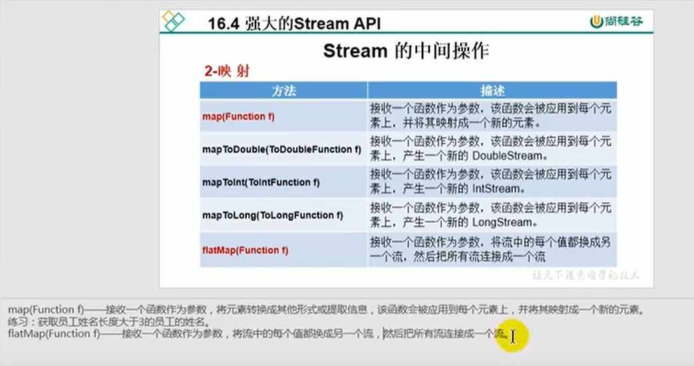

# 13.Stream的中间操作映射



 


#### 代码练习：

```java
//    映射
    @Test
    public void test2(){
//        map(Function f) --接收一个函数作为参数，将元素转换成其他形式或提取信息，该函数会被应用到每个元素上，并将其映射成一个新的元素
        List<String> list = Arrays.asList("aa", "bb", "cc", "dd");
        list.stream().map(str -> str.toUpperCase()).forEach(System.out::println);


//        练习1：获取员工姓名长度大于3的员工的姓名
        List<JpaStudent> list2 = new ArrayList<>();
        list2.add(new JpaStudent("张三3"));
        list2.add(new JpaStudent("李四"));
        list2.add(new JpaStudent("王五5"));
        list2.add(new JpaStudent("赵六"));

        //先拿到员工的姓名s -> s.getName()
        Stream<String> nameStream = list2.stream().map(s -> s.getName());

        //然后过滤姓名大于3的姓名，从0开始
        nameStream.filter(name -> name.length()>2).forEach(System.out::println);

        System.out.println("**********练习2**********************");

//        练习2：
        Stream<Stream<Character>> streamStream = list.stream().map(StreamAPITest2::fromStringToStream);
        streamStream.forEach(s -> {
            s.forEach(System.out::println);
        });

        System.out.println("**********练习3**********************");
//        flatMap(Function f) --接收一个函数作为参数，将流中的每个值换成另一个流，然后把所有流连接成一个流
        //上面的练习2，使用map的方式就显得有点复杂了，如果使用flatMap就简单多了
        Stream<Character> characterStream = list.stream().flatMap(StreamAPITest2::fromStringToStream);
//        我们使用flatMap一层遍历就ok了
        characterStream.forEach(System.out::println);

    }

    //将字符串中的多个字符构成的集合，转化为对应的Stream实例
    public static Stream<Character> fromStringToStream(String str){
        //把string的每一个字符看做每个元素
        ArrayList<Character> list = new ArrayList<>();
        for (Character c : str.toCharArray()) {
            list.add(c);
        }
        return list.stream();

    }


//    类比
    @Test
    public void test3(){
        ArrayList list1 = new ArrayList<>();
        list1.add(1);
        list1.add(2);
        list1.add(3);

        ArrayList list2 = new ArrayList<>();
        list2.add(4);
        list2.add(5);
        list2.add(6);

//        list1.add(list2);
        list1.addAll(list2);
        System.out.println(list1);

    }
    
```


