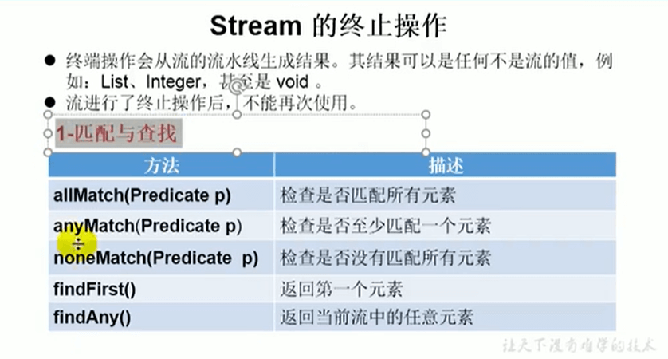
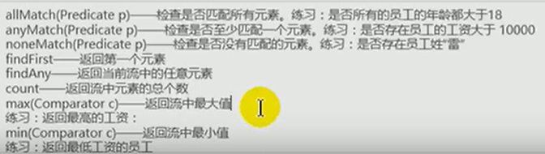

# 15.Stream的终止操作-匹配与查找






 

```java
package com.llbt.jpademo.stream;

import com.llbt.jpademo.entity.JpaStudent;
import org.junit.jupiter.api.Test;

import java.util.ArrayList;
import java.util.List;
import java.util.Optional;
import java.util.stream.Stream;

// Stream的终止操作
public class StreamAPITest3 {

    //1、匹配与查找
    @Test
    public void test1(){
        //先创建一个集合
        List<JpaStudent> list = new ArrayList<>();
        list.add(new JpaStudent(1L,"张三"));
        list.add(new JpaStudent(2L,"李四"));
        list.add(new JpaStudent(4L,"王五"));
        list.add(new JpaStudent(7L,"赵雷"));
//        allMatch(Predicate p) --检查是否匹配所有元素，
//        练习：是否所有的员工年龄都大于18----------因为没有创建员工对象用id替代年龄
        boolean b = list.stream().allMatch(e -> e.getId() > 0);
        System.out.println(b);  //allMatch是所有的都是true他才是true


//        anyMatch(Predicate p) --检查是否至少匹配一个元素。练习：是否存在员工工资大于10000
        boolean anyMatch = list.stream().anyMatch(e -> e.getId() > 2);
        System.out.println(anyMatch);  //allMatch是所有的都是true他才是true


//        noneMatch（Predicate p） --检查是否没有匹配的元素，练习：是否存在员工姓雷---有就显示false，没有就true
        boolean b1 = list.stream().noneMatch(e -> e.getName().contains("雷"));
        System.out.println(b1);

//        findFirst --返回第一个元素
        Optional<JpaStudent> first = list.stream().findFirst();
        System.out.println(first);

//        findAny  --返回当前流中的任意元素
//        Optional<JpaStudent> any = list.stream().findAny(); --使用顺行流 可能一直是返回第一个，我们可以使用并行流
        Optional<JpaStudent> any = list.parallelStream().findAny();
        System.out.println(any);

    }

    @Test
    public void test2(){
        //先创建一个集合
        List<JpaStudent> list = new ArrayList<>();
        list.add(new JpaStudent(1L,"张三"));
        list.add(new JpaStudent(2L,"李四"));
        list.add(new JpaStudent(4L,"王五"));
        list.add(new JpaStudent(7L,"赵雷"));

        //        count     --返回流中的总个数
        long count = list.stream().count();
        System.out.println(count);

//        max(Comparator c) --返回流中最大值
//        练习返回最高工资
        Stream<Long> money = list.stream().map(e -> e.getId());
        Optional<Long> max = money.max(Long::compare);
        System.out.println(max);

//        min(Comparator c) --返回流中的最小值
//        练习：返回工资最低的员工
        Optional<JpaStudent> min = list.stream().min((e1, e2) -> Long.compare(e1.getId(), e2.getId()));
        System.out.println(min);


//        forEach(Consumer c )   --内部迭代
        list.stream().forEach(System.out::println);

//        也可以这样写，虽然都是forEach 但是主体是不一样的，这个是集合的遍历操作
        list.forEach(System.out::println);
    }
}


```


