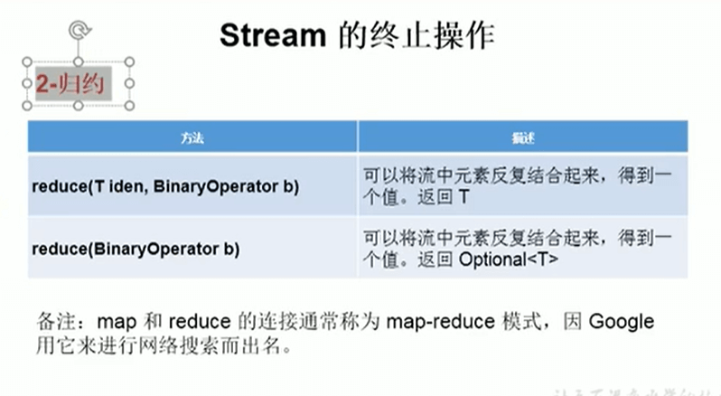

# 16.Stream的终止操作-归约



```java
//    2、归约
    @Test
    public void test3(){
//        reduce(T identity, BinaryOperator) --可以将流中元素反复结合起来，到一个值，返回，返回T
//      练习1：计算1-10的自然数和
        List<Integer> list = Arrays.asList(1,2,3,4,5,6,7,8,9,10);
        Integer reduce = list.stream().reduce(0, Integer::sum); //0是初始值，计算为55 如果初始值是10 那么结果就是65
        System.out.println(reduce);


//        reduce（BinaryOperator） --可以将流中元素反复结合起来，得到一个值，返回Optional<T>
//        练习2：计算公式所有员工工资的总和
        //先创建一个集合
        List<JpaStudent> list2 = new ArrayList<>();
        list2.add(new JpaStudent(1L,"张三"));
        list2.add(new JpaStudent(2L,"李四"));
        list2.add(new JpaStudent(4L,"王五"));
        list2.add(new JpaStudent(7L,"赵雷"));

        Stream<Long> longStream = list2.stream().map(e -> e.getId());
        Optional<Long> sum = longStream.reduce(Long::sum);
        System.out.println(sum);

        //第二种写法
        Stream<Integer> integerStream = list2.stream().map(e -> e.getId().intValue());
        Optional<Integer> sum2 = integerStream.reduce((e1,e2) -> e1 + e2);
        System.out.println(sum2);


    }
    
```


https://www.bilibili.com/video/BV1kk4y1R7AC?p=18&spm_id_from=pageDriver


