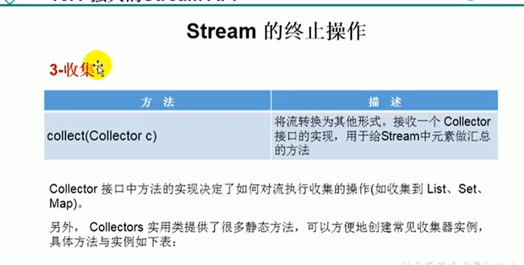
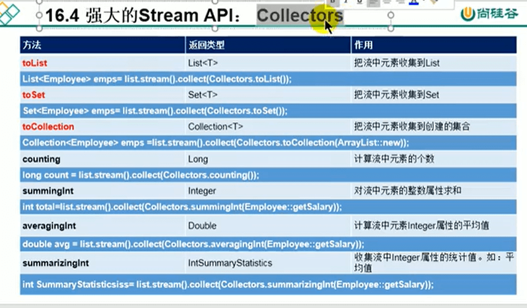

# 17.Stream的终止操作-收集






#### 代码示例：

```java
 //    3、收集
    @Test
    public void test4(){
//      collect(Collector c) --将流转换为其他形式，接收一个Collector接口的实现，用于给
//        练习1： 查找工资大于6000的员工，结果返回一个List或者是Set
        //先创建一个集合
        List<JpaStudent> list2 = new ArrayList<>();
        list2.add(new JpaStudent(1L,"张三"));
        list2.add(new JpaStudent(2L,"李四"));
        list2.add(new JpaStudent(7L,"王五"));
        list2.add(new JpaStudent(8L,"赵雷"));

        List<JpaStudent> collect = list2.stream().filter(e -> e.getId() > 6).collect(Collectors.toList());

        collect.forEach(System.out :: println);

        System.out.println("*****************************");
        //如果我们需要返回一个Set的话
        Set<JpaStudent> set = list2.stream().filter(e -> e.getId() > 6).collect(Collectors.toSet());
        set.forEach(System.out :: println);

    }
    
```


https://www.bilibili.com/video/BV1kk4y1R7AC?p=19&spm_id_from=pageDriver