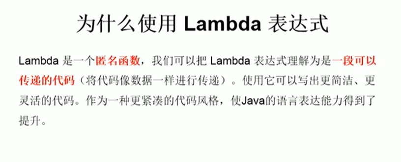
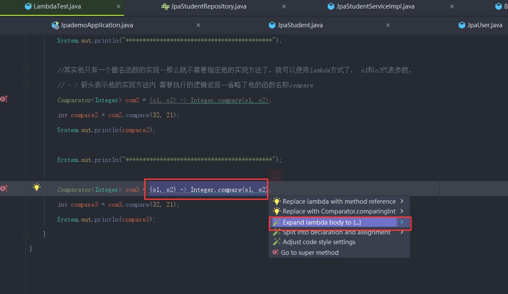
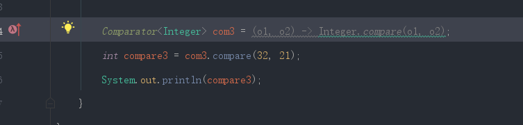
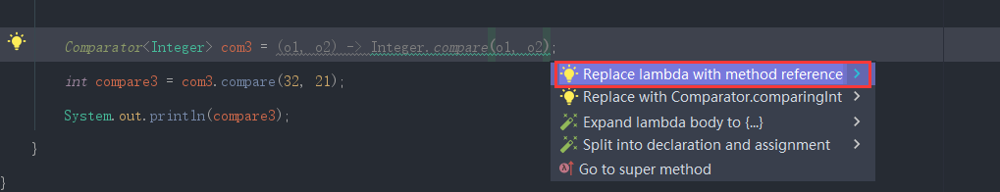
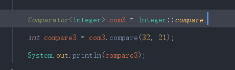

# 2.Lambda表达使用举例


为什么使用Lambda---其实是别的地方使用的比较好，然后我们也就加入了这种语法




理解为：可以传递的一段代码--将代码像数据一样进行传递


**例如1：**

```java
package com.llbt.jpademo;

import org.junit.jupiter.api.Test;

import java.util.Comparator;

/**
 *
 */
public class LambdaTest {
    @Test
    public void Test1() {

        Runnable r1 = new Runnable() {
            @Override
            public void run() {
                System.out.println("测试LamBda");
            }
        };
        r1.run();

        System.out.println("********************************************");

        Runnable r2 = () -> System.out.println("测试LamBda换为Lambda的方式");

        r2.run();
    }


    @Test
    public void Test2() {

        //Comparator 的匿名实现类对象
        Comparator<Integer> com1 = new Comparator<Integer>() {
            @Override
            public int compare(Integer o1, Integer o2) {
                return Integer.compare(o1, o2);
            }
        };

        int compare = com1.compare(12, 21);

        System.out.println(compare);
        System.out.println("*******************************************");

        //其实他只有一个匿名函数的实现--那么就不需要指定他的实现方法了，就可以使用Lambda方式了， o1和o2代表参数，
        // - > 箭头表示他的实现方法内 需要执行的逻辑返回--省略了他的函数名称compare
        Comparator<Integer> com2 = (o1, o2) -> Integer.compare(o1, o2);
        int compare2 = com2.compare(32, 21);
        System.out.println(compare2);

        System.out.println("*******************************************");

        Comparator<Integer> com3 = Integer::compare;
        int compare3 = com3.compare(32, 21);
        System.out.println(compare3);
    }
}

```


如果我们看不懂这个Lambda代码的话--我们可以使用ALT+Enter 来显示他的内容




这个显示灰色：说明还是可以进行简化操作的，使用alt+Enter




然后选择用方法引用替换Lambda




替换后的结构：这个叫方法引用的写法




