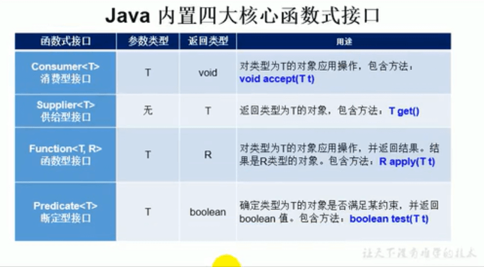

# 20.复习-函数式接口

#### 1、函数式接口的使用说明

​		> 如果一个接口中，只声明了一个抽象方法，则此接口就称为函数式接口。

​		> 我们可以在一个接口上使用@FunctionInterface 注解，这样做可以检查他是否是一个函数式接口。

​		> Lambda表达式的本质：就是作为函数式接口的实例。

#### 2、Java8中关于Lambda表达式提供的4个基本的函数式接口

**具体使用：**

#### 3、总结

#### 			3.1、何时使用Lambda表达式？

​				当需要对一个函数式接口实例化的时候，可以使用Lambda表达式。

#### 	3.2、何时使用给定的函数式接口？

​					如果我们开发中，需要定义一个函数式接口，首先看看在已有的jdk提供的函数式接口是否提供了能满足需求的函数式接口，如果有，则直接调用就可以了，不需要自己在自定义了。

