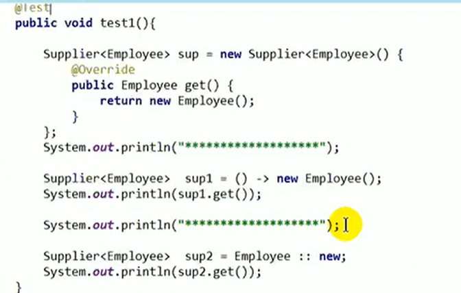

# 21.复习-方法引用和构造器引用

#### 方法引用

#### 1、理解：

​			方法引用可以看做是Lambda 表达式深层次的表达。换句话说，方法引用就是Lambda表达式，也就是函数式接口的一个实例，通过方法的名字来指向一个方法。

#### 2、使用情境：

​			当要传递诶Lambda体的操作，已经实现的方法了，可以使用方法引用！

#### 3、格式：

​			类（或对象） ：： 方法名

#### 4、分为如下三种情况：

​			情况1：	对象 ：：非静态方法

​			情况2：	类  ：： 静态方法

​			情况3：     类 ：： 非静态方法

#### 5、要求：

​			1.要求接口中的抽象方法的形参列表和返回值类型与方法引用的方法的形参列表和返回值类型相同！（针对于 情况1和情况2）

​		

​			2.当函数式接口方法的第一个参数是需要引用方法的调用者，并且第二个参数是需要引用方法的参数【或无参数】时，ClassName：：methodName（针对于情况3）

#### 6、使用建议：

​			如果给函数式接口提供实例，恰好满足满足方法引用的要求，大家就可以考虑使用方法引用给函数式接口提供实例。

​			如果大家不熟悉方法引用，那么还可以使用Lambda表达式。

#### 使用举例：

#### 构造器引用

#### 1、构造器引用格式：

​			类名：：new

#### 2、构造器引用使用要求：

​			和方法引用类似，函数式接口的抽象方法的形参列表和构造器的形参列表一致，抽象方法的返回值类型即为构造器所属的类的类型。

#### 3、构造器引用举例

​			

#### 4、数组引用格式

​		数组类型[] :: new

#### 5、数组引用举例

