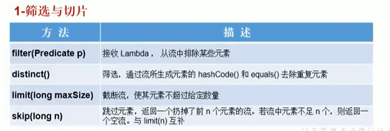
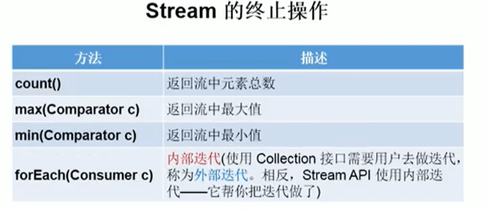

# 22.复习-StreamAPI


#### 1、Stream API的理解：

​			1.1Stream关注的是对数据的运算，与CPU打交道

​			集合关注的是数据的存储，与内存打交道

​			

​			1.2：Java8提供了一套API，使用这套API可以对内存中的数据进行过滤、排序、映射、归约等操作。类似于sql对数据库表的相关操作。


#### 2、注意点：

- 2.1: Stream本身自己不会存储元素。
- 2.2：Stream不会改变源对象，相反，他们会返回一个持有结果的新Stream
- 2.3：Stream 操作是延迟执行的，这意味着他们会等到需要结果的时候才执行

​		


#### 3、Stream的使用流程

- 3.1：Stream的实例化
- 3.2：一系列中间操作
- 3.2：终止操作


#### 4、使用流程的注意点

- 4.1： 一个中间操作链，对数据源的数据进行处理
- 4.2： 一旦执行终止操作，就执行中间操作链，并产生结果，之后不会再被使用。


#### 5、步骤一：Stream实例化

```java
// 创建Stream方式一： 通过集合
    @Test
    public void test1(){
        //先创建一个集合
        List<JpaStudent> list = new ArrayList<>();
        list.add(new JpaStudent("张三"));
        list.add(new JpaStudent("李四"));
        list.add(new JpaStudent("王五"));
        list.add(new JpaStudent("赵六"));

//        default Stream<E> stream();   返回一个顺序流
        Stream<JpaStudent> stream = list.stream();


//        default Stream<E> parallelStream（）；   返回一个并行流
        Stream<JpaStudent> parallelStream = list.parallelStream();


    }

    // 创建Stream方式二： 通过数组
    public void test2(){
        int [] arr = new int[]{1,2,3,4,5,6};
        // 调用Arrays 类的static <T> Stream<T> stream(T[] array);          返回一个流
        IntStream stream = Arrays.stream(arr);

        JpaStudent s1 = new JpaStudent("张三");
        JpaStudent s2 = new JpaStudent("张四");

        JpaStudent[] arr1 = new JpaStudent[]{s1,s2};
        Stream<JpaStudent> stream1 = Arrays.stream(arr1);


    }

//    创建Stream 方式三： 通过Stream的of（）
    @Test
    public void test3(){
        Stream<Integer> integerStream = Stream.of(1, 2, 3, 4, 5);

    }


//    创建Stream 方式四：创建无限流----可以使用它来帮我们造数据
    @Test
    public void test4(){
//        迭代  创建无限个元素流 seed种子
//        public static<T> Stream<T> iterate(final T seed, final UnaryOperator<T> f)

//        遍历前10个偶数--首先我们给一个种子，最先是0----会导致无限流，添加一个limit限制一下取前10个
        Stream.iterate(0, t -> t + 2).limit(10).forEach(System.out :: println);

//        生成
//        public static<T> Stream<T> generate(Supplier<T> s)
        Stream.generate(Math :: random).limit(10).forEach(System.out::println);


    }
```


#### 6、步骤二：中间操作





#### 7、步骤三：终止操作





#### Collector 需要使用 Collectors提供实例。


