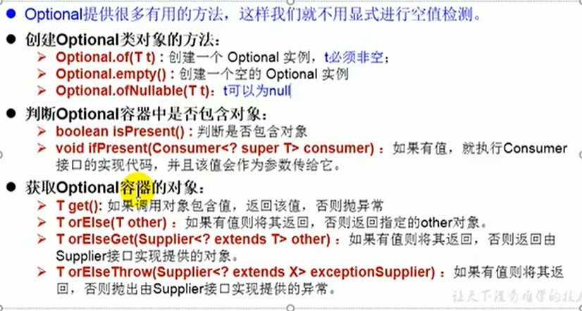

# 23复习-Optional类的使用


#### java.util.Optional类


#### 1.理解： 为了解决Java中的空指针问题而生！

​				之前是在Guava项目中最先使用的，然后java借鉴此优点

​				Optional《T》类（java.util.Optional）是一个容器类，他可以保存类型T的值，代表这个值存在。或者仅仅保存null，表示这个值不存在，现在Oprional可以更好的表达这个概念，并且可以避免空指针异常。


#### 2.常用方法：




代码演示：

```java
@Test
    public void test6(){
        //empty() 创建的Optional对象内部的value = null 
        Optional<Object> optional = Optional.empty();
        //isPresent判断封装的数据是否包含数据
        if (optional.isPresent()){
            System.out.println("数据为空");
        }
//        System.out.println(optional.get());
        System.out.println(optional);
        System.out.println(optional.isPresent());

    }

    @Test
    public void test7(){
        String str = "hello";
        Optional<String> str1 = Optional.of(str);

//        get方法就是获取核心数据--注意使用of对象必须不为空，否则报错
        String s = str1.get();
        System.out.println(s);

        //那么以上就说明of和get是配对使用的，因为使用of必须是非空的，而非空才可以使用get--否则报错
        //get()用于获取我们Optional封装的内部数据value


    }

    @Test
    public void test8(){
        String str = "beijing";
        str = null;
//        ofNullable(T t) 封装数据t赋给Optional内部的value， 不要求t必须是非空的了
        Optional<String> str1 = Optional.ofNullable(str);

        //orElse(T t1) --如果Optional 内部的value非空，则返回value值，如果value值为空，则返回t1
        //orElse 这个方法就是能保证你这个数据返回肯定是非空的
        String str2 = str1.orElse("上海");

        System.out.println(str2);

    }
```


#### 3.典型练习：

能保证如下的方法执行中不会出现空指针异常


```java
package com.llbt.jpademo.optional;

import org.junit.jupiter.api.Test;

import java.util.Optional;

/**
 * 测试option类 :为了在程序中，避免出现空指针异常而创建的。
 *
 * 常用方法 ： ofNullable（T t）
 *              orElse（T t）
 *
 */
public class OptionalTest {


//  Optional.of(T t) : 创建一个Optional实例 ，t必须非空
//    Optional.empty() : 创建一个空的Optional 实例
//    Option.ofNullable(T t) :t可以为null
    @Test
    public void test1(){
        //Optional.of() 传入一个对象
        Girl girl = new Girl();
//        girl = null; //如果对象是null 则也会报空指针异常
        Optional<Girl> optionalGirl = Optional.of(girl);
    }


    @Test
    public void test2(){
        //Optional.of() 传入一个对象
        Girl girl = new Girl();
        girl = null; //如果对象是null 则也会返回Optional.empty 也就是你调用了empty
        Optional<Girl> optionalGirl = Optional.ofNullable(girl);
        System.out.println(optionalGirl);

        // orElse(T t1) : 如果当前的Optional内部封装的t是非空的，则返回内部的t，
        // 如果内部的t是空的，则返回 orElse（） 方法中的参数t1
        Girl girl1 = optionalGirl.orElse(new Girl("赵丽颖"));
        System.out.println(girl1);
    }


    public String getGirlName(Boy boy){
        //很显然这样的写法是会发生空指针异常的
        return boy.getGirl().getName();
    }


    @Test
    public void test3(){
        Boy boy = new Boy();
        String girlName = getGirlName(boy);
        System.out.println(girlName);
    }

    //我们现在做一下优化处理getGirlName
    public String getGirlName1(Boy boy){
        //原来的写法是
        if (boy != null){
            Girl girl = boy.getGirl();
            if (girl != null){
                return girl.getName();
            }
        }
        return null;
    }

    @Test
    public void test4(){
        Boy boy = new Boy();
        String girlName = getGirlName1(boy);
        System.out.println(girlName);
    }

    //使用Optional 类的getGirlName
    public String getGirlName2(Boy boy){
        Optional<Boy> boyOptional = Optional.ofNullable(boy);
        // 此时的boyElse一定是非空的
        Boy boyElse = boyOptional.orElse(new Boy(new Girl("迪丽热巴")));

        Girl girl = boy.getGirl();
        Optional<Girl> optionalGirl = Optional.ofNullable(girl);
        // 此时的girl1一定非空
        Girl girl1 = optionalGirl.orElse(new Girl("古力娜扎"));

        return girl1.getName();
    }

    @Test
    public void test5(){
        Boy boy = null;
        boy = new Boy();
        boy = new Boy(new Girl("大调皮"));
        String girlName2 = getGirlName2(boy);

        System.out.println(girlName2);
    }


    @Test
    public void test6(){
        //empty() 创建的Optional对象内部的value = null 
        Optional<Object> optional = Optional.empty();
        //isPresent判断封装的数据是否包含数据
        if (optional.isPresent()){
            System.out.println("数据为空");
        }
//        System.out.println(optional.get());
        System.out.println(optional);
        System.out.println(optional.isPresent());

    }

    @Test
    public void test7(){
        String str = "hello";
        Optional<String> str1 = Optional.of(str);

//        get方法就是获取核心数据--注意使用of对象必须不为空，否则报错
        String s = str1.get();
        System.out.println(s);

        //那么以上就说明of和get是配对使用的，因为使用of必须是非空的，而非空才可以使用get--否则报错
        //get()用于获取我们Optional封装的内部数据value


    }

    @Test
    public void test8(){
        String str = "beijing";
        str = null;
//        ofNullable(T t) 封装数据t赋给Optional内部的value， 不要求t必须是非空的了
        Optional<String> str1 = Optional.ofNullable(str);

        //orElse(T t1) --如果Optional 内部的value非空，则返回value值，如果value值为空，则返回t1
        //orElse 这个方法就是能保证你这个数据返回肯定是非空的
        String str2 = str1.orElse("上海");

        System.out.println(str2);

    }


}

```


https://www.bilibili.com/video/BV1kk4y1R7AC?p=26&spm_id_from=pageDriver

