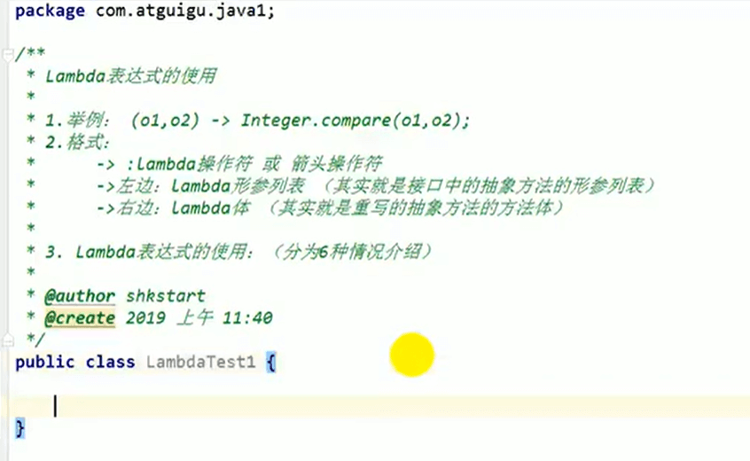
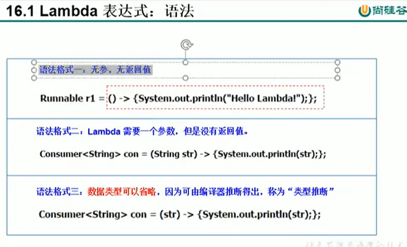

# 3.Lambda表达式语法使用1







```java
package com.llbt.jpademo;

import org.junit.jupiter.api.Test;

import java.util.ArrayList;
import java.util.Comparator;
import java.util.function.Consumer;


public class LamBdaTest2 {

    //语法格式1 ：对于这种 无参 无返回值的
    @Test
    public void Test1() {
        Runnable r1 = new Runnable() {
            @Override
            public void run() {
                System.out.println("测试LamBda");
            }
        };
        r1.run();

        System.out.println("********************************************");
        Runnable r2 = () -> System.out.println("测试LamBda换为Lambda的方式");
        r2.run();
    }

    //第二种情况：Lambda 需要一个参数，但是没有返回值
   @Test
    public void Test2(){
        Consumer<String> consumer = new Consumer<String>() {
            @Override
            public void accept(String s) {
                System.out.println(s);
            }
        };

        consumer.accept("谎言和誓言的区别是什么呢？");

        System.out.println("*********************************");

        Consumer<String> consumer1 = (String s) -> { System.out.println(s); };
        //另外一种简化
        Consumer<String> consumer2 = s -> System.out.println(s);

        consumer1.accept("谎言是听的人当真了");
    }

    //第三种语法格式： 数据类型可以省略，因为可由编译器推断得出，称为---类型推断
    @Test
    public void Test3(){
        Consumer<String> consumer1 = (String s) -> { System.out.println(s); };
        //另外一种简化--类型推断 比如类型推断 ArrayList<String> arrayList = new ArrayList<>(); // ArrayList<>就是类型推断
        Consumer<String> consumer2 = (s) -> System.out.println(s);
        consumer2.accept("谎言是听的人当真了");
    }
    @Test
    public void TestType(){
        ArrayList<String> arrayList = new ArrayList<>(); // ArrayList<>就是类型推断
        int [] arr = {1,2,3}; //类型推断
    }

    // 语法格式4 ：Lambda 若只需要一个参数时，参数的小括号可以省略
    @Test
    public void Test4(){
        Consumer<String> consumer1 = (s) -> System.out.println(s);
        consumer1.accept("谎言是听的人当真了1");
        System.out.println("******************************");

        Consumer<String> consumer2 = s -> System.out.println(s);
        consumer2.accept("谎言是听的人当真了2");
    }


    //语法格式五： Lambda需要俩个或以上的参数，多条执行语句，并且可以有返回值
    @Test
    public  void  Test5(){
        Comparator<Integer> comparator = new Comparator<Integer>() {
            @Override
            public int compare(Integer o1, Integer o2) {
                System.out.println(o1);
                System.out.println(o2);
                return o1.compareTo(o2);
            }
        };
        System.out.println(comparator.compare(10,11));
        System.out.println("以上是原来的这种写法");


        Comparator<Integer> comparator2 = (o1, o2) -> {
            System.out.println(o1);
            System.out.println(o2);
            return o1.compareTo(o2);
        };

        System.out.println(comparator2.compare(11,19));

    }


    //语法格式六：当Lambda只有一条语句时，return 与大括号若有，都可以省略
    @Test
    public void Test6(){
        Comparator<Integer> comparator1 = (o1, o2) -> {
            return o1.compareTo(o2);
        };
        System.out.println(comparator1.compare(11,19));

        System.out.println("***************************************");
        Comparator<Integer> comparator2 = (o1, o2) -> o1.compareTo(o2);
        System.out.println(comparator2.compare(11,31));
    }

    @Test
    public void Test7(){
        Consumer<String> consumer1 = (s) -> {System.out.println(s);};
        consumer1.accept("谎言是听的人当真了1");
        System.out.println("******************************");

        Consumer<String> consumer2 = s -> System.out.println(s);
        consumer2.accept("谎言是听的人当真了1");
    }
}

```


#### 总结：

```
  -> 左边：lambda的形参列表的参数类型可以省略（类型推断）：如果参数列表只有一个参数，其一对（）也可以省略。
  
  -> 右边：lambda体应该使用{}来包裹：如果lambda只有一条执行语句（也可能是return语句），可以省略这一对{}和return关键字
  
  
  我们玩的这些都必须是函数式接口--都是只有一个实现
```


