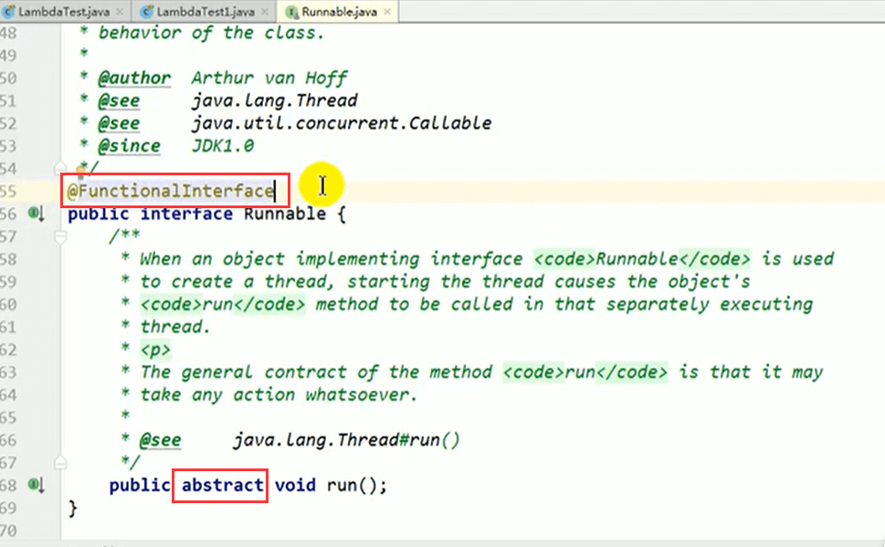
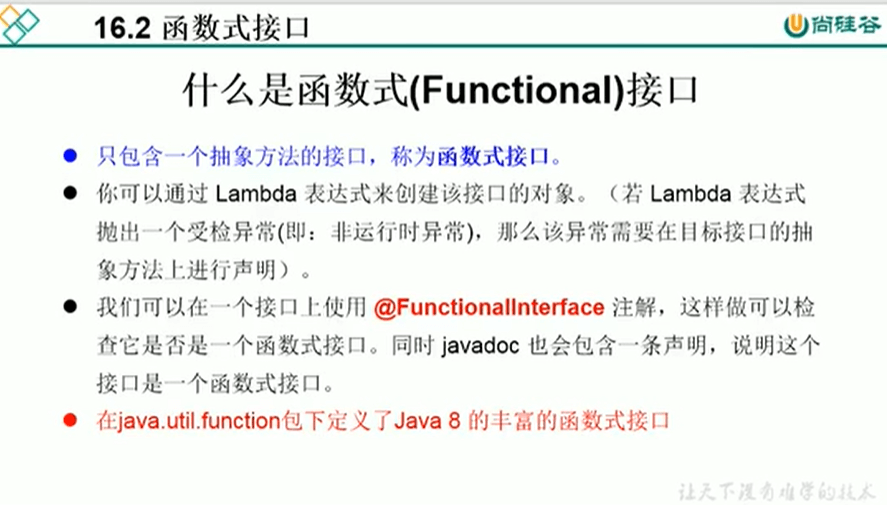
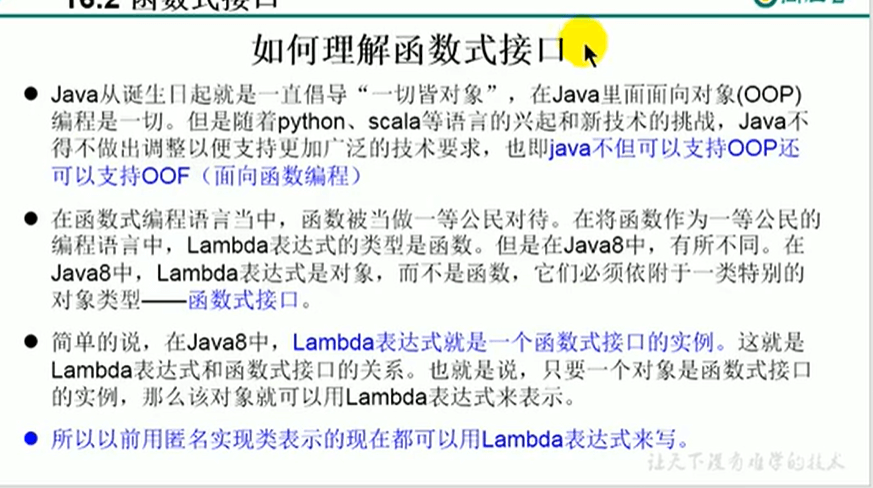

# 4.函数式接口介绍

如果一个接口中只声明了一个抽象方法，则此接口就称为函数式接口。

我们可以在一个接口上使用@FunctionalInterFace注解，这样做可以检查他是否是一个函数式接口

所以以前用匿名实现类表示的现在都可以用Lambda	表达式来写。

 

比如Runnable

其实和abstract没关系，接口中的方法都称为抽象方法，主要是一个方法就为函数式接口，如果不加@FunctionalInterface 也是抽象方法

