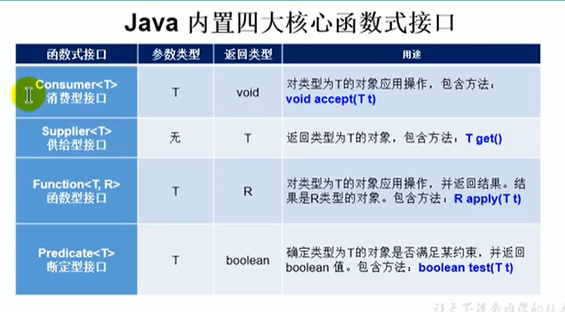
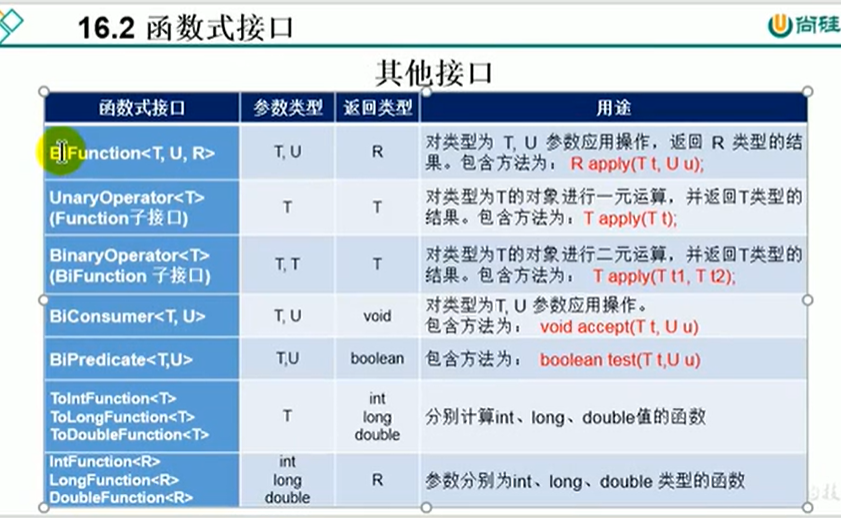

# 5.Java内置的函数式接口及使用




- 消费型接口：属于接收参数最后消费完毕
- 供给型接口：属于无参 都会返回提供数据的接口
- 函数型接口：属于你提供一种参数，根据提供的参数T经过函数最终返回一个R对象数据
- 断定型接口：属于根据你提供的对象参数，根据参数来进行某种约束校验，返回布尔类型





#### 例子：

```java
package com.llbt.jpademo;

import org.junit.jupiter.api.Test;

import java.util.ArrayList;
import java.util.Arrays;
import java.util.List;
import java.util.function.Consumer;
import java.util.function.Predicate;

/**
 * java内置的4大核心函数式接口
 *
 *  消费型接口 Consumer<T>      void accept(T t)
 *  供给型接口 Supplier<T>      T get()
 *  函数型接口 Function<T,R>    R apply(T t)
 *  段定型接口 Predicate<T>     boolean test(T t)
 */
public class LambdaTest3 {

//    我们简单的做几个练习 就不完全做了
    @Test
    public void Test1(){
        happyTime(500, new Consumer<Double>() {
            @Override
            public void accept(Double aDouble) {
                System.out.println("学习太累了，去天上人间买了瓶矿泉水，价格为 " + aDouble);
            }
        });

        System.out.println("***********以上是以前的写法**************");

        happyTime(400, money ->  System.out.println("学习太累了，去天上人间喝了口水，价格为 " + money));
    }

    public void happyTime(double money, Consumer<Double> con){
        con.accept(money);
    }


    @Test
    public  void  Test2(){
        List<String> list = Arrays.asList("北京","南京","天津","东京","西京","普京");

        List<String> filterStrs = filterString(list, new Predicate<String>() {
            @Override
            public boolean test(String s) {
                return s.contains("京");
            }
        });
        System.out.println(filterStrs);

        System.out.println("******************以上是传统写法***********************");

        List<String> filterStrs1 = filterString(list, s -> s.contains("京"));
        System.out.println("******************Lambda写法***********************");
        System.out.println(filterStrs1);
    }

    // 根据给定的规则，去过滤集合中的字符串，此规则由Predicate的方法决定的
    public List<String> filterString(List<String> list, Predicate<String> pre){
        ArrayList<String> filterList = new ArrayList<>();

        for (String s : list) {
            if (pre.test(s)){
                filterList.add(s);
            }
        }
        return filterList;
    }


}

```


