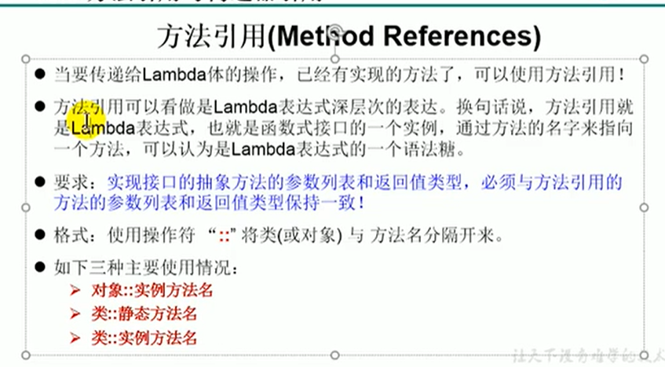
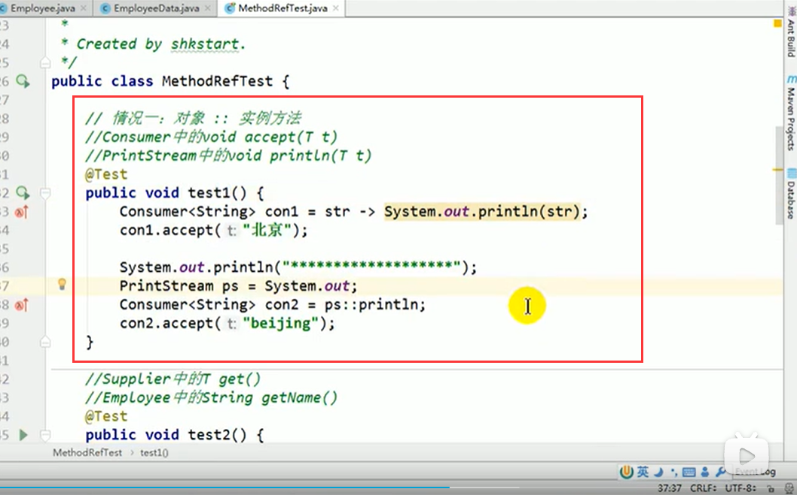
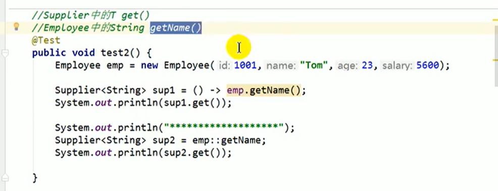

# 6.方法引用的使用1

## 方法引用与构造器引用

我们什么时候会使用方法引用呢？

**1、使用情景：** 当要传递给Lambda体的操作，已经有实现的方法了，可以使用方法引用。

**2、方法引用：** 本质上就是Lambda表达式，而Lambda表达式作为函数式接口的实例，所以方法引用，也是函数式接口的实例。

**3、使用格式：** 类（或对象）：：方法名

**4:、具体分为如下三种情况：**

​		对象：：非静态方法

​		类：：静态方法

​		类：：非静态方法

**5、方法引用的使用要求：** 要求接口中的抽象方法的形参列表和返回值类型，与方法引用的方法的形参列表和返回值类型相同，才可以使用方法引用。

**例子：**

案例2：

