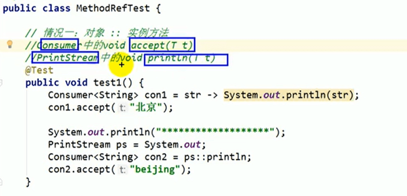
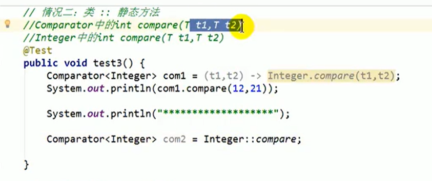
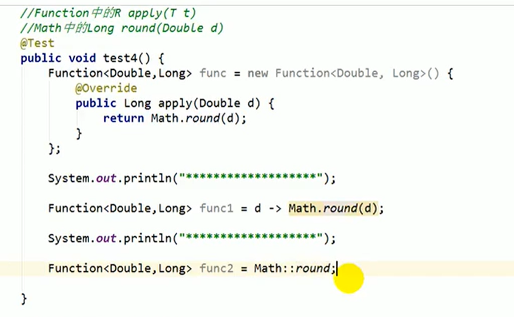

# 7.方法引用的使用2

我们在第一种情况介绍的是：

我们可以看出：Consume的方法 accept 的返回值是 void 和 形参是 T t，而我们需要实现实例的对象使用PrintStream 的方法 println 返回值也是void 形参 也是T t 那么对于这种的我们就可以使用方法引用了。情况一：都是非静态的方法。

#### 情况二：类：：静态方法

比如：Comparator 中的 int compare （T, t1,T t2）

​			Integer 中的 int compare（T t1,T t2）

那么我们就有疑问了，为什么使用方法引用连形参都省略了，因为我们使用的形参是一致的

**再次举例**

