# 10、条件构造器

​		

​				Wapper就是条件构造器

#### 1、结构说明

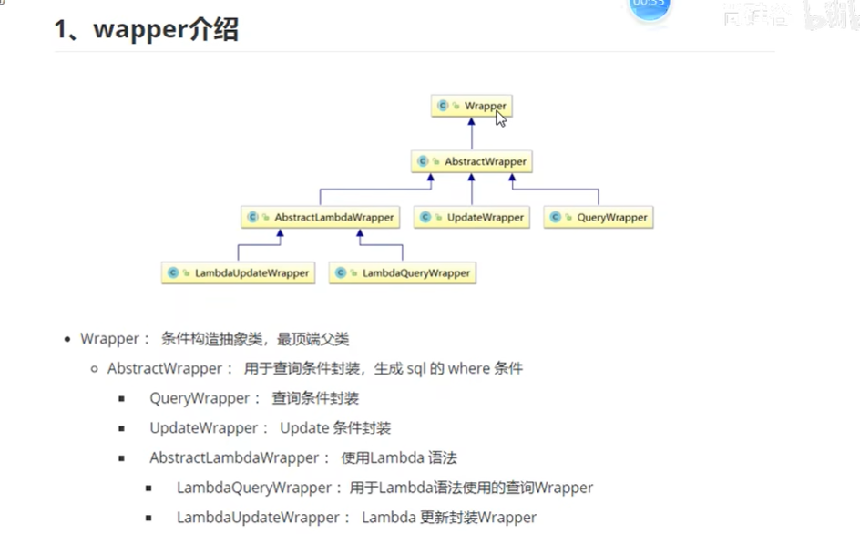

https://www.bilibili.com/video/BV12R4y157Be?p=29&vd_source=243ad3a9b323313aa1441e5dd414a4ef

#### 2、Warpper构造器

​		写一个测试类--可以看到在使用查询的时候传入的是一个Wrapper类型

​	

​		因为Warpper是一个抽象类，那么如果我们想给Warpper赋值的话就需要找到它的子类

​			比如使用查询条件的封住 那么就需要QueryWarpper这个子类了

​	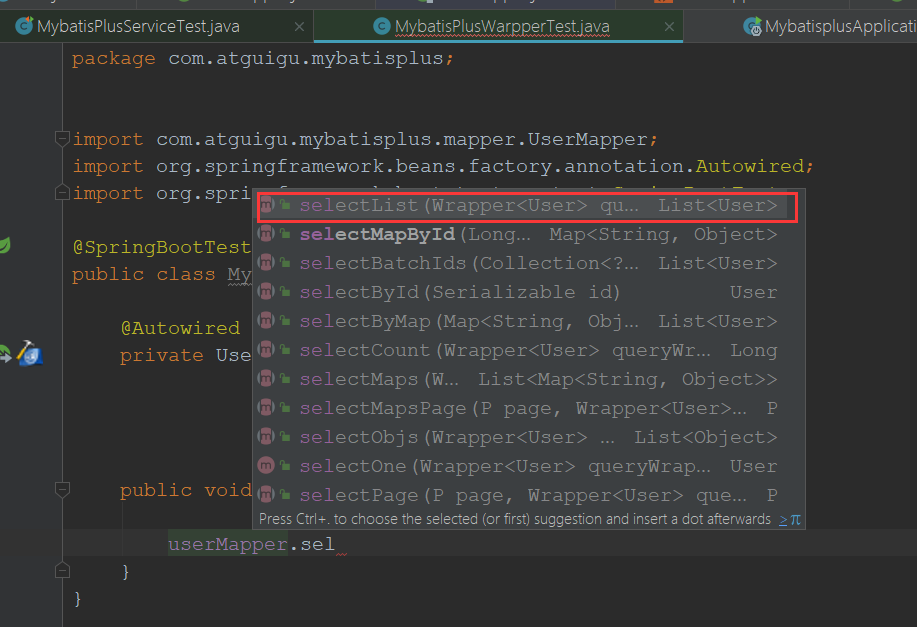

​	使用的泛型指定为实体类型

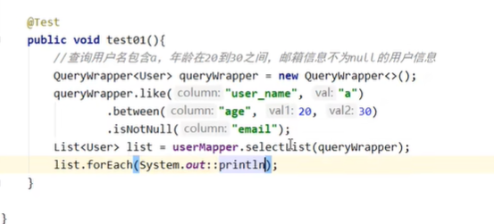

如果使用了逻辑删除，那么所有的查询都是按逻辑删除来查询的

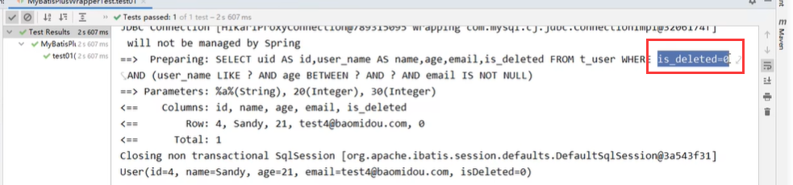

https://www.bilibili.com/video/BV12R4y157Be/?p=30&vd_source=243ad3a9b323313aa1441e5dd414a4ef

#### 3、组装排序条件

​	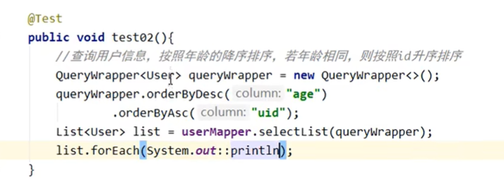

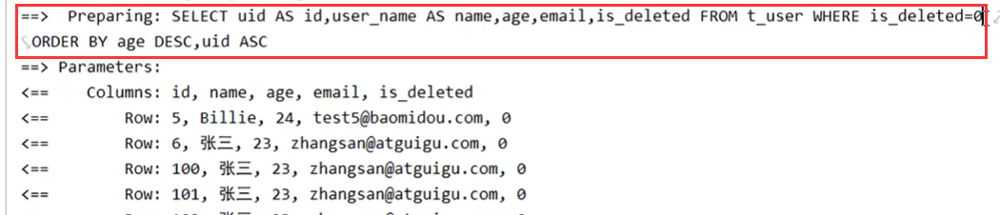

#### 4、组装删除条件

​	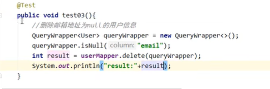

​		这个sql语句其实是执行修改语句，因为使用了逻辑删除

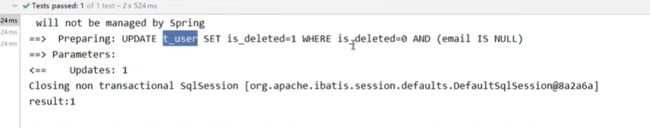

#### 5、通过Warpper实现修改功能

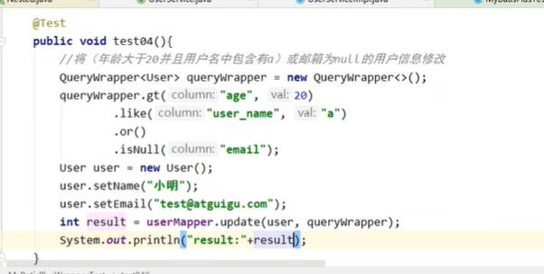

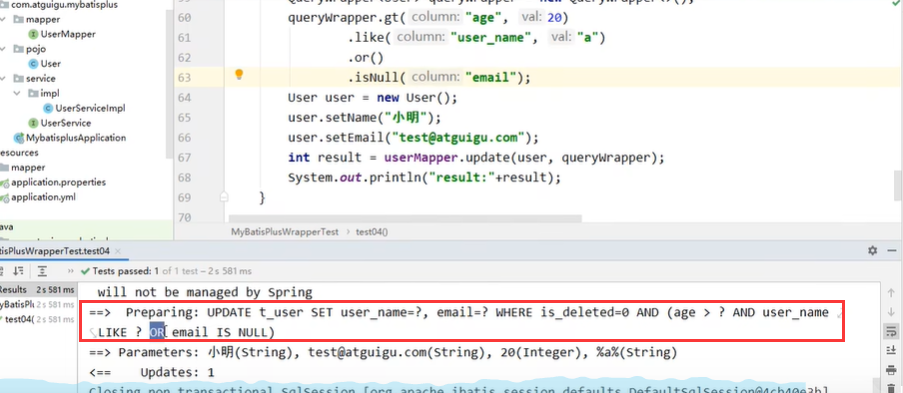

#### 6、条件的优先级

​			如果在条件中使用了lambda表达那么，lambda的条件优先执行

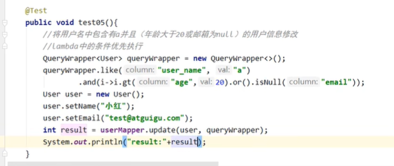

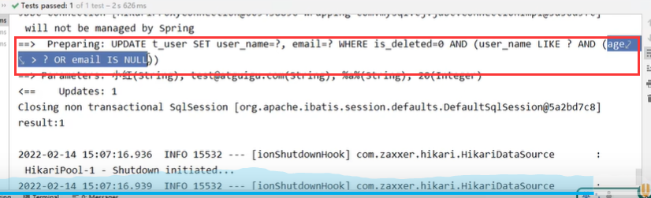

https://www.bilibili.com/video/BV12R4y157Be?p=34&spm_id_from=pageDriver&vd_source=243ad3a9b323313aa1441e5dd414a4ef

#### 7、组装select子句

​			比如我们现在只要查询个别的字段该如何处理，因为目前的查询都是全部的字段查询

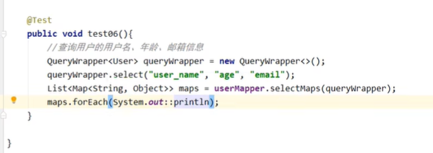

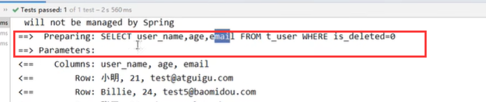

#### 8、组装子查询

​		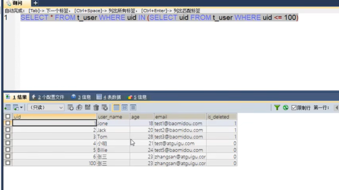

​	使用inSql方法

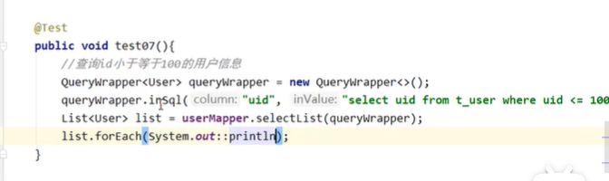

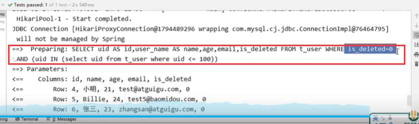

#### 9、使用UpdateWarpper实现修改功能

​		updateWarpper不单可以设置修改条件，还可以设置修改的值

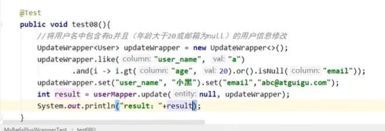

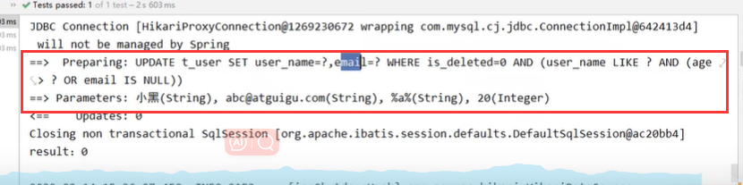

#### 10、模拟开发中组装条件的情况

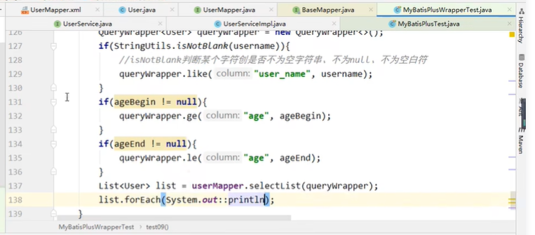

查看sql

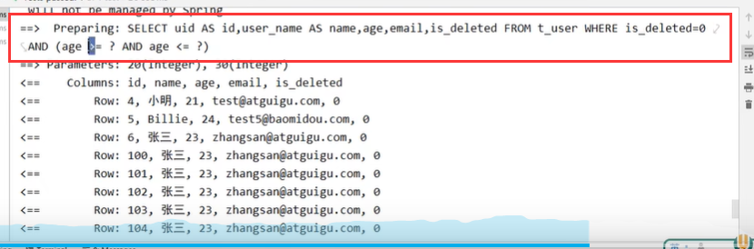

https://www.bilibili.com/video/BV12R4y157Be?p=38&spm_id_from=pageDriver&vd_source=243ad3a9b323313aa1441e5dd414a4ef

​	

