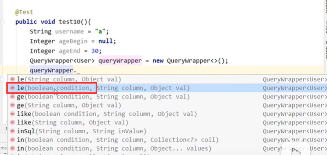
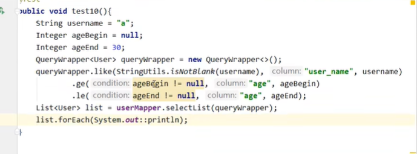
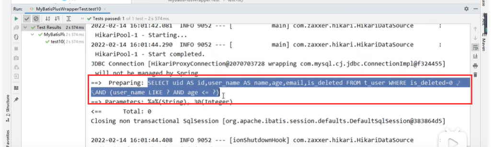
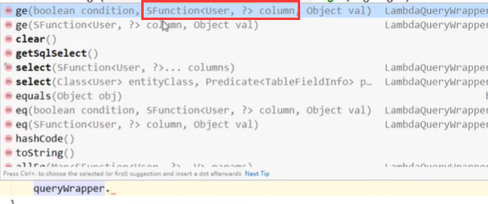
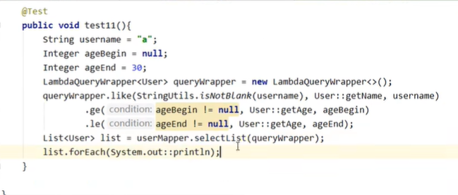
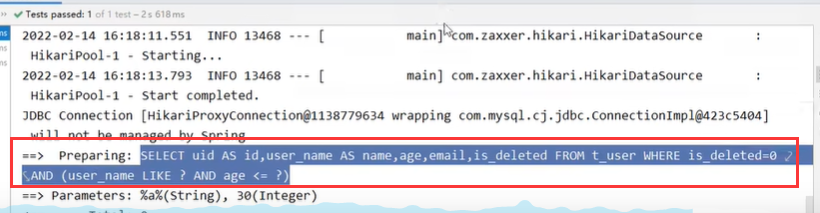
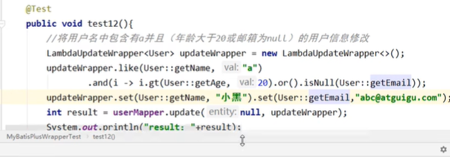
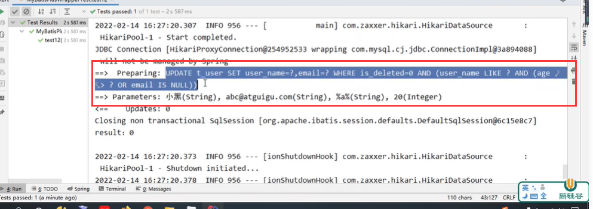

# 11、使用condition和LambdaQueryWarpper组装条件

#### 1、condition条件

​		我们使用的Warpper其实还有一个布尔类型的参数condition--条件参数

​					意思是如果这个条件满足 true那么就组装这个条件

SQL查看

#### 2、LambdaQueryWarpper使用

​		使用LambdaQueryWarpper的话不容易把字段写错，以上的容易写错字段属性

​		我们在和之前的相比，条件有区别Sfunction，这个其实就是为了防止我们把字段名称写错

​				我们通过这个函数就可以访问到我们当前这个实体对应的字段名

代码示例：

https://www.bilibili.com/video/BV12R4y157Be?p=40&spm_id_from=pageDriver&vd_source=243ad3a9b323313aa1441e5dd414a4ef

#### 3、LambdaUpdateWarpper使用

​		

