# 12、MybatisPlus分页插件

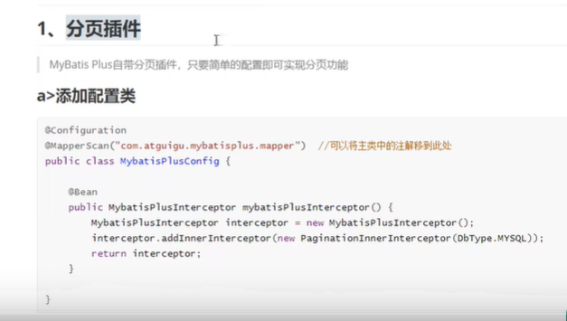

#### 1、配置类

​			首先需要添加一个配置类

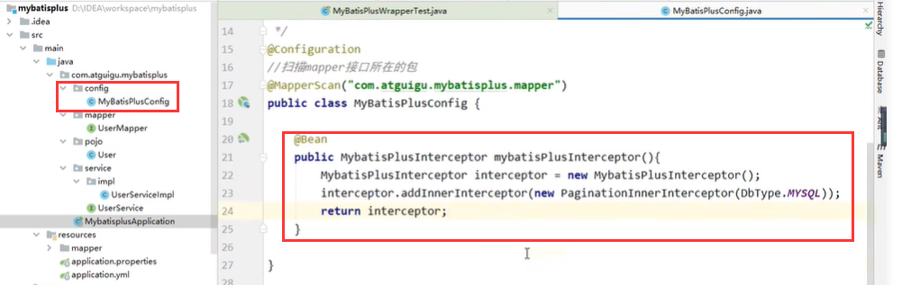

#### 2、测试

​	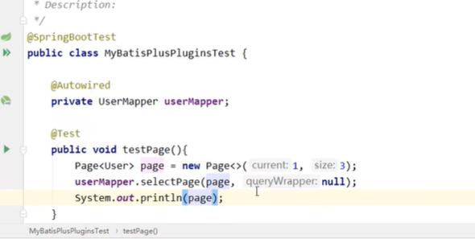

​	查看SQL

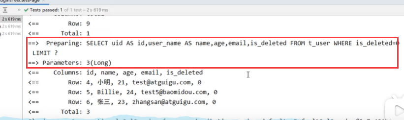

https://www.bilibili.com/video/BV12R4y157Be?p=42&spm_id_from=pageDriver&vd_source=243ad3a9b323313aa1441e5dd414a4ef

#### 3、分页相关数据获取

​	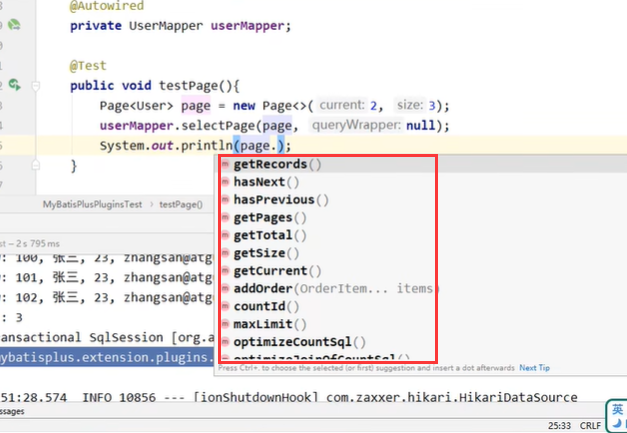

​		getRecords --获取当前数据

​		getCurrent --获取当前页码

​		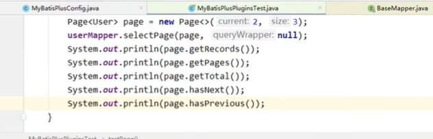

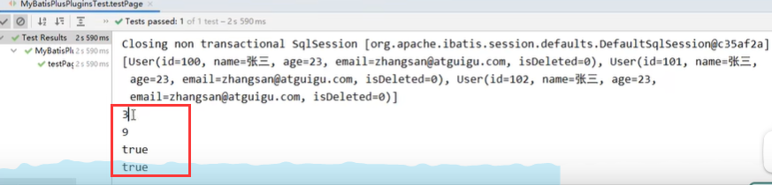

#### 5、自定义分页

​			自定义的sql如何实现分页查询呢

​		首先是接口定义

​				通过年龄查询用户且分页

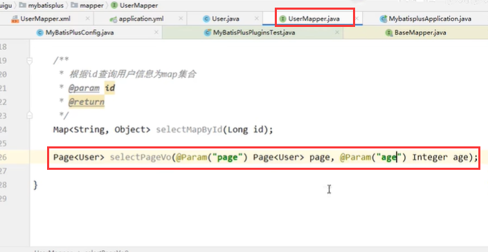

设置类型别名对应的包

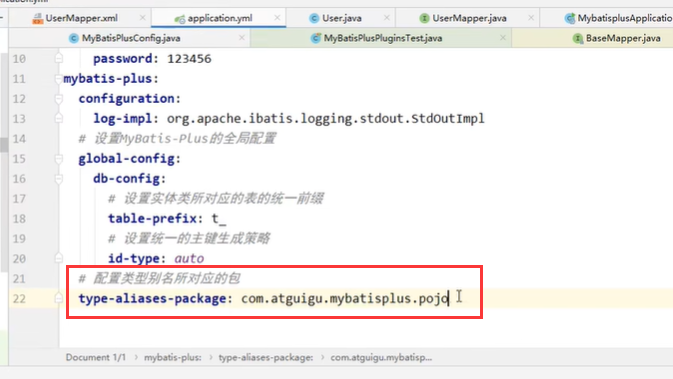

​	

映射xml写sql语句

​		默认的别名就是类名，且不区分大小写

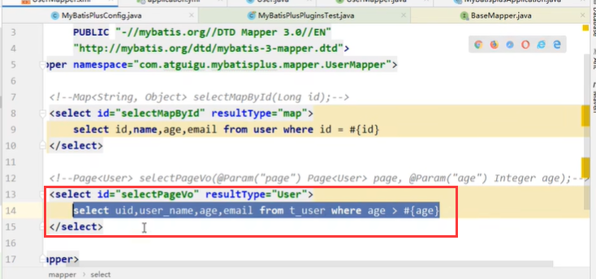

​		测试：

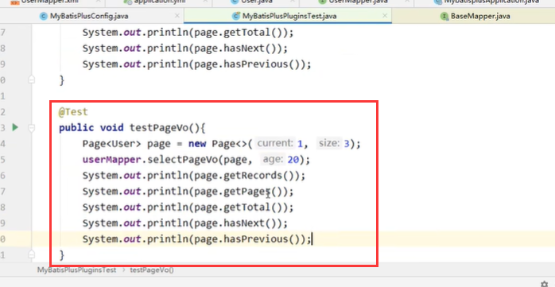

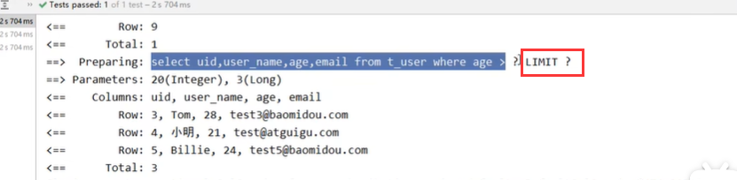

https://www.bilibili.com/video/BV12R4y157Be?p=44&spm_id_from=pageDriver&vd_source=243ad3a9b323313aa1441e5dd414a4ef

