# 13、乐观锁悲观锁

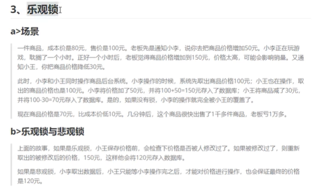

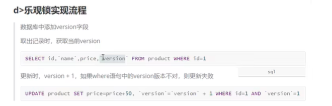

#### 2、模拟修改冲突

​	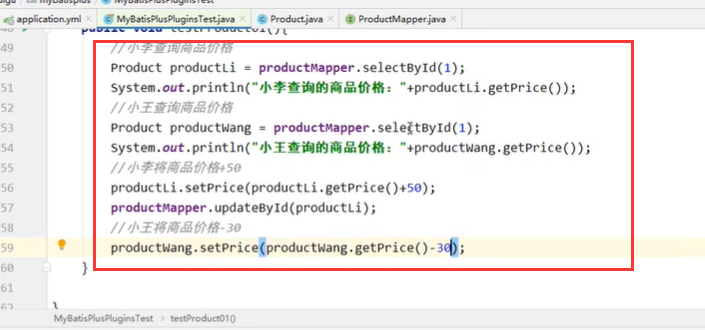

​			预想是100 + 50 -30=120 实际上是70

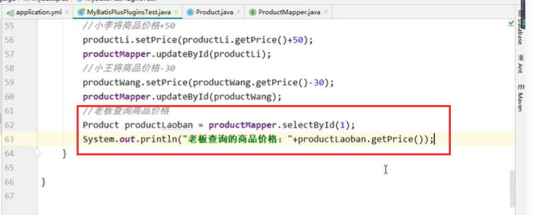

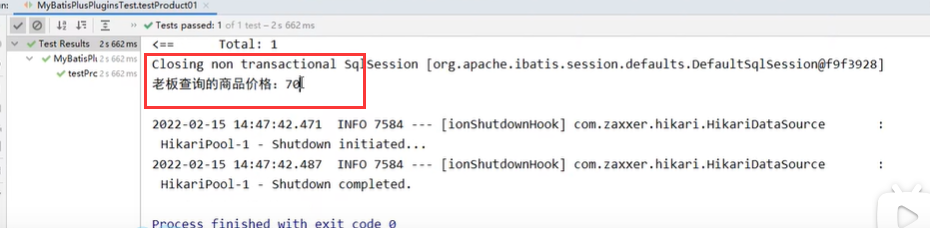

​	在这种情况下如果不使用锁的情况下，就会有问题

#### 3、乐观锁插件

​	配置类中设置乐观锁插件

​	我们在MybatisPlus中使用@Version注解来标识乐观锁字段就可以实现乐观锁的功能了

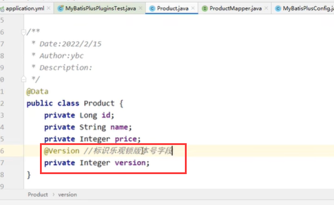

​	我们重新测试：

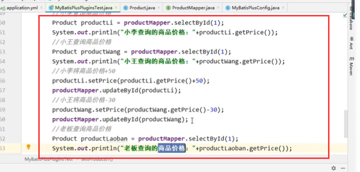

​	结果是150---也不是我们期望的120，因为小王在修改的时候是失败的

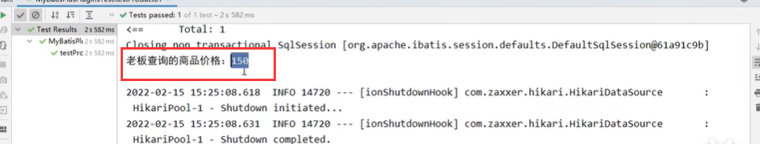

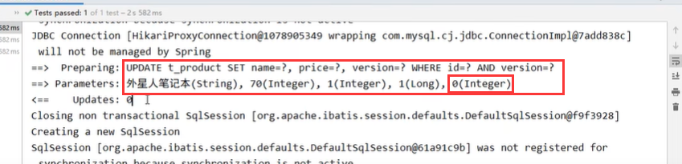

#### 3、优化修改

​		判断是否失败，失败就重试

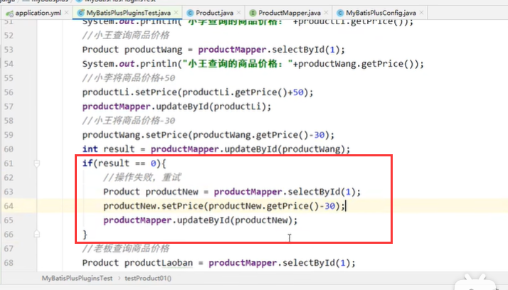

​	这样查看结果--达到预期120了

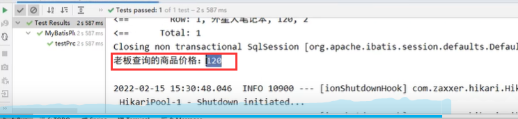

https://www.bilibili.com/video/BV12R4y157Be?p=48&spm_id_from=pageDriver&vd_source=243ad3a9b323313aa1441e5dd414a4ef

​	乐观锁---在表中添加version字段就可以了

