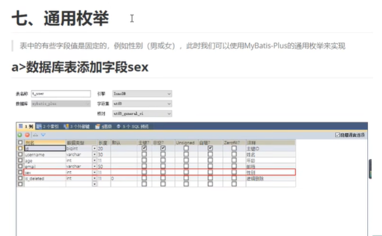
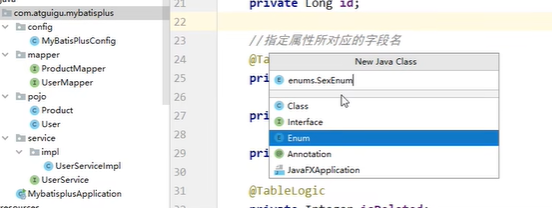
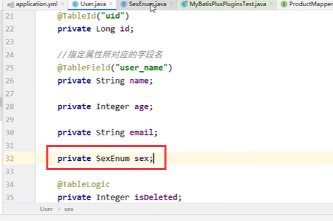
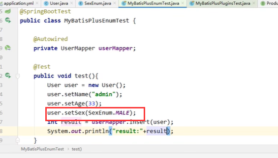
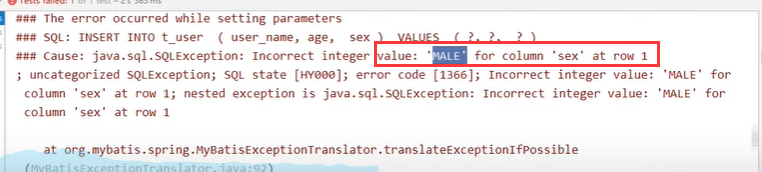
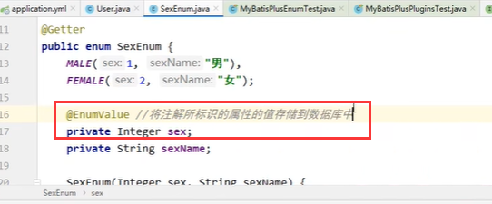
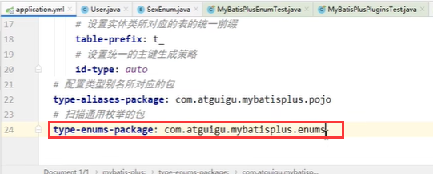
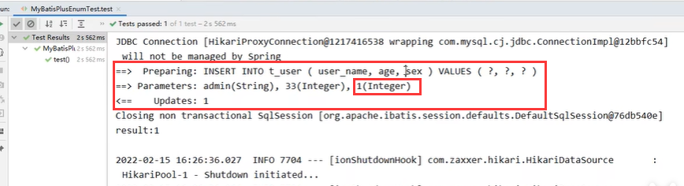

# 14、通用枚举

​		

​		

​	

​	创建一个枚举类

​	设置属性 -- 添加构造器，然后设置枚举值

​		实体类中设置枚举类型的属性字段

测试为性别赋值

​	报错--原因是把name存放到数据库了

​	使用枚举注解

​	还需要扫描通用枚举

再次测试成功

​		使用场景 --- 某些字段值是固定的

https://www.bilibili.com/video/BV12R4y157Be?p=49&spm_id_from=pageDriver&vd_source=243ad3a9b323313aa1441e5dd414a4ef

