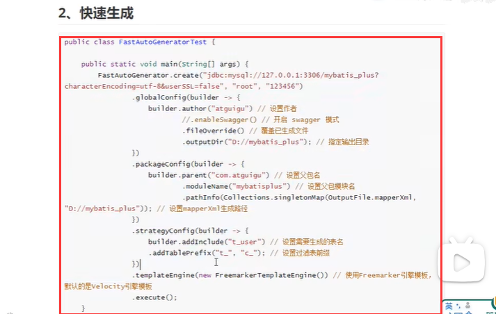
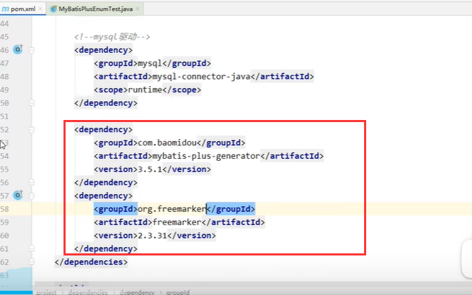
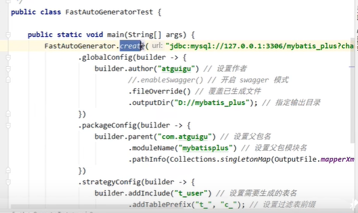
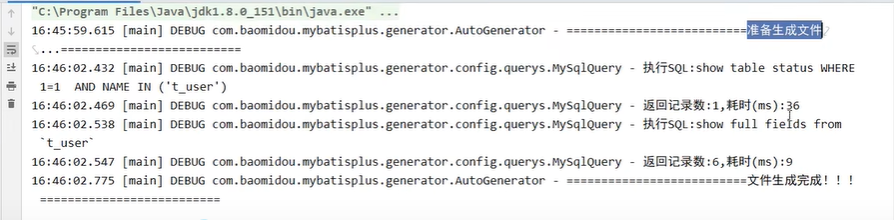
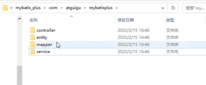

# 15、代码生成器

​		通过表---逆向生成，controller，service，mapper，entity都可以生成

​	快速生成的模板---从官网复制就可以

# 1、首先引入依赖

​	

#### 2、创建测试类

​			测试类中直接执行模板代码

​	执行：

​	查看生成

https://www.bilibili.com/video/BV12R4y157Be?p=50&spm_id_from=pageDriver&vd_source=243ad3a9b323313aa1441e5dd414a4ef

