# 16、模拟多数据源

​	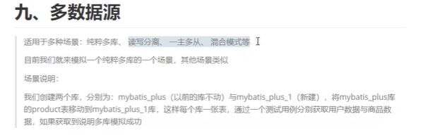

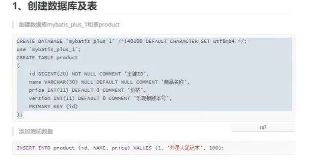

#### 1、引入依賴

​		

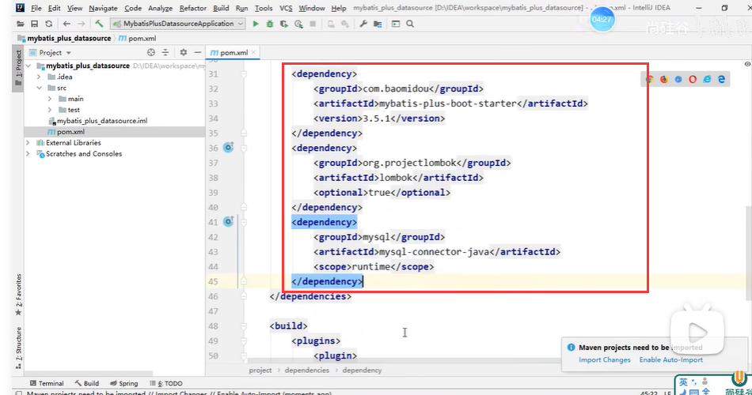

​	还需引入多数据源的依赖

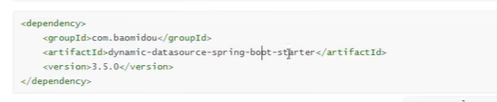

#### 2、多数据源的配置文件配置

​	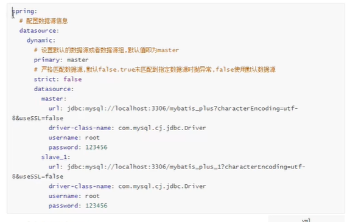

​	strict -- 默认是false，如果主数据源匹配不到数据，去从数据源

​				如果是true就是必须使用master来匹配

​				注意这个数据源组名称必须一致

​	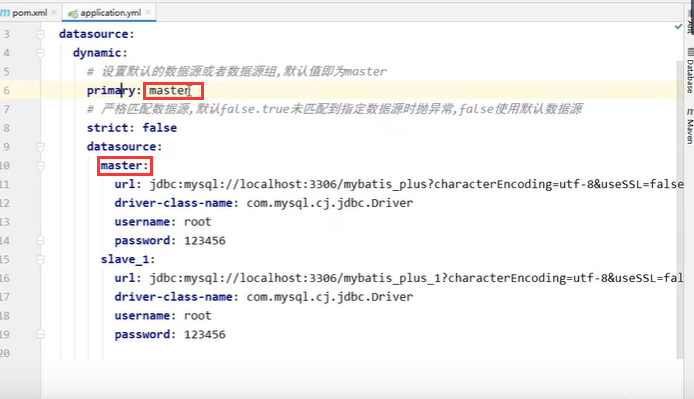

​	通过@DS来指定数据源

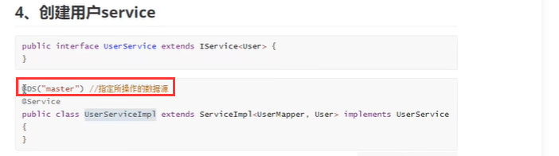

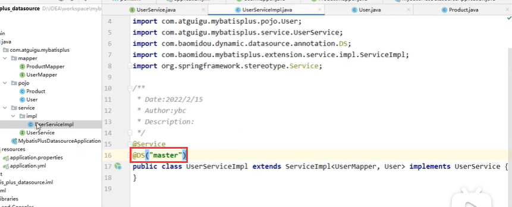

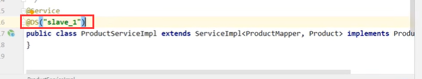

#### 3、测试

​	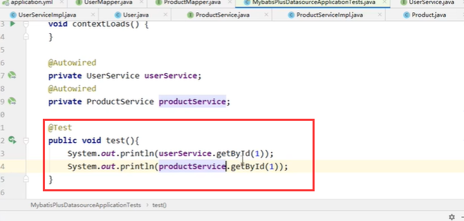

​	数据查询没有问题

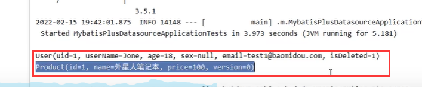

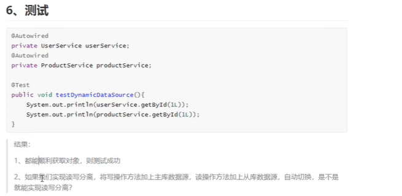

​		如果是读写分离---那么可以将DS注解放到方法上

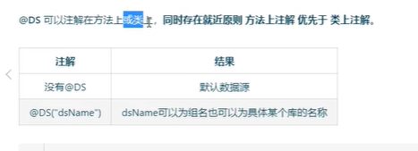

https://www.bilibili.com/video/BV12R4y157Be?p=53&spm_id_from=pageDriver&vd_source=243ad3a9b323313aa1441e5dd414a4ef

