# 17、MybatisPlusX插件

​			基于idea的快速开发插件--为效率而生

​	

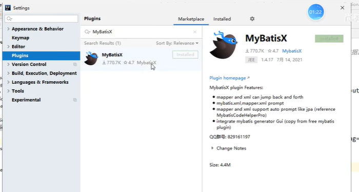

​		可以帮助我们快速对应mapper接口和映射文件

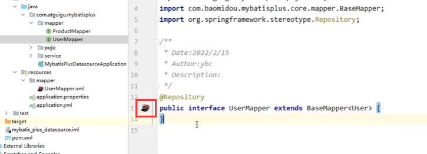

#### 1、MybatisX插件快速生成代码

​		先使用idea的database连接数据库才可以使用

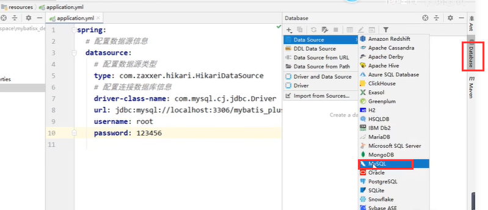

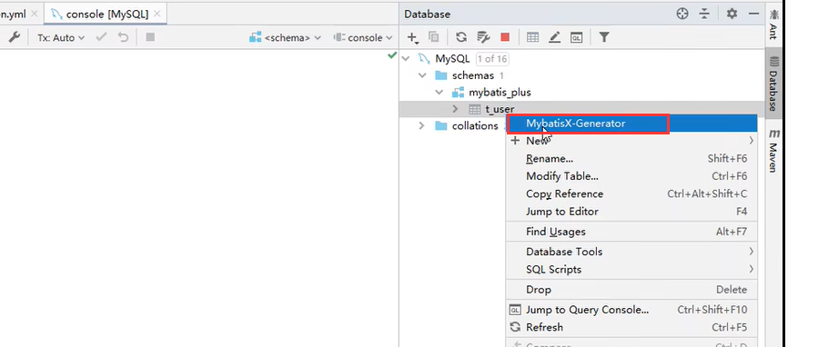

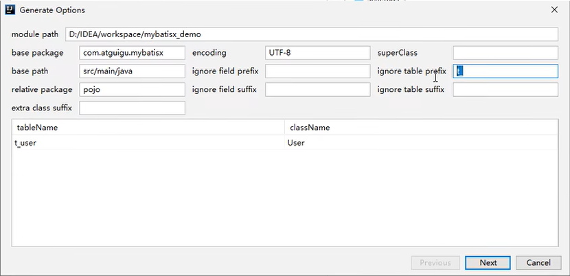

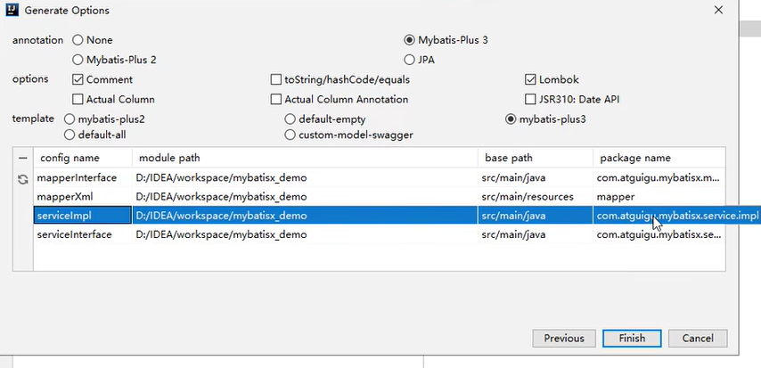

全部生成了

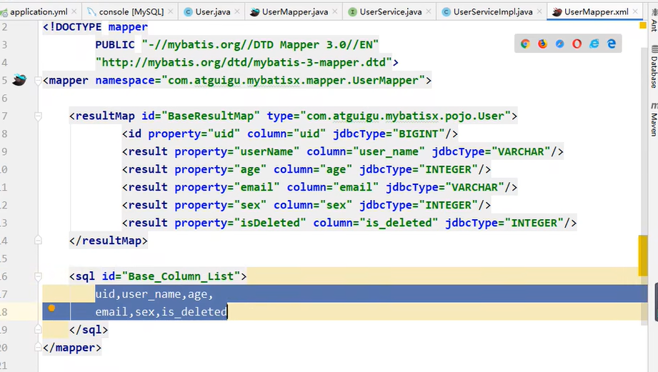

https://www.bilibili.com/video/BV12R4y157Be?p=55&spm_id_from=pageDriver&vd_source=243ad3a9b323313aa1441e5dd414a4ef

#### 2、快速生成CURD

​		写方法名称就可以快速生成

​	在方法名称上使用alt+enter

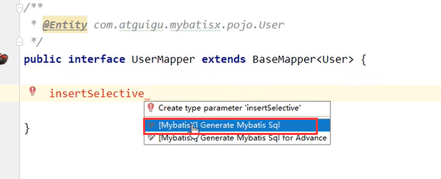

​	

方法会被自动补全

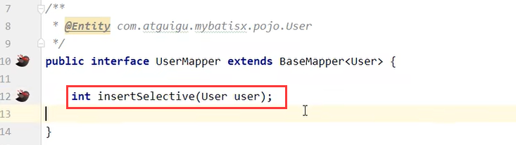

​	我们可以键入查看生成的sql

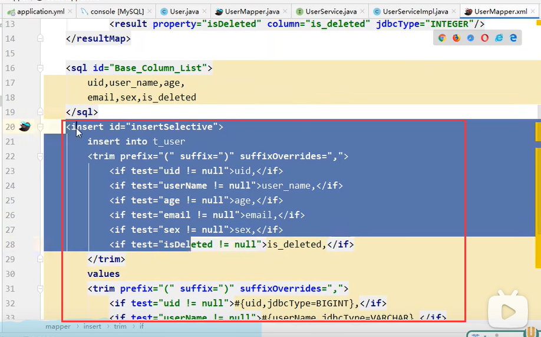

​	比如生成根据id和name删除的方法---也是可以自动生成的

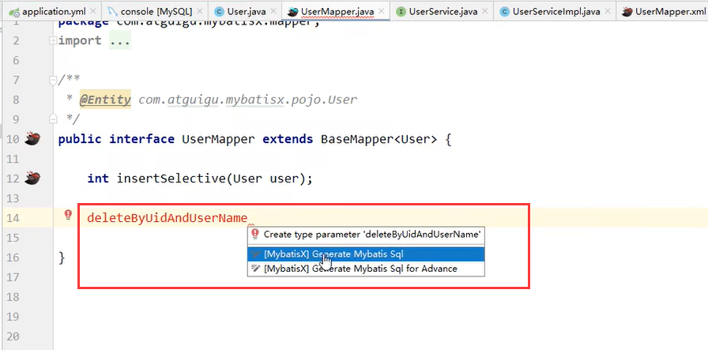

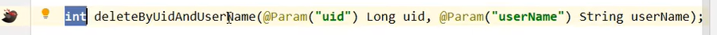

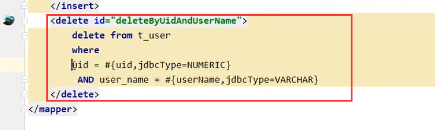

​	

##### 	修改

​		

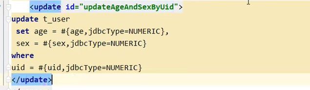

​	

#####  查询

​		可以选择需要的字段

​		

​		除了可以选择需要的字段--还可以设置各种需要的条件

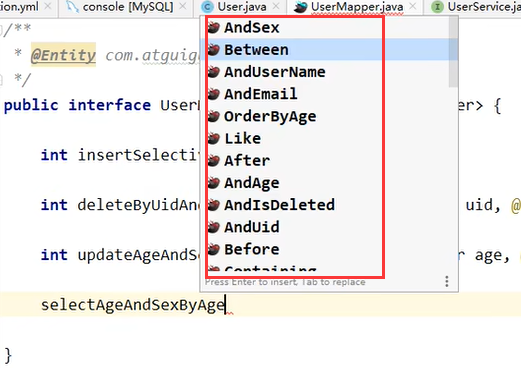

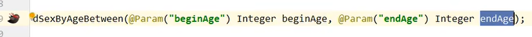

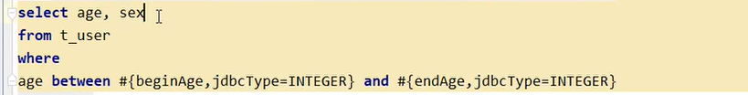

##### 	排序

​		根据年龄排序

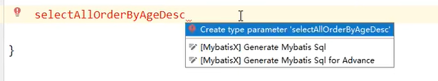

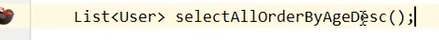

​	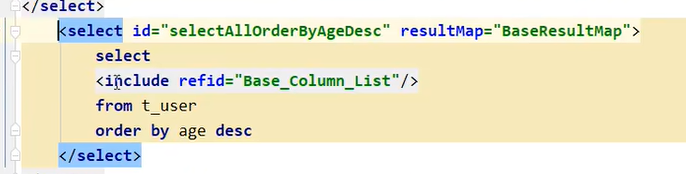

​		

https://www.bilibili.com/video/BV12R4y157Be?p=57&spm_id_from=pageDriver&vd_source=243ad3a9b323313aa1441e5dd414a4ef

