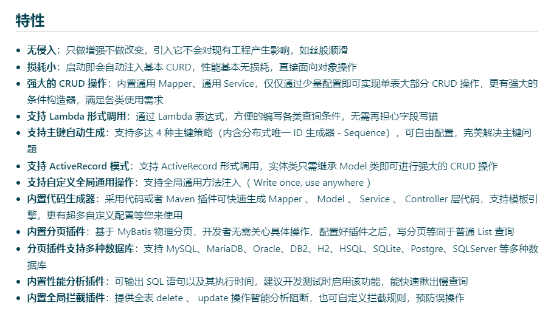

# 1、mybatisPlus介绍

​				mybatis-plus 是mybatis的一个增强工具，在mybatis基础之上只做增强不做改变。

​		官网地址：https://baomidou.com/

#### 1、mybatis-plus的特性

#### 2、框架结构

​	组成部分：

​			首先是需要mybatis-plus-boot-starter 这个是启动器

​			annotation是注解部分

​			extension 是扩展部分

​			core是核心部分

​			generator 是代码生成部分

​		由右侧的框架结构--来实现左侧的功能实现

​		图的左侧是展示mybatis-plus是如何来实现功能的

#### 实现功能的过程：

​	1、Scan-Entity -- 第一步是扫描实体（我们操作的表由实体类来决定）

​	2、Reflection -- 通过反射技术 来 进行 extraction抽取属性

​	3、抽取之后来Analysis分析我们当前的Table表 和 实体类直接的关系		

​	4、根据当前所调用的方法--根据我们调用的方法生成相应的sql语句

​	5、把生成相应的SQL语句 Injection 注入到 Mybatis 的容器中 -- 从而实现最终的功能

​	

