# 2、mybatisPlsu入门案例

​	


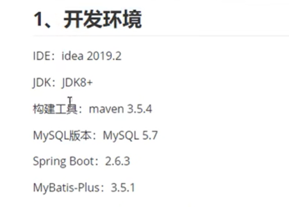


#### 1、数据库设置

​		笔记地址

​			https://blog.csdn.net/weixin_48854649/article/details/126321036?spm=1001.2014.3001.5501

​	

​		注意：这里表的id使用的是bigint 原因是我们在使用mybatis-plus进行数据插入的时候，默认使用的是雪花算法-来生成id，长度比较长使用bigint就行

```

-- 创建数据库
CREATE DATABASE `mybatis_plus` /*!40100 DEFAULT CHARACTER SET utf8mb4 */;
use `mybatis_plus`;


-- 创建表
CREATE TABLE `user` (
`id` bigint(20) NOT NULL COMMENT '主键ID',
`name` varchar(30) DEFAULT NULL COMMENT '姓名',
`age` int(11) DEFAULT NULL COMMENT '年龄',
`email` varchar(50) DEFAULT NULL COMMENT '邮箱',
PRIMARY KEY (`id`)
) ENGINE=InnoDB DEFAULT CHARSET=utf8;


-- 添加数据 
INSERT INTO user (id, name, age, email) VALUES
(1, 'Jone', 18, 'test1@baomidou.com'),
(2, 'Jack', 20, 'test2@baomidou.com'),
(3, 'Tom', 28, 'test3@baomidou.com'),
(4, 'Sandy', 21, 'test4@baomidou.com'),
(5, 'Billie', 24, 'test5@baomidou.com');


```


#### 2、创建springboot项目

​	

初始化项目

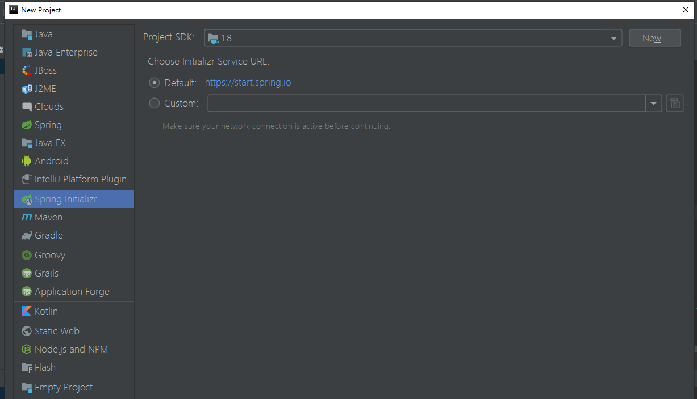


​	设置maven工程

​	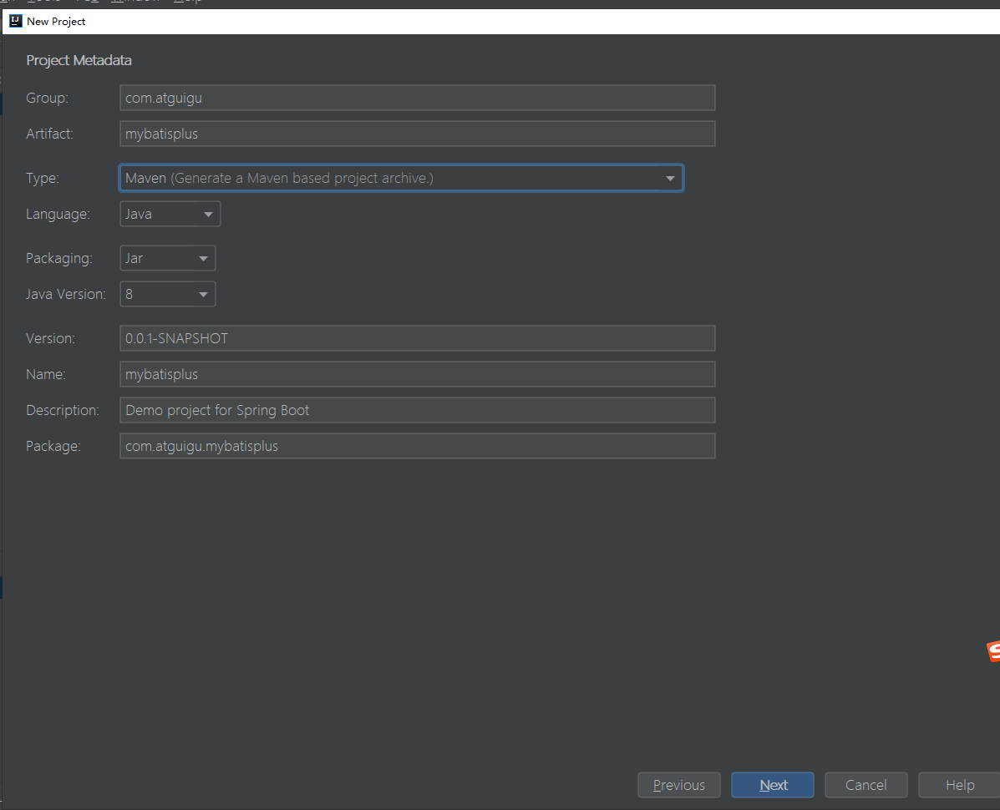


​	选择Springboot项目版本和依赖--依赖先不选后续pom加

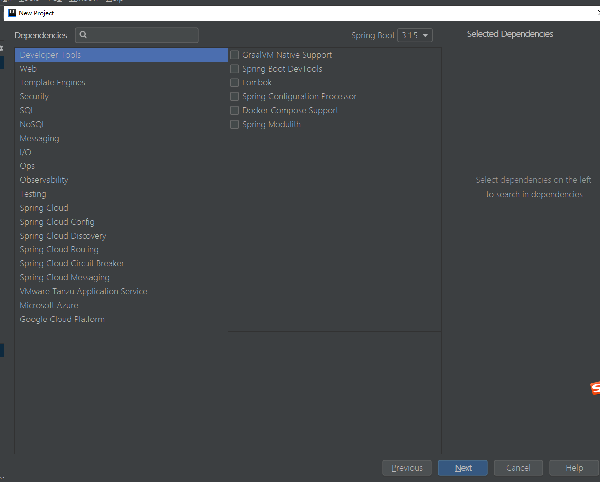


工程名称和工程位置--进行创建

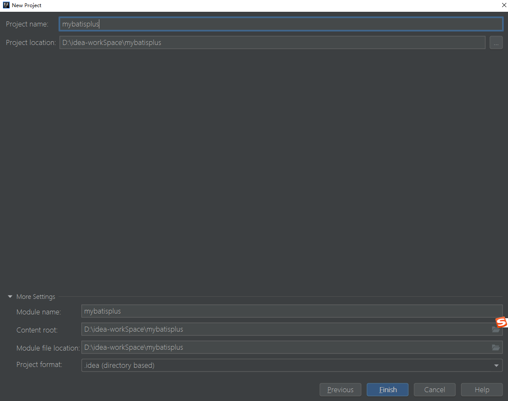


​	删除工程中不相干的内容

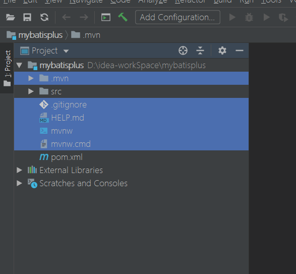


添加相关依赖

```
		<!--   mybatis-plus    -->
        <dependency>
            <groupId>com.baomidou</groupId>
            <artifactId>mybatis-plus-boot-starter</artifactId>
            <version>3.5.1</version>
        </dependency>

        <!--   lombok    -->
        <dependency>
            <groupId>org.projectlombok</groupId>
            <artifactId>lombok</artifactId>
            <optional>true</optional>
        </dependency>

        <!-- mysql驱动 -->
        <dependency>
            <groupId>mysql</groupId>
            <artifactId>mysql-connector-java</artifactId>
            <scope>runtime</scope>
        </dependency>
        
```


lombok插件安装

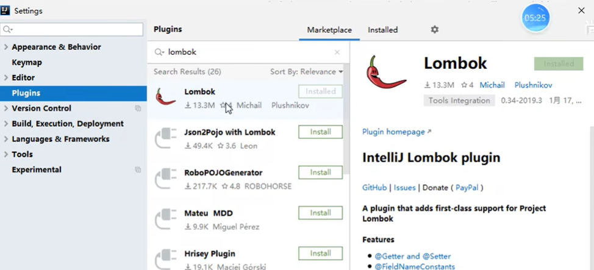


#### 3、配置application.yaml

创建yml

​	我们就配置数据源就可以了

​		比如我们可以使用springboot中默认的数据源HikariDataSource

​	驱动类

注意事项

```
1、驱动类driver-class-name
spring boot 2.0（内置jdbc5驱动），驱动类使用：

driver-class-name: com.mysql.jdbc.Driver
spring boot 2.1及以上（内置jdbc8驱动），驱动类使用：

driver-class-name: com.mysql.cj.jdbc.Driver
否则运行测试用例的时候会有 WARN 信息

2、连接地址url

MySQL5.7版本的url：

jdbc:mysql://localhost:3306/mybatis_plus?characterEncoding=utf-8&useSSL=false


MySQL8.0版本的url：

jdbc:mysql://localhost:3306/mybatis_plus?

serverTimezone=GMT%2B8&characterEncoding=utf-8&useSSL=false
否则运行测试用例报告如下错误：

java.sql.SQLException: The server time zone value ‘Öйú±ê׼ʱ¼ä’ is unrecognized or

represents more


```


#### 4、创建实体类

​	

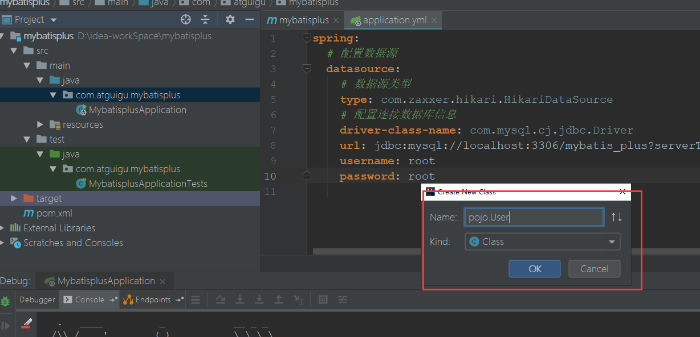


​	添加无参构造--可以使用lombok的@NoargsConstructor

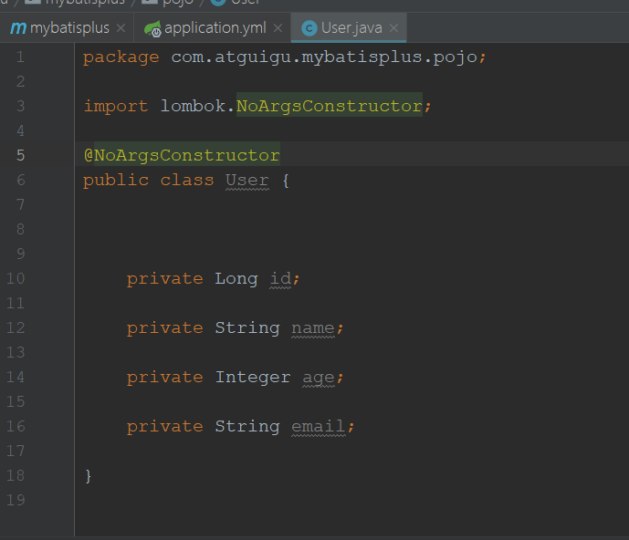

编译后是会产生无参构造的

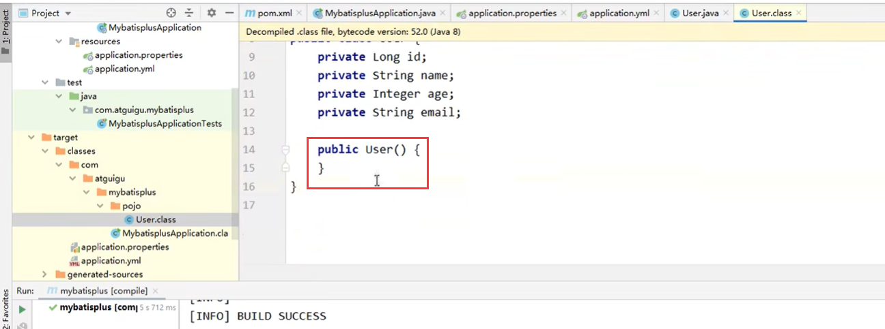


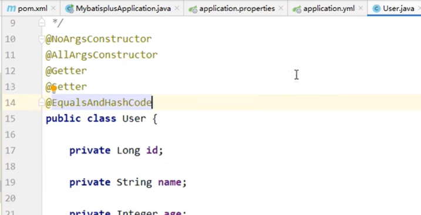

​	这些多个注解和@Data注解的效果一样


#### 5、创建mapper接口并扫描


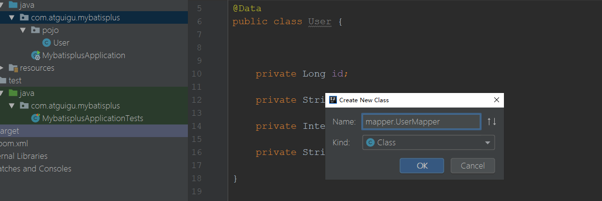


​	继承mybatisPlus的baseMapper

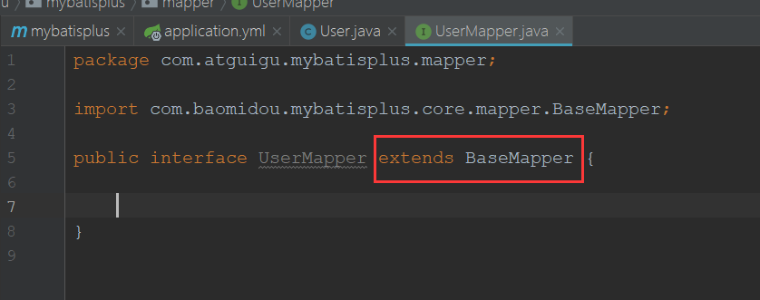


​	BaseMapper需要携带泛型T，这个T就是我们的实体类型

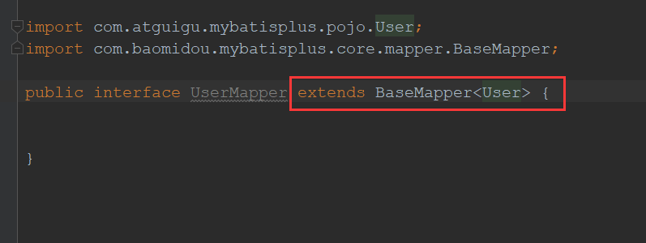


​	我们在使用springboot项目的时候一定要记得，我们要设置当前mapper接口所在的包，以及映射文件所在的包

​	@MapperScan -- mapper接口所在的包

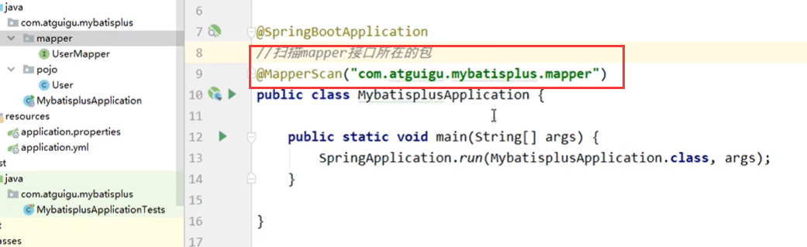


#### 6、测试


​	创建mybatisplusTest测试类

​    加上@SpringBootTest注解

​		此时我们在当前的测试类中，就可以对我们IOC容器所管理的一些组件来进行自动装配了

```
@SpringBootTest
public class MybatisPlusTest {

    
}
```


​	我们在注入userMapper的时候报红，是因为spring认为我们注入的是实体的Bean，而这个是个接口可能会没有实现导致问题，但其实是没有问题的在运行过程中--保证它是有实现的就行

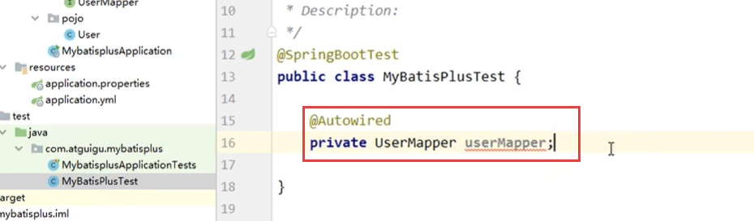


##### 		1、测试查询集合

​	查询的时候使用mybatisPlus的条件构造器Wrapper

​		没有条件传个null就可以

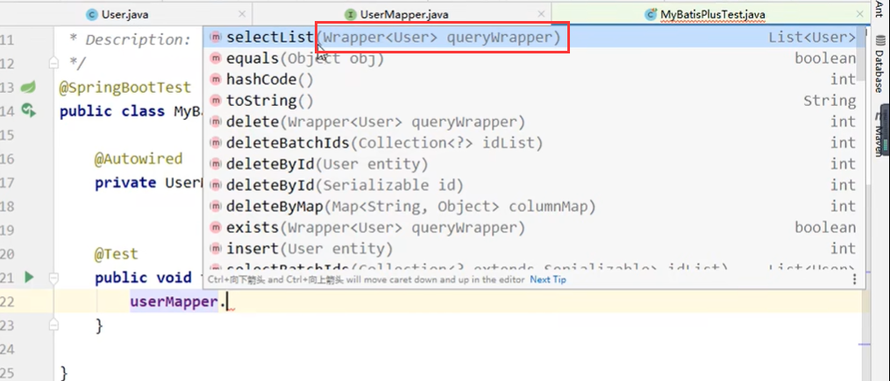


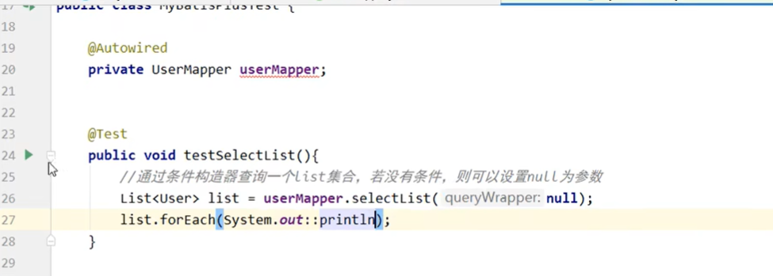


没有问题--数据全部查询出来了

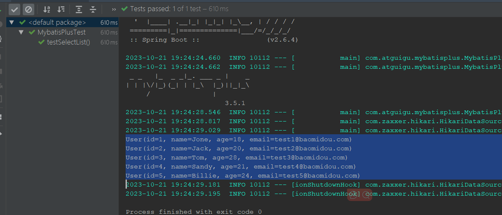


##### 2、消除mapper的报红

​		如果想消除mapper的报红，可以使用注解@Resposity

​		这个注解是将实体或接口，标记为实体组件

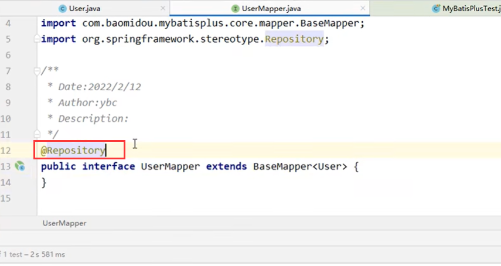


https://www.bilibili.com/video/BV12R4y157Be/?p=10&spm_id_from=pageDriver&vd_source=243ad3a9b323313aa1441e5dd414a4ef


