# 4、BaseMapper

​	BaseMapper对象

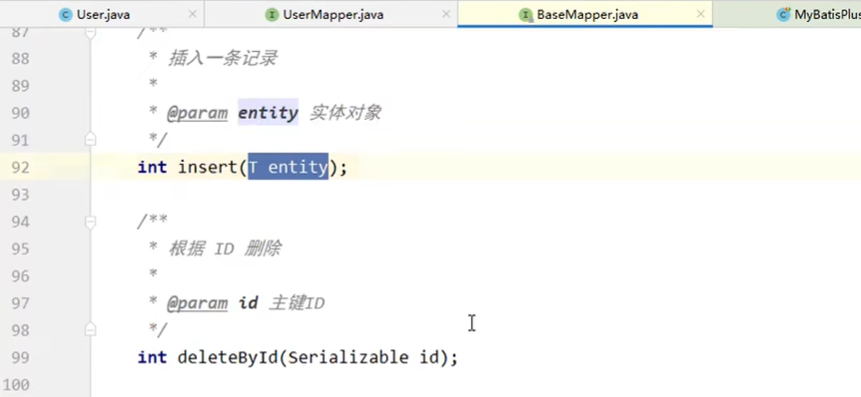

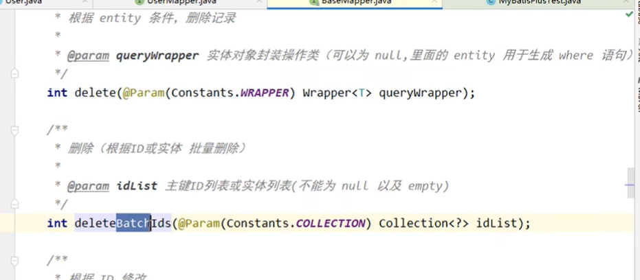

#### 1、新增功能测试

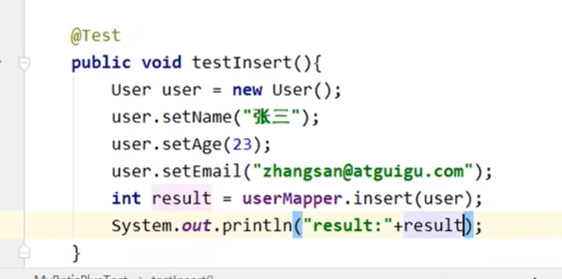

​	也可以获取id

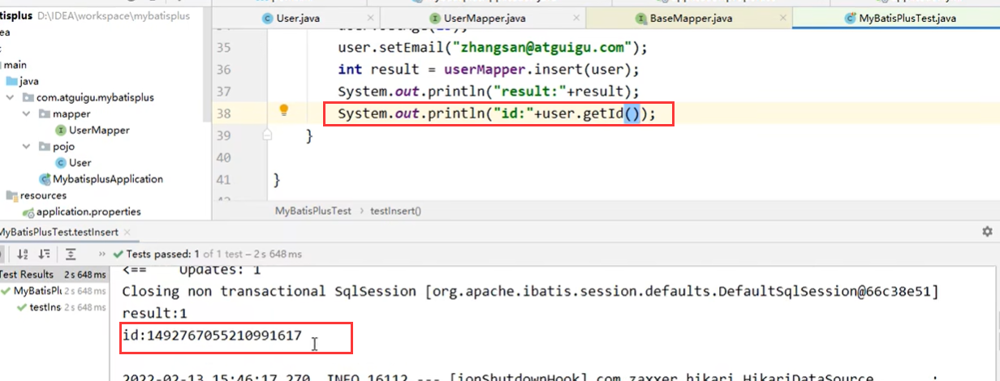

#### 2、删除

​	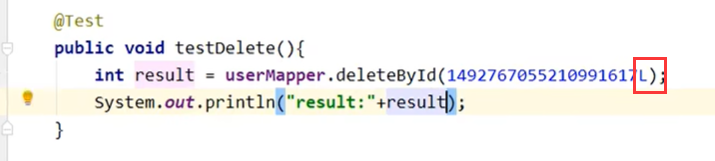

​		使用map进行删除

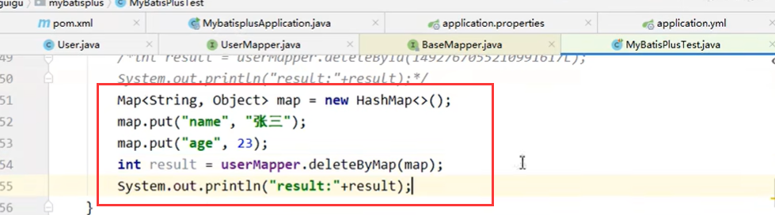

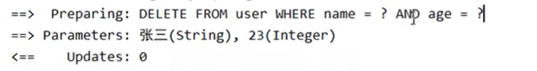

​	批量删除

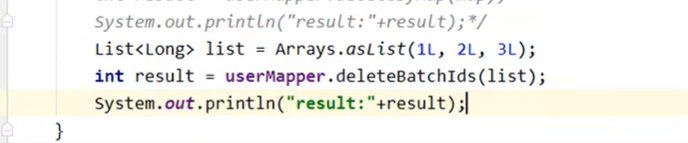

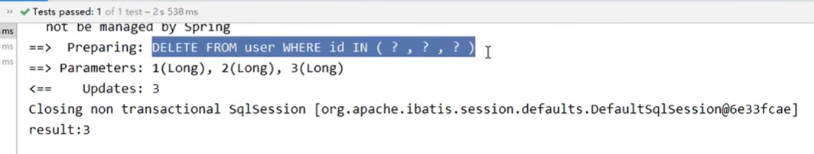

#### 3、修改

​		2个修改方法，一个是符合条件构造器的数据

​								第二个是通过id来修改

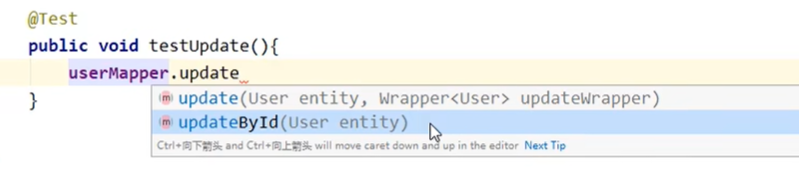

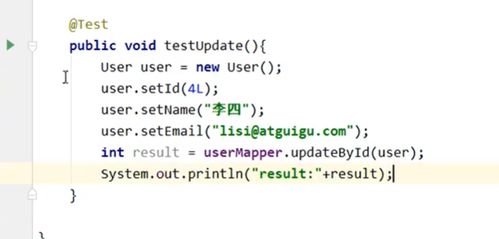

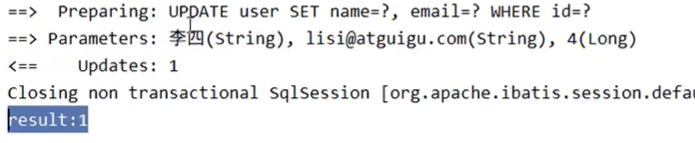

#### 4、查询

​		

​	通过id查询

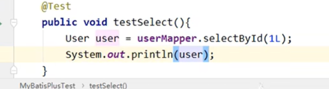

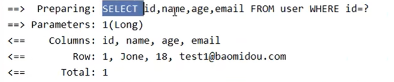

​	批量根据id查询

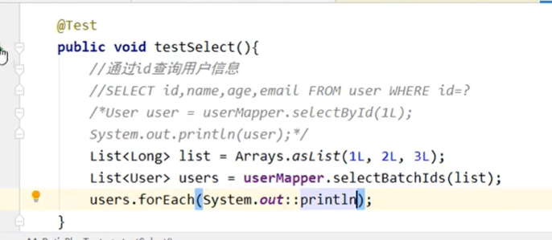

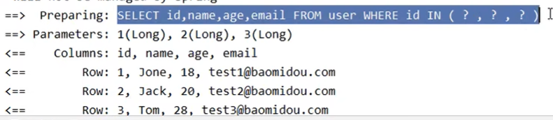

​	通过Map查询

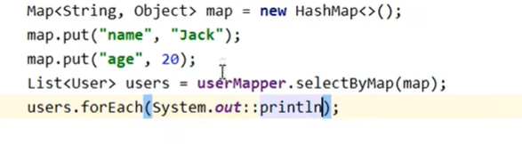

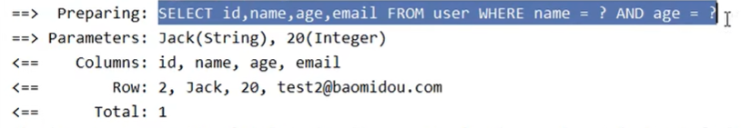

条件构造 器查询，没有条件就是null

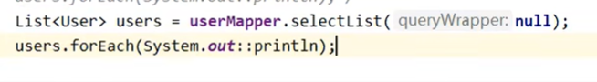

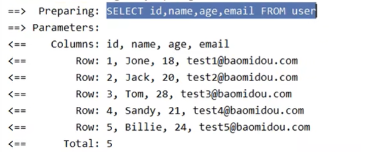

​	

