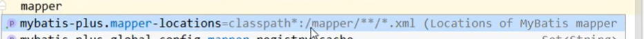
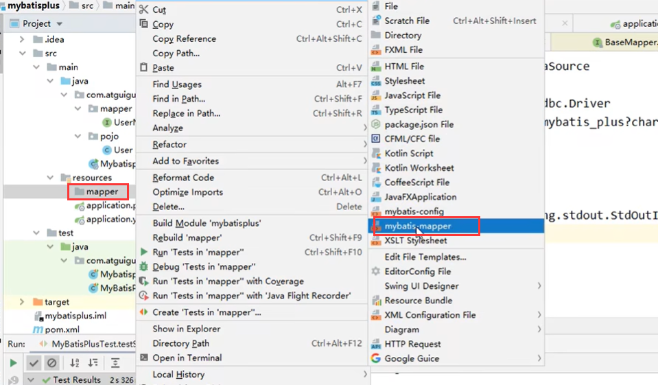
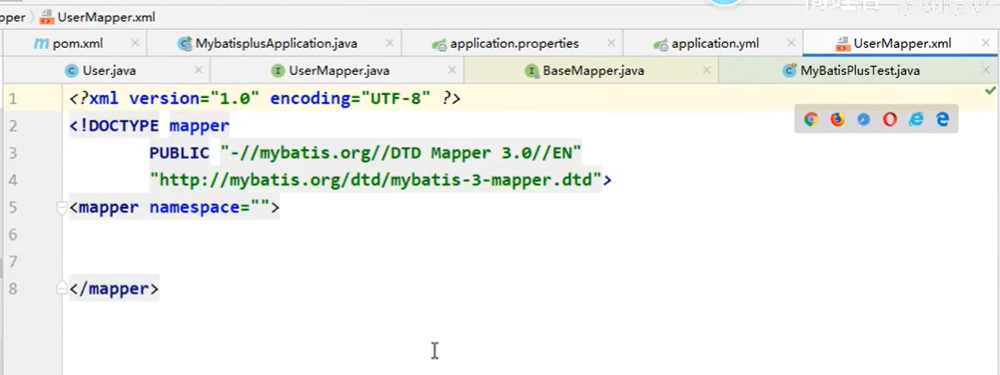
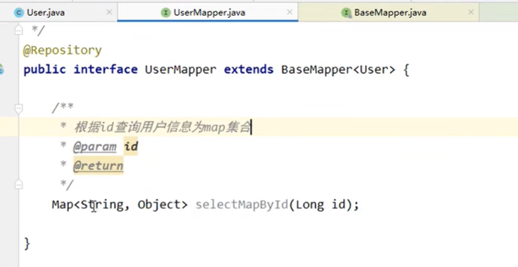
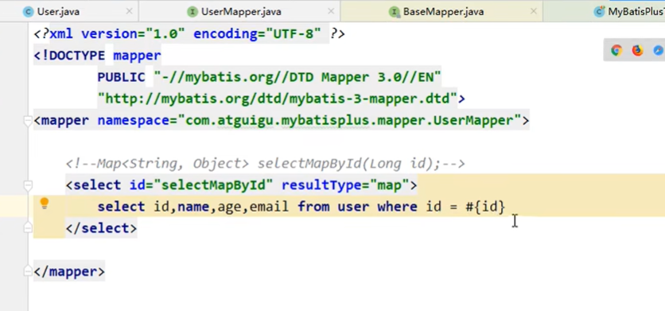
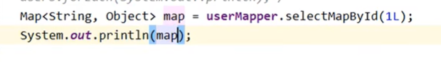
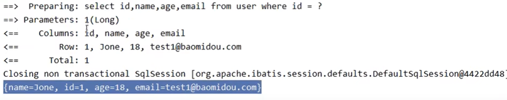
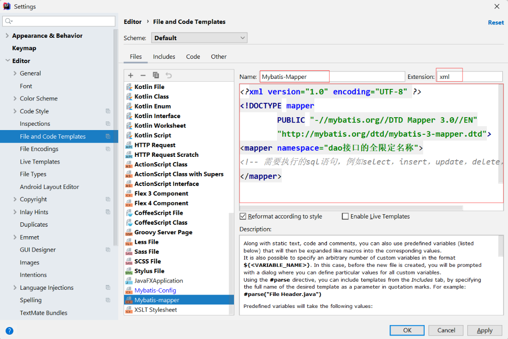

# 5、测试自定义功能

​			如果我们要实现连表查询，或者是其他的自定义查询

​	如果我们自定义，那么就需要写mapper.xml文件了

​	我们需要配置mapper的地址，而这个地址我们可以看到有个默认路径

​	项目路径下--mapper文件夹下的所有xml--这是默认路径，所以如果xml放在这个路径下我们就可以不写这个配置

​	创建mapper映射文件

我们在mapper接口中定义方法

​		设置mapper.xml

测试：

​	

##### mybatis模板创建

主要是为了方便下次创建，重复代码就不需要写了

 

https://www.bilibili.com/video/BV12R4y157Be/?p=17&spm_id_from=pageDriver&vd_source=243ad3a9b323313aa1441e5dd414a4ef

