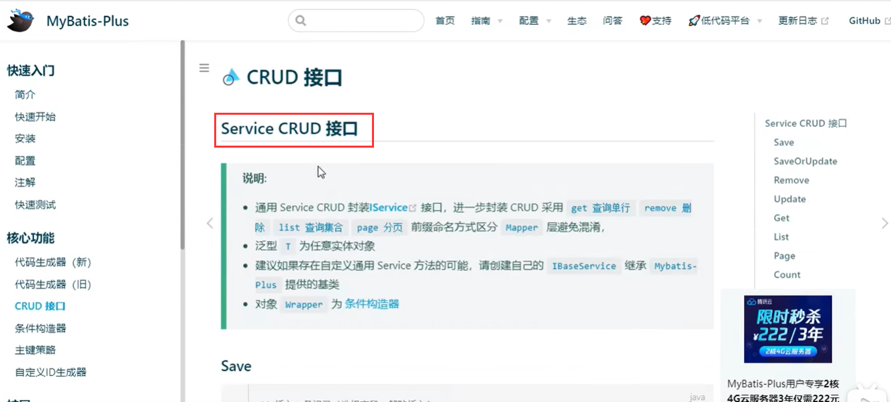
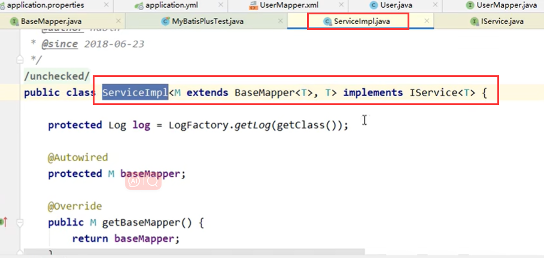
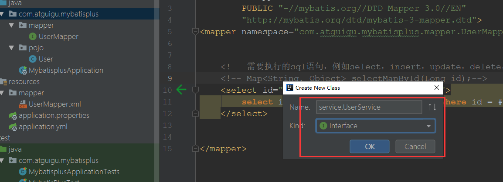
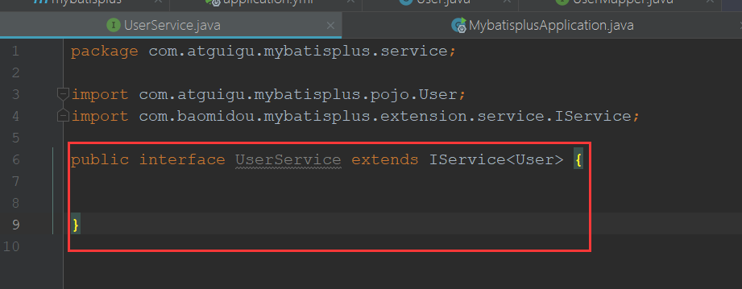
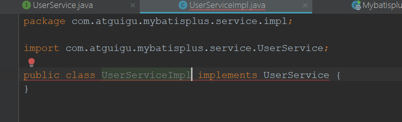
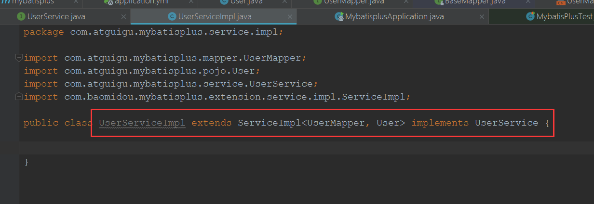
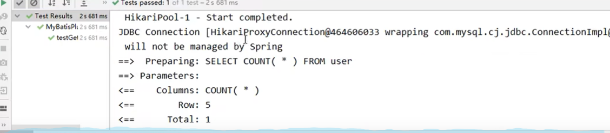

# 6、通用Service接口


​			mybatisPlus除了可以使用通用的Mapper还可以使用通用的Service


​	我们可以在官网上查看




​	为了防止和mapper方法的混淆，通用service在方法名称上和mapper有区别，如get是获取数据，而在mapper中是select


	说明:
		通用 Service CRUD 封装IService接口，进一步封装 CRUD 采用 get 查询单行 remove 删
	
	除 list 查询集合 page 分页 前缀命名方式区分 Mapper 层避免混淆，
	
	泛型 T 为任意实体对象
	
	建议如果存在自定义通用 Service 方法的可能，请创建自己的 IBaseService 继承
	
	Mybatis-Plus 提供的基类
	
	官网地址：https://baomidou.com/pages/49cc81/#service-crud-%E6%8E%A5%E5%8F%
	
	A3


​	我们看一下这个通用的实现类

​		这个M其实就是 我们的mapper，这个T就是实体




####  创建Service接口




​	继承通用Service 泛型是实体对象




#### 创建实现类

​		实现我们的接口，发现有报红--原因是 IService中的方法我们需要实现

​				其实我们不需要实现，我们继承MybatisPlus已实现的实现类就可以了




​	注意继承的实现类 需要传入M，T ，m是我们的mapper接口，T是我们的实体




#### 测试类进行Service测试

```java
package com.atguigu.mybatisplus;


import com.atguigu.mybatisplus.service.UserService;
import org.junit.jupiter.api.Test;
import org.springframework.beans.factory.annotation.Autowired;
import org.springframework.boot.test.context.SpringBootTest;

@SpringBootTest
public class MybatisPlusServiceTest {

    @Autowired
    private UserService userService;


    @Test
    private void testGetCount(){
        long count = userService.count();

        System.out.println("总记录数"+count);
    }

}

```


​	没有问题




####  


